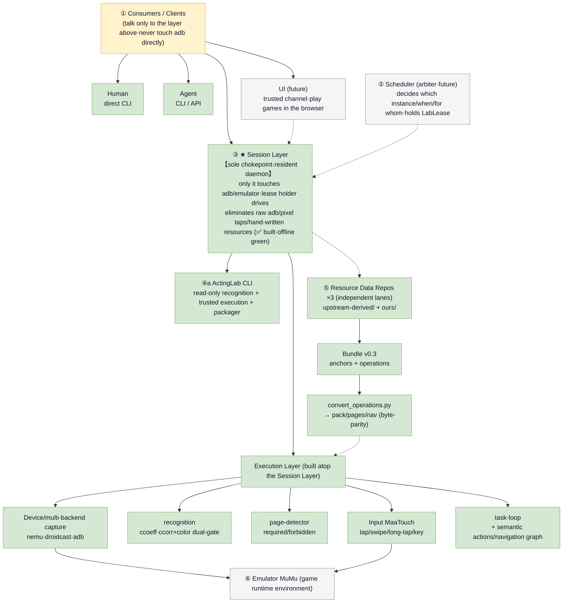
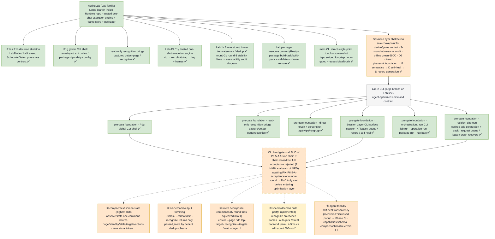
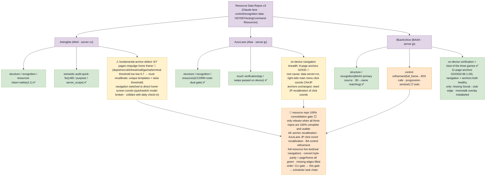
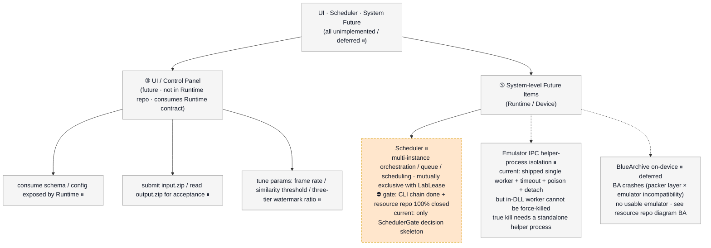

**🌐 语言 / Language:** [简体中文](./README.md) · English

# ActingCommand Runtime

> The **Rust mainline runtime** of a multi-game automation framework. The control plane is a **clean-room Rust rewrite** (referencing MaaFramework's behavior and public protocols, **not copying its C++ source**); recognition is done via **FFI-linked external providers** (ONNXRuntime / PP-OCR).

`cargo build --release` ✅ · `cargo test --workspace` **791 passed / 0 failed** · License `AGPL-3.0-only` · Public repo

The earlier Python `AliceRuntimeOrchestrator` mock, Go historical contracts and benchmark harnesses were moved to [ActingCommand-Legacy-Runtime](https://github.com/HS7097/ActingCommand-Legacy-Runtime).

---

## 🧭 Main-Chain Gating Order

```mermaid
graph LR
  a1["P6.4 Session Layer"]
  a2["P6.5-A MAA Fusion Chain<br/>Closed Loop · Acceptance Bounced"]
  g1["CLI Hard Gate<br/>All P6.5-A DoD"]
  a3["Lab-2 CLI Agent Optimization Layer"]
  g2["Resource Repo 100% Cleanup Closeout Gate"]
  a4["Scheduler Task Chain"]

  a1 --> a2
  a2 --> g1
  g1 -.-> a3
  a3 --> g2
  g2 -.-> a4

  classDef done fill:#d5e8d4,stroke:#82b366,color:#111827;
  classDef wip fill:#fff2cc,stroke:#d6b656,color:#111827;
  classDef todo fill:#ffe6cc,stroke:#d79b00,color:#111827;
  classDef future fill:#f5f5f5,stroke:#999999,color:#111827;
  classDef gate fill:#ffe6cc,stroke:#d79b00,color:#111827,stroke-dasharray:5 3;

  class a1 done;
  class a2 wip;
  class g1 gate;
  class a3 todo;
  class g2 gate;
  class a4 future;
```



> Legend: ✅ Done · 🔄 In progress / Bounced · ⬜ To-do · ⏸ Deferred / Future · 🚧 Hard gate

---

## 📌 Current Progress (2026-07)

- **P6.5-A · MAA Fusion Chain closed** (commit `aea10a4`): device execution (touch tiered fallback / minitouch / capture autotune / device discovery / record-replay), the declarative self-healing graph executor, FeatureMatch, project-interface assembly, and OCR / NN recognition (via FFI-linked external providers) are all in place.
- **Health**: `cargo build --release` passes · `cargo test --workspace` = **791 passed / 0 failed / 0 ignored**.
- **Full-acceptance verdict: not signed off yet (very close)** — the chain is code-complete, the control "sole chokepoint" holds, and FFI entry points already use `catch_unwind`; but there are still **2 deterministic HIGH + a batch of MED** defects, and A2's "stall → switch backend" decision is computed but not actually driven. One fix round is recommended before sign-off (see "Stability Audit"). Most defects have a small blast radius today because the recognition / device-discovery modules are not yet wired into the runtime poll loop — robustness debt to pay before wiring.

---

## 🏛 Architecture — the Sole Chokepoint



**The Session Layer is the sole chokepoint of the whole system**: only it touches the emulator / adb; the lease holder drives it; the goal is to eliminate "raw adb + pixel taps + hand-written resources". Upper layers (human CLI / agents / future UI) and the scheduler all issue through it; recognition, capture, page detection, input and the task loop are built on top; the resource data repos are an independent lane.

---

## 🧱 Runtime Mainline

```mermaid
graph TD
  R["① Runtime Mainline<br/>(HS7097/ActingCommand-Runtime)"]

  R --> m1["P1.6 Input Backend MaaTouch ✅<br/>Attached: device/maatouch (bundled with P2.2-Lab-1y)"]
  R --> m2["P2 / P2.1 / P2.1.1 Screenshot Foundation ✅<br/>(ADB screencap + storage + artifact path safety)"]
  R --> m3["P2.2 Multi-Backend adb / droidcast_raw / nemu_ipc ✅<br/>Attached: Lab-1y capture-backends · capture-backend-fixes (wchar/rotation)"]
  R --> m4["P2.3 Screenshot Pipeline: raw frame + post-encoding ✅<br/>(release nemu capture-only 4-5ms)"]
  R --> m5["P2.x nemu DLL stdout Isolation (strictly machine-readable JSON) ⬜ To-Do<br/>Attached: no task file yet (CHECKPOINT leftover item)"]
  R --> m6["P4 Recognition Engine CCOEFF / CCORR+color ✅<br/>Attached: P4a · P4a.1 score-semantics · P4b/CONTRACT-P4b · P4c realdata · P4c-fixup"]
  R --> m7["P5 Page Detection page-detector + detect-page CLI ✅<br/>Attached: P5b-2 detect-page-cli"]
  R --> m8["P5c / P6a operation dry-run ✅<br/>Attached: P5c-and-P6a-dry-run"]
  R --> m9["P6 task-loop / probe / live validation / benchmark / multi-instance ✅<br/>Attached: P6b-P6c-P6d probe-loop · live-validation · P6d-P6e · P6e benchmark"]
  R --> mP64["P6.4 Session Abstraction Layer Session Layer Merged into Mainline ✅<br/>Sole chokepoint · resident daemon (between P6 and P6.5-A)<br/>Only it touches adb/emulator system-wide · lease holder drives<br/>D6 closed = MAA adopts module A (Transceiver socket handshake)"]
  R --> mMAA["P6.5-A MAA Framework Fusion Chain ✅ code-complete close chain<br/>🔄 full acceptance kicked back pending fixes (2 HIGH + a batch of MED · see ⑤ Stability Audit)<br/>Recognition line: P0 OCR(PaddleOCR/FastDeploy) · P1 FeatureMatch(SIFT/AKAZE/ORB) · P2 NN+YOLOv8(ONNX)<br/>Orchestration/interface: Pipeline task graph · ProjectInterface · Agent IPC (ZMQ)<br/>SL non-target must borrow · FFI dynamic linking LGPL→AGPL clean"]
  R -.-> m10["Scheduler ⏸ Future<br/>(multi-instance orchestration / queue / scheduling · mutually exclusive with LabLease)<br/>Attached: only SchedulerGate decision skeleton · see the UI-Scheduler-Future diagram"]

  m7 -.-> mFF["✅ full_frame Template-Match Hang Fixed (accepted)<br/>Pyramid coarse-to-fine + integral image + 5s deadline<br/>Adversarial acceptance: 62/62 no hang (max 307ms) · detect-page 20 pages 634ms<br/>Leftover (non-blocking): H1 pyramid top-4 misses · H2 evaluate_all short-circuit"]

  mMAA --> a1["A readiness→socket = D6 closed ✅"]
  mMAA --> a11["A1 Touch fallback + P0 error classification ✅<br/>(shared validation + 8 entry points zero bypass)"]
  mMAA --> a111["A1.1 minitouch ✅"]
  mMAA --> a2["A2 Screenshot autotune ✅<br/>⚠ freshness switch decision computed at runtime but not acted on"]
  mMAA --> a3["A3 Device Discovery ✅<br/>⚠#1 file_name().is_some() dead fallback pending fix"]
  mMAA --> a4["A4 Record/Replay ✅"]
  mMAA --> aB["B on_error / wait_freezes Self-Healing Graph ✅"]
  mMAA --> aE["E FeatureMatch gate ✅"]
  mMAA --> aO1["O1 ProjectInterface Assembly ✅"]
  mMAA --> aR["R1/R3 OCR/NN = FFI External Provider ✅<br/>(onnxruntime-json + ppocr-onnx-json)"]
  mMAA -.-> reject["⚠ Full Acceptance Kicked Back<br/>2 HIGH (A3 dead fallback · PE parser u32 overflow)<br/>+ a batch of MED (provider thread leak/TOCTOU · gate tools undefended · O1 validation gaps)<br/>see ⑤ Stability Audit diagram"]

  R -.-> mFix["↪ Runtime-Side Stability Fixes<br/>(FIX-P2.2 device/FFI · FIX-P2.3 nemu performance)<br/>see the Task-Tree-5-Stability-Audit diagram"]

  classDef done fill:#d5e8d4,stroke:#82b366,color:#111827;
  classDef wip fill:#fff2cc,stroke:#d6b656,color:#111827;
  classDef todo fill:#ffe6cc,stroke:#d79b00,color:#111827;
  classDef future fill:#f5f5f5,stroke:#999999,color:#111827;
  classDef gate fill:#ffe6cc,stroke:#d79b00,color:#111827,stroke-dasharray:5 3;
  classDef root fill:#dae8fc,stroke:#6c8ebf,color:#111827;

  class R,mFix root;
  class m1,m2,m3,m4,m6,m7,m8,m9,mP64,mFF,a1,a11,a111,a2,a3,a4,aB,aE,aO1,aR done;
  class mMAA wip;
  class m5 todo;
  class m10,reject future;
```



---

## 🧪 ActingLab + Lab-2 CLI (a large branch of the Lab family)



**Foundation already built (done ✅)**: global CLI shell, read-only bridge, direct touch, the full set of Session Layer subcommands, orchestration / run commands, and the resident daemon.
**CLI hard gate** = all P6.5-A fusion-chain DoD (closed now, but acceptance bounced — pending one fix round).
**Post-gate to-do (agent-optimized ⬜)**: ① compact text screen state (replaces screenshot + reading) ② on-demand output trimming ③ intent / synthetic commands (many round-trips compressed into one) ④ speed (daemon built, partly implemented 🔄) ⑤ agent-friendliness (transparent self-heal, actionable errors).

---

## 🎮 Resource Data Repos ×3



The three repos are reorganized into `upstream-derived/` + `ours/`, with full asset catalogs downloaded. **🚧 Resource-repo 100% cleanup closeout gate**: all three repos must be fully 100% usable (anchor re-calibration + JP coordinates + control refinement + full-resource live testing) before entering the scheduler task chain.

---

## 🖥 UI · Scheduler · System Future



---

## 🛡 Stability Audit · This Round's Acceptance

```mermaid
graph TD
  root["⑤ Stability Audit + Fixes<br/>Cross Runtime + ActingLab · Multi-round high-pressure adversarial audit"]

  au["Full-task stability audit ✅<br/>33 agents · 21 vulns confirmed · produced 4 FIX docs + Lab-1z round-2<br/>Root cause: external-boundary calls with no deadline → hang holding LabLease · nemu heap overflow · resource leaks · accounting drift"]

  gr["Lab-1z frame-store fix rounds<br/>frame_store accounting/watermark/spill"]
  r1["round-1 task-boundary revision ✅<br/>13 bugs → 16 items: lifecycle/admission/segment-flush/T3 resume/timeout"]
  r2["round-2 stability ✅<br/>atomic accounting/spill isolation/thumbnail/reserve/removed timeout"]
  r3["round-3 regression wrap-up ✅<br/>structured errors carry frame_failures · run_dir cleaned only on success · monotonic Drop<br/>Acceptance: 51+33 tests green · zero panic on real device · nemu 3-5ms"]

  gf["Per-sequence FIX guides<br/>round-2 whole batch implemented ✅"]
  f1["FIX-P2.2 device layer ✅<br/>nemu heap overflow→probe+resize · single worker+poison · droidcast zombie · bounded reads"]
  f2["FIX-P2.3 nemu capture perf ✅<br/>33ms was a debug artifact · release capture-only 4-5ms meets target"]
  f3["FIX-Lab-1y execution engine ✅<br/>partial zip · zip bomb · git timeout · dangerous extensions · run_dir cleanup"]
  f4["FIX-P1g CLI/package validation ✅<br/>zip bomb · unreachable→Err · hash path sanitization · list_runs warnings"]

  adb["⭐ ADB connection hardening ✅<br/>unified device-layer adb discovery/env/config · no kill-server · one bounded reconnect · screencap timeout<br/>Measured: tap + standalone capture stable; leftover dirty server is adb-inherent and uncontrollable"]

  sl["⭐ Session Layer adversarial audit, 3 rounds 🟠<br/>10~23 agents/round · dual probes · tracked-fixed D1–D9 + B0 + B1 (offline green 682/0)<br/>🔴 Sole blocker D6 = ready signal is forgeable (process identity not bound) · remaining D5/D7/D3/D9/D4 low-to-medium residual"]

  p65["⭐ P6.5-A closed-loop full-acceptance adversarial audit 🔄<br/>90 agents · 2 probes rebutted · build green · 791/0 · power-cut mirror clean · CLI gate held<br/>Read-only audit throughout, no direct edits · FIX-P6.5-A-acceptance pending"]

  must["🔴 Must-fix (2 items)<br/>discovery file_name().is_some() always true → nx_main fallback is dead code<br/>vision PE export parser unchecked u32 overflow"]
  should["🟠 Should-fix (a batch)<br/>provider terminate leaks detached thread · ensure_ort TOCTOU · silently picks wrong DLL<br/>ppocr Session rebuilt every call · gate tool undefended (lock not compared/exit code always 0)"]
  harden["🟡 Hardening / within threat model<br/>recovery misjudges loop as MaxAttempts · take_owned_buffer trusts provider len<br/>manifest path doesn't block ../ · powershell enumeration has no timeout"]

  root --> au
  root --> gr
  root --> gf
  root --> adb
  root --> sl
  root --> p65

  gr --> r1
  gr --> r2
  gr --> r3

  gf --> f1
  gf --> f2
  gf --> f3
  gf --> f4

  p65 --> must
  p65 --> should
  p65 --> harden

  classDef done fill:#d5e8d4,stroke:#82b366,color:#111827;
  classDef wip fill:#fff2cc,stroke:#d6b656,color:#111827;
  classDef todo fill:#ffe6cc,stroke:#d79b00,color:#111827;
  classDef future fill:#f5f5f5,stroke:#999999,color:#111827;
  classDef gate fill:#ffe6cc,stroke:#d79b00,color:#111827,stroke-dasharray:5 3;

  class root,au,r1,r2,r3,f1,f2,f3,f4,adb done;
  class sl todo;
  class p65,should wip;
  class must gate;
  class harden future;
  class gr,gf done;
```



**This round · P6.5-A closed-chain full acceptance (multi-agent adversarial audit · not signed off)**, after dedup and calibration:

- **🔴 Must fix (deterministic)**: the device-discovery adb-path "dead fallback" logic error (existence check is always true → the fallback branch is unreachable; a one-line fix); the provider audit tool's PE export-table parser has no overflow protection.
- **🟠 Should fix**: recognition providers leak a watchdog thread per call; runtime-library init race; wrong dependency-library selection; inefficient full-frame pixel serialization; the "gate" tools do not truly defend; two lazy / silent validations in the project interface; device-discovery instance-id collapse.
- **🟡 Hardening (within threat model · deferrable)**: recovery-graph long-loop diagnostic label; FFI buffer-length trust; manifest path has no traversal check; process enumeration has no timeout.

> After a forced shutdown (BSOD), `git fsck` / zero-byte / NUL scans confirmed the code is clean.

---

## 📂 Repository Layout & Running

**Responsibility**: config discovery / validation · profile→runtime resolution · scheduler & command state · device and ADB boundaries · upstream task dispatch · execution-result normalization · runtime recovery · log streaming · resource history · acquisition screenshot metadata indexing.

**Runtime boundary**: the runtime talks to the UI over localhost HTTP / WebSocket endpoints and must survive UI reload / crash / close.

**Rust workspace**:

- contracts `crates/actingcommand-contract` · device layer `crates/device` (MaaTouch / minitouch / adb input fallback · multi-backend capture autotune · device discovery · record-replay)
- recognition `crates/recognition` (CCOEFF / CCORR + color) · `crates/recognition-pack` · page detection `crates/page-detector`
- task loop `crates/task-loop` · core `crates/runtime-core` · vision FFI `crates/vision-ffi` (OCR / NN boundary, artifact contract, ABI check, artifact lock)
- apps `apps/actinglab` (main CLI + Session Layer + packager + frame store) · `apps/device-test` · `apps/vision-provider-check` (vision-provider diagnostic tool)
- recognition providers (FFI external libs) `providers/onnxruntime-json` · `providers/ppocr-onnx-json`

```powershell
cargo test --workspace
```

**Device input fallback (A1)**: MaaTouch failures are classified by **severity** — transient failures (transport / backend) may fall back to the adb input path, while serious errors (e.g. out-of-bounds coordinate validation failures) **fail loud and do not fall back**, so illegal input is never downgraded and emitted.

**Contracts**: `contracts/` holds the UI HTTP / event / task-flow / SQLite schema, server-variant policy, execution-layer boundary, etc.

## Conventions

- **Clean-room**: reference MaaFramework's behavior and public protocols, **do not copy its C++ source**. Clean-room Rust rewrite for the control plane; FFI-linked external providers for recognition.
- **Audit**: read-only adversarial acceptance throughout; no sign-off on our behalf (decided by the project owner).
- **Privacy**: local emulator ports, adb serials, absolute local paths and runtime config directories are redacted from this document and the diagrams.

## License

Planned under `AGPL-3.0-only`. When license conditions are met, compatible upstream code may be copied / adapted / referenced / refactored; preserve upstream notices, license texts, source availability and modification records.
