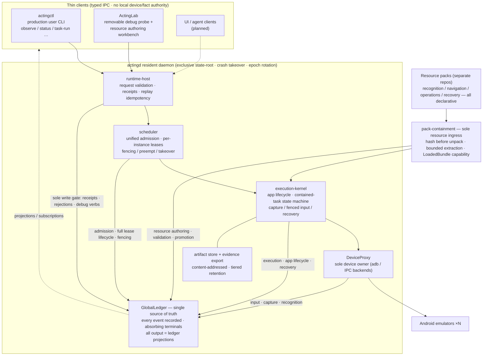

**🌐 语言 / Language:** [简体中文](./README.md) · English

# ActingCommand Runtime

> The **resident Rust runtime** of a multi-game emulator automation framework: a long-lived daemon owns scheduling arbitration, device control and a global event ledger, while all game knowledge lives in declarative resource packs — the runtime kernel contains **zero game logic**. The control plane is a **clean-room Rust implementation** (referencing MaaFramework's behavior and public protocols, **not copying its C++ source**); recognition links **external providers via FFI** (ONNXRuntime / PP-OCR).

`cargo test --workspace` **all green (42 suites / 1200+ tests)** · CI: GitHub Actions (fmt / clippy `-D warnings` / test) · License `AGPL-3.0-only` · Public repository

Early Python mocks, Go legacy contracts and benchmark suites moved to [ActingCommand-Legacy-Runtime](https://github.com/HS7097/ActingCommand-Legacy-Runtime).

---

## 🏛 System shape



## ⚖ Seven structural invariants (enforced by guards, tests and real-process counterexamples)

1. **Scheduler is the sole arbiter**: every device touch is admitted first; leases are issued from one place; fencing, takeover and epoch rotation invalidate stale tokens;
2. **Runtime is the sole device owner**: no raw adb outside DeviceProxy; legacy client device commands are fail-loud tombstones;
3. **GlobalLedger is the single source of truth**: every event is recorded; terminals are absorbing (duplicate/conflicting commits are rejected with an audit fact); clients cannot submit semantic facts;
4. **Containment is the sole resource ingress**: hash verification precedes extraction; the `LoadedBundle` capability makes "unverified pack in use" unrepresentable by construction;
5. **Tasks never spawn tasks**: tasks only publish outcome facts; successor decisions belong to the scheduler;
6. **Lab and resource tooling are removable**: the production-only build (excluding every dev-facing crate) must stay green;
7. **Zero game identity**: production runtime code must not contain concrete game names, coordinates, thresholds or gameplay branches (architecture guards also police test code) — the framework understands *game shapes* (resource pools, pages, tasks), never *game identities*.

## 📦 Components

| Layer | Name | Responsibility |
|---|---|---|
| apps | `actingd` | resident daemon hosting all kernel components below |
| apps | `actingctl` | production user CLI (observe / status / contained task execution) |
| apps | `actinglab` | debug probe + resource authoring (record→draft→build→transactional promote); **not a production dependency** |
| crates | `runtime-host` / `runtime-client` | typed IPC server / client |
| crates | `scheduler` | admission, per-instance leases, queueing, preemption, takeover |
| crates | `execution-kernel` | app lifecycle, contained-task run state machine, recovery |
| crates | `ledger` / `artifact-store` | global event ledger / content-addressed artifacts & evidence export |
| crates | `pack-containment` | resource pack customs (shared by dev and production) |
| crates | `device` / `recognition` / `page-detector` | device backends, template matching (NCC family), page detection; OCR/NN via FFI providers |
| crates | `resource-tooling` | pack building algorithms (Lab / CI / sealed tests only; outside the production dependency graph) |

## 🧭 Design principles

- **Game shape, not game identity**: onboarding a new game = creating one resource repository, with zero runtime commits;
- **Declarations before code**: recognition, navigation, operations, recovery and (planned) scheduling policy are statically validatable data;
- **Fail loud**: severe errors fail explicitly, never fake success; only transient errors may retry within bounds, fully recorded;
- **Clean room**: reference public behavior and protocols, never copy copyrighted implementations;
- **Transactional resource publishing**: staging → full validation → hashing → atomic swap; failures never leave a mixed tree.

## 🚀 Build & run

```bash
cargo build --release
cargo test --workspace

# Start the resident daemon (config declares instances: serial, capture/touch backends, application identity)
actingcommand-actingd --config <config.json>

# Read-only observation of one frame (scheduler-admitted; events and frame artifacts fully recorded)
actingctl observe --state-root <state-root> --instance <alias>

# Execute a contained task package (hash verified before unpacking)
actingctl task-run --state-root <state-root> --instance <alias> \
  --package <task.zip> --expected-sha256 <hash>
```

## 🎮 Resource repositories

Game data (recognition templates, navigation graphs, operation and recovery declarations) is versioned independently of the runtime:

- [ActingCommand-Resources-Arknights](https://github.com/HS7097/ActingCommand-Resources-Arknights)
- [ActingCommand-Resources-AzurLane](https://github.com/HS7097/ActingCommand-Resources-AzurLane)
- [ActingCommand-Resources-BlueArchive](https://github.com/HS7097/ActingCommand-Resources-BlueArchive)

Each repository uses a two-tier layout: `upstream-derived/` (third-party derived material with licenses and provenance) + `ours/` (our own declarative data).

## Conventions & license

- **Clean-room boundary**: the control plane is rewritten from MaaFramework's observable behavior and public protocols without copying its C++ source; OCR/NN recognition is dynamically linked via FFI, keeping the licensing boundary clean;
- **Contribution flow**: changes land via branch + PR with all required CI green before merge;
- License: **AGPL-3.0-only**.
