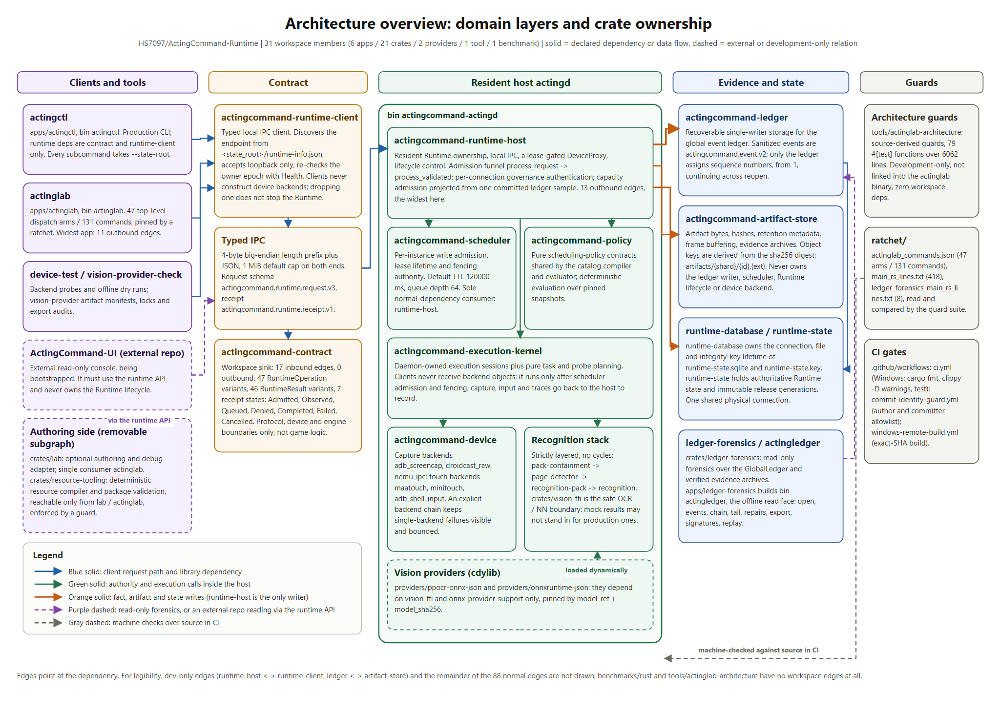
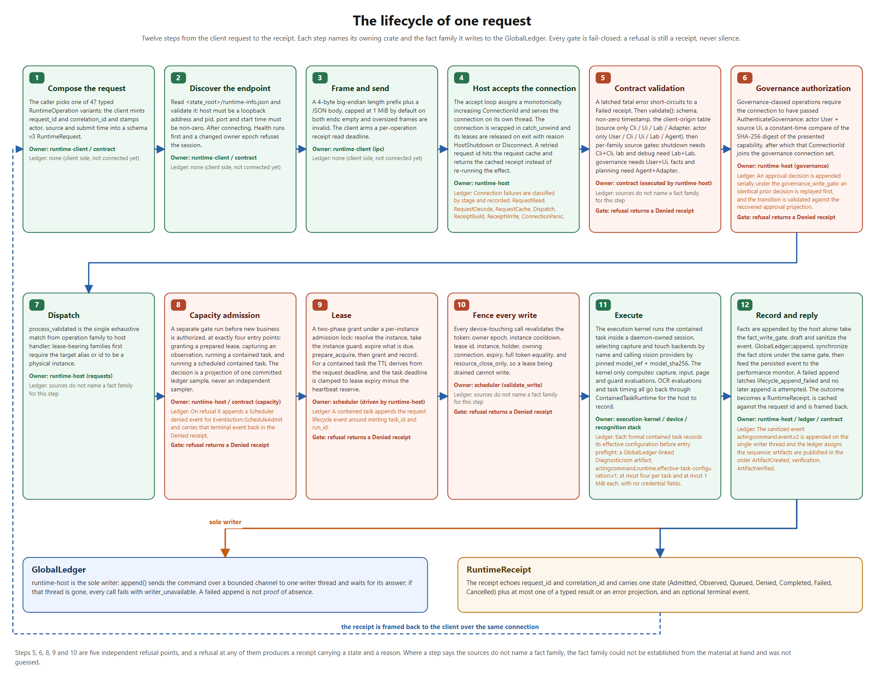
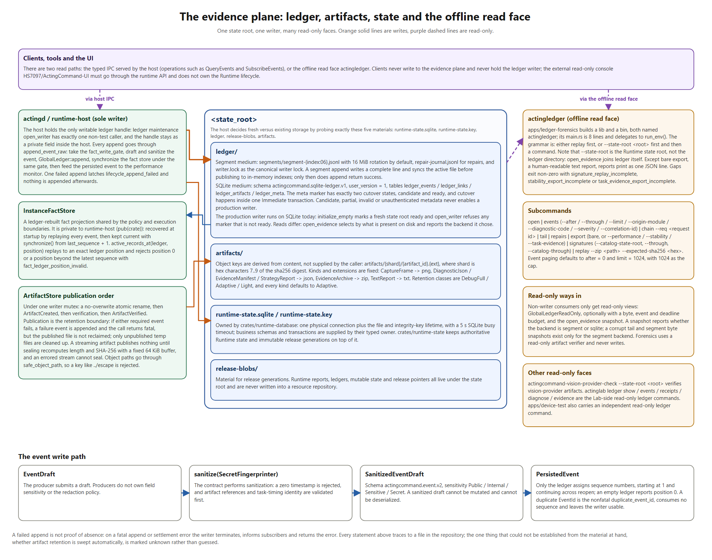

<div align="center">


**Chief Executive Officer & Chairman** — HS7097<br/>
**Chief Technology Officer & Chief Architect** — GPT‑6 Astra<br/>
**Board Secretary & Chief Audit Officer** — Fable 5.1<br/>
**Principal Engineer** — GPT‑6 Astra<br/>
**Interviewing** — DeepSeek

</div>

**🌐 语言 / Language:** [简体中文](./README.md) · English

# ActingCommand Runtime

ActingCommand Runtime is a resident Rust runtime for running multi-target automation on emulators. The kernel carries no identity of any concrete target: contracts, defaults, benchmarks and fixtures are all scanned by guard tests that keep them neutral (`tools/actinglab-architecture/tests/workspace_guards.rs:161`, `:212`). All target knowledge lives as declarative resource packs in separate resource repositories, and the runtime accepts only sealed, hash-verified packs (`actingctl task-run` requires `--package`, plus either `--expected-sha256` or `--package-ref`). The GlobalLedger is the single source of truth, and only runtime-host holds a writable handle to it; a fact must be sanitized by the contract layer into `actingcommand.event.v2` before it may enter the ledger. Device access always goes through a lease granted by the scheduler, and every write revalidates the fence. Every boundary fails closed: invalid configuration, a non-loopback bind, stale evidence and incomplete exports all end in an explicit error or a nonzero exit rather than a silent downgrade.

[CI main status](https://github.com/HS7097/ActingCommand-Runtime/actions/workflows/ci.yml?query=branch%3Amain) (Windows: fmt / clippy `-D warnings` / test) · [Exact-SHA Windows build](https://github.com/HS7097/ActingCommand-Runtime/actions/workflows/windows-remote-build.yml) · License `AGPL-3.0-only` · [Coordination board](https://github.com/HS7097/ActingCommand-Workflow) · [UI console](https://github.com/HS7097/ActingCommand-UI) · [Legacy archive](https://github.com/HS7097/ActingCommand-Legacy-Runtime)

## Architecture overview



`actingcommand-contract` is where the whole workspace converges: 17 packages depend on it, it depends on no workspace package, and it uses only serde, serde_json and sha2. It defines the vocabulary of the protocol, device and engine boundaries, and contains no target logic.

`actingcommand-runtime-client` is the only typed IPC path available to clients. A client never constructs and never owns a production device backend, and closing a UI or CLI client does not stop the runtime.

`actingcommand-runtime-host` owns the resident process. With an out-degree of 13 it is the widest node in the graph. It exclusively holds local IPC, the lease-gated DeviceProxy and lifecycle control, and, among normal (non-dev) dependencies, it is the sole consumer of `actingcommand-scheduler`, `actingcommand-runtime-state` and `actingcommand-host-metrics`.

`actingcommand-scheduler` owns per-instance write admission, lease lifetime and fencing authority, and its only dependency is the contract. `actingcommand-policy` is a pure scheduling-policy contract shared by the catalog compiler and the evaluator. `actingcommand-execution-kernel` holds the daemon-side execution session and pure task/probe decision planning; it is invoked only after the scheduler has admitted the work and fencing has completed, and a client never obtains a backend object.

The device layer `actingcommand-device` selects input through an explicit backend chain, which keeps a single backend failure visible and bounded. The recognition stack is strictly layered and acyclic: `recognition` ← `recognition-pack` ← `page-detector` ← `pack-containment`. `actingcommand-vision-ffi` is the safety boundary for the OCR/NN engines, making it impossible for a caller to quietly substitute a simulated recognition for a production result.

`actingcommand-ledger` provides recoverable single-writer storage for the global event ledger. `actingcommand-artifact-store` owns artifact bytes, hashes, retention metadata, frame buffers and evidence archives, but never owns the ledger writer, the scheduler, the runtime lifecycle or a device backend. `actingcommand-runtime-database` owns the lifetime of the SQLite connection, file and integrity key, while the business schemas are supplied by their own typed owners; `actingcommand-runtime-state` owns the authoritative runtime state and the immutable release generations.

The authoring side is removable: `crates/lab` has exactly one consumer, `apps/actinglab`, and `crates/resource-tooling` is reachable only from lab and actinglab. Both rules have named guard tests. `tools/actinglab-architecture` is a development-only package that derives the architecture guards from source and is linked into no runtime binary.

## How one request travels



1. **Assemble** (`runtime-client`): the caller picks one of 47 typed `RuntimeOperation` variants; the client mints a request_id and a correlation_id and writes the actor, source and submission time, forming an `actingcommand.runtime.request.v3` request.
2. **Discover** (`runtime-client`): the client reads `<state_root>/runtime-info.json` and requires its host to be a loopback address and pid/port/start time to be nonzero; after connecting over TCP it sends Health first, and if the owner epoch no longer matches the one seen at discovery the session is refused with `runtime_owner_epoch_changed`.
3. **Frame** (`runtime-client`): a request goes out as a 4-byte big-endian length prefix plus JSON, with a 1 MiB default cap on both ends, and the receipt read deadline is loaded according to the operation category.
4. **Accept** (`runtime-host`): the accept loop assigns each connection an increasing ConnectionId and serves it on its own named thread; the connection is wrapped in catch_unwind and, on exit, releases that connection's leases under either Disconnect or HostShutdown.
5. **Validate** (`actingcommand-contract`): `RuntimeRequest::validate()` rejects, in order, a wrong schema, a zero timestamp and an actor/source combination outside the allow table, then applies the per-family origin gates: shutdown must be Cli/Cli, Lab and debug must be Lab/Lab, governance must be User/Ui, and facts and planning must be Agent/Adapter. A failure produces a Denied + InvalidRequest receipt.
6. **Authorize** (`runtime-host`): a governance operation additionally requires that the connection has previously passed `AuthenticateGovernance`; the credential is compared as a SHA-256 digest in constant time and, on success, recorded per ConnectionId.
7. **Dispatch** (`runtime-host`): `process_validated` is the single exhaustive match from operation family to handler; a lease-bearing family first asserts that the target alias/ID is a physical instance.
8. **Capacity admission** (`runtime-host`): before authorizing new work the host consults the capacity projection. The projection reads the last committed capacity sample from an in-process cache (each entry carries a reference back to the ledger event), and refuses on a missing sample, an owner epoch change, a sample outside the freshness window, a volume binding change, an unreadable volume or hard-threshold pressure; a refusal appends a Scheduler `denied` event and comes back with the receipt. Four request-side work entry points are protected this way (the same projection also has call sites on non-request paths): granting a lease, collecting an observation, running a contained task and running a scheduled contained task.
9. **Lease** (`scheduler`): the lease is prepared and committed in two phases under the per-instance admission lock; the TTL of a contained task is derived from the deadline of the request itself, and the task deadline is then clamped to lease expiry minus the heartbeat reserve.
10. **Fence every call** (`scheduler`): every single call that touches the device revalidates the token — owner epoch, cooldown, lease position, instance/lease/holder identity, owning connection, expiry, whole-token equality and the resource_close_only state.
11. **Execute** (`execution-kernel`): the kernel runs the contained task under a daemon-owned session, selects the capture and input backends by name and calls the vision provider with a fixed model_ref and model_sha256; every capture, input and trace calls back into the host through `ContainedTaskRuntime`, so the host records the facts, not the kernel.
12. **Record and receipt** (`runtime-host` + `ledger`): the host takes the fact_write_gate, drafts and sanitizes the event, hands it to the ledger's single writer thread to append, synchronizes the fact store and then feeds the performance monitor. The result becomes a `RuntimeReceipt` carrying a status (Admitted / Observed / Queued / Denied / Completed / Failed / Cancelled), cached by request_id and framed back. A refusal is a receipt too; silence is never used in its place.

## The evidence plane



**GlobalLedger** is the single source of truth and runtime-host is its only writer: the writable handle is opened only in `RuntimeHost::start_with_provider` and is held as a private field. A producer submits an `EventDraft`, which must pass `sanitize()` into an immutable, non-deserializable `SanitizedEventDraft` (`actingcommand.event.v2`) before it may enter the ledger; field sensitivity and the redaction policy are decided by the contract, not by the producer. Sequence numbers are assigned by the ledger alone, start at 1 and continue across a reopen. A duplicate EventId is the nonfatal `duplicate_event_id` and consumes no sequence number, whereas a failed append does not mean "the event does not exist" — the writer terminates on a fatal error and notifies its subscribers. The medium the host writes to today is SQLite: schema `actingcommand.sqlite-ledger.v1`, with its tables in the same database as `runtime-state.sqlite`. A brand-new state root has the `ready` marker written directly by `initialize_empty`, and `open_writer` refuses any marker that is not `ready`, so a freshly installed instance runs on SQLite from the start. The segment storage `<state_root>/ledger/segments/segment-NNNNNN.jsonl` (16 MiB rotation by default, whole lines written and fsynced before being published to the in-memory index) is the legacy on-disk form, frozen and imported by the offline `ledger-maintenance` path; a `candidate` or unauthenticated marker never enables the production writer, and the cutover completes inside a single Immediate transaction. The read-only side differs: `open_evidence` picks its backend from the material actually present in the state root and reports in the snapshot whether that backend is segment or sqlite.

**ArtifactStore** owns artifact bytes and hashes. The object key is derived from content rather than specified by the caller: `artifacts/{shard}/{artifact_id}.{ext}`. The publication order is no-overwrite atomic rename → ArtifactCreated → verification → ArtifactVerified; publication is the retention boundary — a failure of either required event appends a failure event and returns a fatal error, but an already published file is not reclaimed and only unpublished temporary files are cleaned up. A streaming artifact publishes nothing until sealing has recomputed its length and SHA-256.

**runtime-state / runtime-database** own the authoritative mutable state and the immutable release generations, landing in `runtime-state.sqlite`, with the integrity key in `runtime-state.key`. At startup the host probes exactly five state-root materials to tell a fresh store from an existing one: `runtime-state.sqlite`, `runtime-state.key`, `ledger`, `release-blobs` and `artifacts`.

**InstanceFactStore** is a fact projection rebuilt from the ledger and private to runtime-host; it recovers at startup by replaying every event and afterwards synchronizes incrementally from last_sequence+1. It can also replay history at an exact ledger position; a position of 0 or one beyond the latest sequence number is refused.

**Offline reads** are served by `actingledger`, which opens only a read-only evidence snapshot and never writes. Its subcommands are `open`, `events`, `chain --req <request-id>`, `tail`, `repairs`, `export` (optionally with `--performance` / `--stability` / `--task-evidence`), `signatures` and `replay`. Except for bare `export`, which prints a human-readable multi-line text report, every report is single-line JSON; when evidence has gaps the report is printed first and the tool then exits nonzero with `signature_replay_incomplete`, `stability_export_incomplete` or `task_evidence_export_incomplete`.

## Invariants and guards

`docs/architecture/runtime-completion-invariants.md` lists nine completion invariants; in short: deterministic replay; replay has no second side effect; loops are budgeted; a clock jump forces a full recomputation; crash recovery rebuilds the same pending set; eligible work does not starve; invalid input fails loudly; unknown is not silently treated as false; every dispatch has a complete reason chain. The same document also draws its evidence scope explicitly: it uses neutral data, fake backends, an accelerated clock, real subprocesses and persistent local state, and does **not** claim real-device, target-client, UI or 48-hour wall-clock validation.

The guard suite lives in `tools/actinglab-architecture/tests/workspace_guards.rs`: 79 `#[test]` functions across 6062 lines. The named guards include `c2_runtime_code_contracts_defaults_and_fixtures_are_project_neutral`, `r2f_product_and_authoring_paths_have_no_builtin_game_identity` (the neutrality scans), `workspace_packages_do_not_depend_on_apps`, `contract_dependencies_stay_within_budget`, `actingcommand_contract_has_no_dependency_path_to_actingcommand_ledger`, `all_non_lab_packages_remain_lab_free_with_all_features`, `production_packages_cannot_reach_resource_tooling`, `dependency_metadata_requests_all_features` and `feature_gated_forbidden_dependency_paths_are_detected`.

Three ratchet files sit in `ratchet/` at the repository root: `actinglab_commands.json` (schema `actingcommand.command-inventory.v1`, 47 top-level dispatch arms / 131 commands / 8 pipeline exemptions), `main_rs_lines.txt` (`418`) and `ledger_forensics_main_rs_lines.txt` (`8`). The guard tests `command_inventory_matches_checked_in_snapshot`, `main_rs_line_ratchet_matches_checked_in_baseline` and `forensic_leaf_dependency_boundary_is_narrow_and_production_free` read them respectively.

There are three CI workflows in total. `ci.yml` runs `cargo fmt --all -- --check`, `cargo clippy --workspace --all-targets --keep-going -- -D warnings` and `cargo test --workspace --no-fail-fast` on windows-latest. `commit-identity-guard.yml` runs on ubuntu-latest and requires the author **and** committer email of every commit in the pushed or PR range to fall inside an exact eight-entry allowlist (two noreply forms for each of the three accounts HS7097 / HS7097Agt / HS7097ViW, one registered mailbox address, and the GitHub web committer `noreply@github.com`), failing otherwise. `windows-remote-build.yml` parses and re-checks a 40-character lowercase SHA and then runs `cargo build --locked --release --target x86_64-pc-windows-msvc`, producing two artifacts, each with a `BUILD-MANIFEST.json`.

## Workspace members

The workspace declares 30 members, resolver `3`, a workspace-level edition of 2024, all `publish = false`.

### apps (6)

| Path | Package | Output | Responsibility |
| --- | --- | --- | --- |
| apps/actingctl | actingcommand-actingctl | bin `actingctl` | Lean production CLI for correlation-scoped runtime flows |
| apps/actingd | actingcommand-actingd | bin `actingcommand-actingd` | Lean process adapter for the resident runtime |
| apps/actinglab | actingcommand-actinglab | bin `actinglab` | Authoring and debugging CLI, 47 top-level dispatch arms, 131 commands |
| apps/device-test | actingcommand-device-test | bin `actingcommand-device-test` | Device backend probing, offline dry-run planning, page/recognition evaluation |
| apps/ledger-forensics | actingledger | lib + bin `actingledger` | Read-only front end for ledger forensic reports, replay and the signature catalog |
| apps/vision-provider-check | actingcommand-vision-provider-check | bin | Verifies vision provider artifact manifests, emits artifact locks and export audits |

### crates (21)

| Path | Package | Responsibility |
| --- | --- | --- |
| crates/actingcommand-contract | actingcommand-contract | Contract definitions for the protocol, device and engine boundaries; no target logic |
| crates/artifact-store | actingcommand-artifact-store | Artifact bytes, hashes, retention metadata, frame buffers and evidence archives |
| crates/device | actingcommand-device | Device-layer primitives; input selected through an explicit backend chain |
| crates/execution-kernel | actingcommand-execution-kernel | Daemon-owned execution sessions and pure task/probe decision planning |
| crates/host-metrics | actingcommand-host-metrics | Safe boundary for platform performance counters (windows-sys only under cfg(windows)) |
| crates/lab | actingcommand-lab | Optional authoring and debugging adapter layer; production still builds and runs without it |
| crates/ledger | actingcommand-ledger | Recoverable single-writer storage for the global runtime event ledger |
| crates/ledger-forensics | actingcommand-ledger-forensics | Read-only forensics over the GlobalLedger and verified evidence archives |
| crates/onnx-provider-support | actingcommand-onnx-provider-support | Provider-side ORT lifetime: idempotent init, cancellable watchdog, session cache |
| crates/pack-containment | actingcommand-pack-containment | Loads and verifies sealed resource packs, including projection and recognition metadata checks |
| crates/page-detector | actingcommand-page-detector | Evaluates declarative page sets against recognition results |
| crates/policy | actingcommand-policy | Pure scheduling-policy contract shared by the catalog compiler and the evaluator |
| crates/recognition | actingcommand-recognition | Low-level image and template matching primitives; no workspace dependency |
| crates/recognition-pack | actingcommand-recognition-pack | Parses declarative recognition packs and dispatches targets to vision providers |
| crates/resource-tooling | actingcommand-resource-tooling | Deterministic resource compilation and pack validation; no device/scheduler/runtime authority |
| crates/runtime-client | actingcommand-runtime-client | Typed local IPC client; owns no production device backend |
| crates/runtime-database | actingcommand-runtime-database | Runtime-owned lifetime of the SQLite connection, file and integrity key |
| crates/runtime-host | actingcommand-runtime-host | Resident runtime ownership, local IPC, lease-gated DeviceProxy and lifecycle |
| crates/runtime-state | actingcommand-runtime-state | SQLite-backed authoritative runtime state and immutable release generations |
| crates/scheduler | actingcommand-scheduler | Per-instance write admission, lease lifetime and fencing authority |
| crates/vision-ffi | actingcommand-vision-ffi | Safe FFI boundary for OCR/NN engines |

### providers (2)

| Path | Package | Output | Responsibility |
| --- | --- | --- | --- |
| providers/onnxruntime-json | actingcommand-onnxruntime-json-provider | cdylib + rlib | ONNXRuntime-backed NN JSON ABI provider, exports `ac_onnxruntime_classify_json` |
| providers/ppocr-onnx-json | actingcommand-ppocr-onnx-json-provider | cdylib + rlib | ONNXRuntime-backed PPOCR ROI recognizer, exports `ac_fastdeploy_ppocr_read_text_json`; ships no models or runtime DLLs |

### tools (1) and benchmarks (1)

| Path | Package | Output | Responsibility |
| --- | --- | --- | --- |
| tools/actinglab-architecture | actingcommand-actinglab-architecture | lib | Source-derived architecture guards; development only, linked into no runtime binary |

## Device and recognition

Capture backends exist by name: `fixture_simulation`, `adb_screencap`, `adb_screencap_encode`, `adb_screencap_raw_gzip`, `droidcast_raw`, `nemu_ipc`, with selectable values `auto`, `auto-fastest`, `adb`, `droidcast_raw` and `nemu_ipc`. The input backends are `maatouch`, `minitouch` and `adb_shell_input`, with selectable values `auto`, `auto-fastest`, `maatouch`, `minitouch` and `adb_shell_input`. The Nemu IPC capture backend is implemented inside the crate and carries its own worker thread. Vendor stdio is captured in bounded, explicitly closed sessions that report a resource-quiescence state.

Recognition targets come in five kinds: Template, Color, ClickOnly, Ocr and Nn. Template matching is CPU image matching with an explicit 5-second timeout and a two-stage coarse-match/refine structure; a timeout failure reports which stage it occurred in. Production OCR and NN are reachable only through the `vision-ffi` boundary into two separate cdylib providers, and the host-side adapter enforces provider identity: `model_ref` must be a bounded logical identifier containing no `/`, `\` or `:` (host paths are not accepted), and `model_sha256` must be exactly 64 lowercase hexadecimal characters. Page projection is a side-effect-free projection of the resolved facts of a single frame, schema `actingcommand.page-projection.v1`, capped at 64 entries / 32 KiB, with entries keyed by role (Navigate / PageOp / ControlPoint), task ID, resource ID and page, each entry carrying a Safety classification that defaults to Dangerous; OCR field declarations under operation schema `0.8` go through `post_admission_ocr.mode = fields_v1`, field declarations cannot be mixed with the older truth-set declarations, and this contract contains no target-proprietary value (`contracts/ocr-fields.md`, `contracts/page-projection.md`).

## Build and run

The `build.rs` of `apps/actinglab` reads Git metadata to determine HEAD. When Git metadata is available and `ACTINGCOMMAND_RUNTIME_HEAD` is also set, it must be 40 hexadecimal characters and must match the repository HEAD, or the build panics; when Git metadata is unavailable (a source tree with no `.git`, for example), that variable is required.

A normal `actingd` invocation accepts only the two arguments `--config <path>`; anything else is `usage_invalid`. The config schema is `actingcommand.actingd.config.v1`, capped at 1 MiB, and rejects unknown fields; `bind_host` must resolve to an IP **and** must be a loopback address, and `secret_fingerprint_salt` must be 16..=1024 bytes. For both `actingctl` and `actingledger`, `--state-root` means the runtime state root, not the `ledger` directory.

```bash
# Local build; the three gate commands below are identical to CI (CI's release build additionally uses --locked and an explicit MSVC target)
cargo build --release
cargo fmt --all -- --check
cargo clippy --workspace --all-targets --keep-going -- -D warnings
cargo test --workspace --no-fail-fast

# Start the resident daemon; on success stdout prints actingd ready pid=<pid> host=<host> port=<port>
actingcommand-actingd --config runtime.json

# Clients (the subcommand must be the first argument, flags come after it; every command needs --state-root)
actingctl status --state-root <state-root>
actingctl monitor-status --state-root <state-root>
actingctl observe --state-root <state-root> --instance <alias>
actingctl reset --state-root <state-root> --instance <alias>
actingctl stream --state-root <state-root> --instance <alias> --max-frames 8 --interval-ms 250
actingctl monitor-set --state-root <state-root> --instance <alias> --interval-ms 30000 --expect home --recover
actingctl monitor-clear --state-root <state-root> --instance <alias>
actingctl task-run --state-root <state-root> --instance <alias> --package <pkg.zip> --expected-sha256 <hex>
actingctl request-shutdown --state-root <state-root>

# Read-only forensics (same state root)
actingledger --state-root <state-root> open
actingledger --state-root <state-root> events --after 0 --limit 200
actingledger --state-root <state-root> chain --req <request-id>
actingledger --state-root <state-root> tail
actingledger --state-root <state-root> repairs
actingledger --state-root <state-root> export --task-evidence --after 0 --limit 1024
actingledger replay --zip <evidence.zip> --expected-sha256 <hex>

# Offline ledger maintenance (assembles no providers, IPC or devices)
actingcommand-actingd ledger-maintenance backup  --config runtime.json --backup frozen-backup
actingcommand-actingd ledger-maintenance dry-run --config runtime.json --backup frozen-backup
actingcommand-actingd ledger-maintenance verify  --config runtime.json

# Vision provider artifact check
actingcommand-vision-provider-check --state-root <state-root> --limit 256
actingcommand-vision-provider-check --manifest provider.json --backend all --require-existing
```

Note: the daemon binary cargo produces is named `actingcommand-actingd`; the short names are `actingctl`, `actinglab`, `actingledger`.

## Current boundaries (2026-09-13)

- All evidence for the completion invariants comes from constructive tests runnable in CI, using neutral data, fake backends, an accelerated clock and real subprocesses. Real-device validation, target-client validation, UI validation and 48-hour wall-clock validation are **not** within the scope of those claims.
- Device backends exist by name and are selectable, but this repository carries no real-device acceptance evidence; any real-device conclusion has to state its backend, resource pack and boundary separately.
- The ledger medium migration is in flight: the host's production writer already runs on the SQLite medium only, and segment storage is retained as an import source — the offline `ledger-maintenance` path is responsible for freezing and importing an existing segment directory. The segment read face and the segment byte snapshots are still in the code; their retirement is scheduled for a later stage.
- Artifact retention has exactly three values, DebugFull / Adaptive / Light, and defaults to Adaptive; no automatic cleanup implementation was found in this repository, so do not assume automatic reclamation exists.
- The UI is an external read-only console, at an early stage in a separate repository; it must go through the runtime API and must not own the runtime lifecycle.
- Only the daemon side of the agent surface is built: `runtime-host` has an `AgentDispatcher` (wake records, session start/stop and bounded management) that can be enabled from the `agent_dispatcher` section of the `actingd` config, and `actingctl agent-publish-facts` is an existing Agent/Adapter origin entry point. This repository contains no external agent client, and automatic wake-up, autonomous exploration and the complete self-maintenance loop are not built yet.

## Related repositories and collaboration

| Repository | Role |
| --- | --- |
| [HS7097/ActingCommand-Workflow](https://github.com/HS7097/ActingCommand-Workflow) | Coordination board; work starts from an issue here |
| [HS7097/ActingCommand-Resources-Arknights](https://github.com/HS7097/ActingCommand-Resources-Arknights) | Resource repository |
| [HS7097/ActingCommand-Resources-BlueArchive](https://github.com/HS7097/ActingCommand-Resources-BlueArchive) | Resource repository |
| [HS7097/ActingCommand-Resources-AzurLane](https://github.com/HS7097/ActingCommand-Resources-AzurLane) | Resource repository |
| [HS7097/ActingCommand-UI](https://github.com/HS7097/ActingCommand-UI) | External read-only console, at an early stage |
| [HS7097/ActingCommand-Legacy-Runtime](https://github.com/HS7097/ActingCommand-Legacy-Runtime) | Archive of the historical Go interface |

Identities: HS7097 is the owner and arbitrator; HS7097Agt is the implementer account; HS7097ViW is the acceptance account. The `commit-identity-guard` workflow requires the author and committer email of every commit to fall inside an exact eight-entry allowlist: two noreply forms for each of these three accounts, one registered mailbox address, and the GitHub web committer `noreply@github.com`.

Merges to main are performed only by the owner. The order for submitting work is: open an issue on the board repository first, then open a branch and a PR here, and once all required CI passes, stop in a mergeable state and wait for the owner. Runtime reports, the ledger, mutable state and release pointers are all written under the runtime state root, never back into a resource repository.

## License

`AGPL-3.0-only`. Full text in [LICENSE](./LICENSE). Third-party material in [NOTICE.md](./NOTICE.md).
