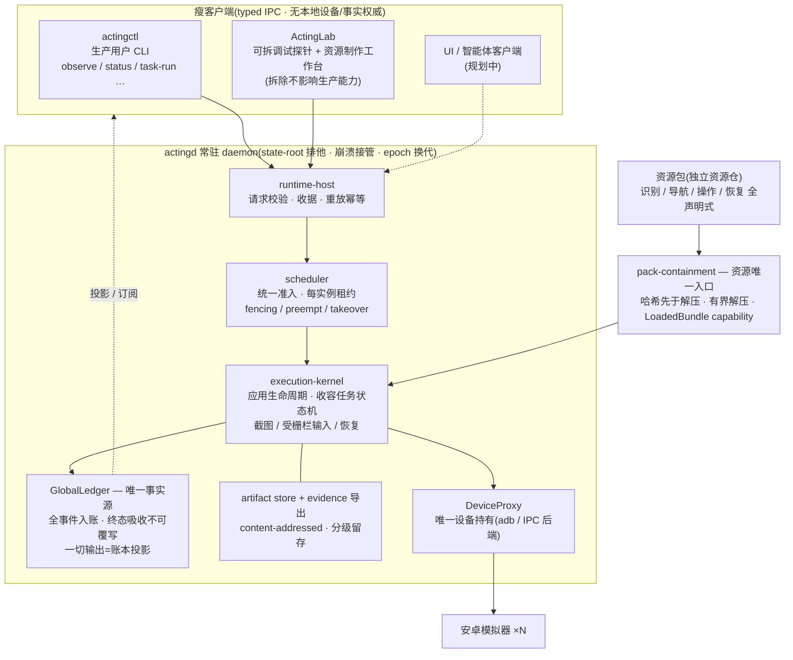

**🌐 语言 / Language:** 简体中文 · [English](./README.en.md)

# ActingCommand Runtime

> 多游戏模拟器自动化框架的 **Rust 常驻运行时**:一个长驻 daemon 承载调度仲裁、设备控制与全局事件账本;游戏知识全部外置于声明式资源包,运行时内核**零游戏逻辑**。控制面为**净室 Rust 实现**(参照 MaaFramework 的行为与公开协议,**不复制其 C++ 源码**);识别面经 **FFI 链接外部 provider**(ONNXRuntime / PP-OCR)。

`cargo test --workspace` **全绿(42 套件 / 1200+ 用例)** · CI:GitHub Actions(fmt / clippy `-D warnings` / test)· 许可 `AGPL-3.0-only` · 公开仓库

早期的 Python mock、Go 历史契约与基准套件已迁出至 [ActingCommand-Legacy-Runtime](https://github.com/HS7097/ActingCommand-Legacy-Runtime)。

---

## 🏛 系统形态



## ⚖ 七条结构不变量(守卫 / 测试 / 真实进程反例执法)

1. **调度器唯一仲裁**:一切设备触碰先准入;租约唯一签发;fencing、takeover 与 epoch 换代作废旧牌;
2. **Runtime 唯一设备持有**:DeviceProxy 之外无 raw adb;客户端历史设备命令一律 fail-loud 墓碑;
3. **GlobalLedger 唯一事实源**:全事件入账;终态为吸收态(重复/冲突提交被拒并留审计事实);客户端不可提交语义事实;
4. **收容为资源唯一入口**:哈希校验先于解压;`LoadedBundle` capability 按构造使"未校验包被使用"不可表示;
5. **任务不得唤起任务**:任务只发布产出事实,后继决策归调度器;
6. **Lab 与资源工具链可拆**:排除全部开发面 crate 的 production-only 构建必须全绿;
7. **零游戏身份**:运行时生产代码禁止出现具体游戏名称、坐标、阈值与玩法分支(架构守卫含测试代码一并执法)——框架只认"游戏形状"(资源池、页面、任务),不认"游戏身份"。

## 📦 组件

| 层 | 名称 | 职责 |
|---|---|---|
| apps | `actingd` | 常驻 daemon,承载下列全部内核组件 |
| apps | `actingctl` | 生产用户 CLI(观察 / 状态 / 收容任务执行) |
| apps | `actinglab` | 调试探针 + 资源制作(录制→草稿→构包→事务化发布);**非生产依赖** |
| crates | `runtime-host` / `runtime-client` | typed IPC 服务端 / 客户端 |
| crates | `scheduler` | 准入、每实例租约、队列、抢占、接管 |
| crates | `execution-kernel` | 应用生命周期、收容任务运行状态机、恢复 |
| crates | `ledger` / `artifact-store` | 全局事件账本 / 内容寻址工件与证据导出 |
| crates | `pack-containment` | 资源包海关(开发与生产共用) |
| crates | `device` / `recognition` / `page-detector` | 设备后端、模板识别(NCC 族)、页面检测;OCR/NN 经 FFI provider |
| crates | `resource-tooling` | 造包算法(仅供 Lab / CI / 密封测试,不进生产依赖图) |

## 🧭 设计原则

- **游戏形状,而非游戏身份**:接入新游戏=新建一个资源仓,运行时零提交;
- **声明先于代码**:识别、导航、操作、恢复、(规划中的)调度策略全部为可静态校验的声明数据;
- **fail-loud**:严重错误显式失败,不返回伪成功;仅暂态错误允许有界重试并完整入账;
- **净室**:参照公开行为与协议,不复制受版权保护的实现;
- **事务化资源发布**:staging→全量验证→哈希→原子替换,失败不留混合树。

## 🚀 构建与运行

```bash
cargo build --release
cargo test --workspace

# 启动常驻 daemon(配置文件声明实例:序列号、截图/触控后端、应用标识)
actingcommand-actingd --config <config.json>

# 只读观察一帧(经调度器准入,事件与帧工件全部入账)
actingctl observe --state-root <state-root> --instance <alias>

# 执行一个收容任务包(哈希校验先于解压)
actingctl task-run --state-root <state-root> --instance <alias> \
  --package <task.zip> --expected-sha256 <hash>
```

## 🎮 资源仓

游戏数据(识别模板、导航图、操作与恢复声明)独立于运行时版本化:

- [ActingCommand-Resources-Arknights](https://github.com/HS7097/ActingCommand-Resources-Arknights)
- [ActingCommand-Resources-AzurLane](https://github.com/HS7097/ActingCommand-Resources-AzurLane)
- [ActingCommand-Resources-BlueArchive](https://github.com/HS7097/ActingCommand-Resources-BlueArchive)

各仓采用 `upstream-derived/`(第三方派生素材,含许可证与出处)+ `ours/`(自有声明数据)两层布局。

## 约定与许可

- **净室边界**:控制面参照 MaaFramework 行为与公开协议重写,不复制其 C++ 源码;识别面 OCR/NN 经 FFI 动态链接外部 provider,许可边界干净;
- **贡献流程**:默认经分支 + PR 合入,全部必需 CI 通过后方可合并;
- 许可:**AGPL-3.0-only**。
