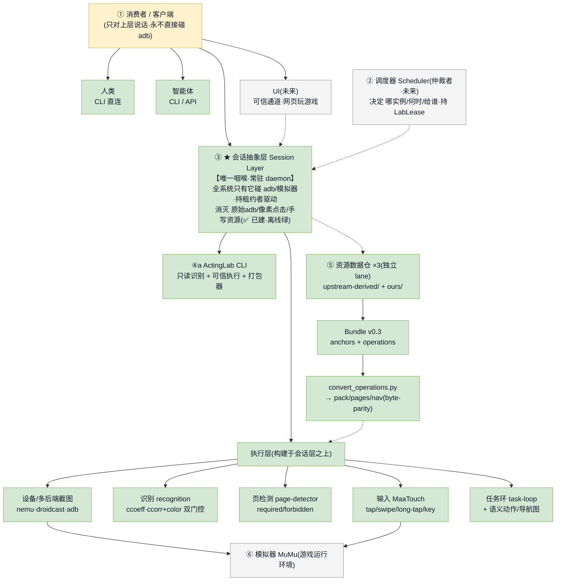
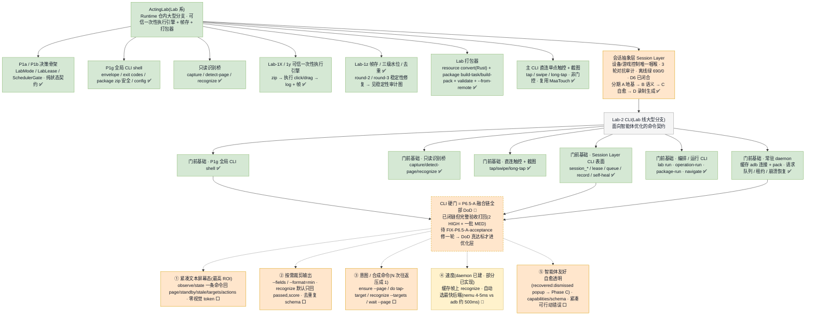
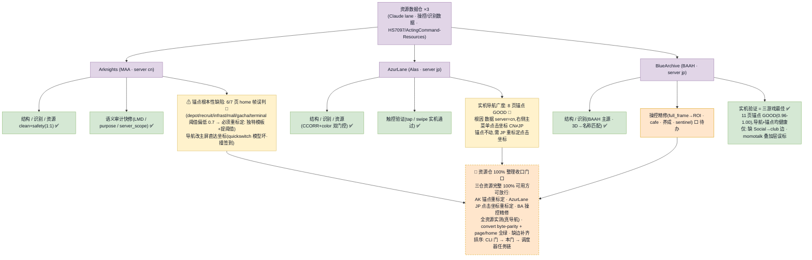
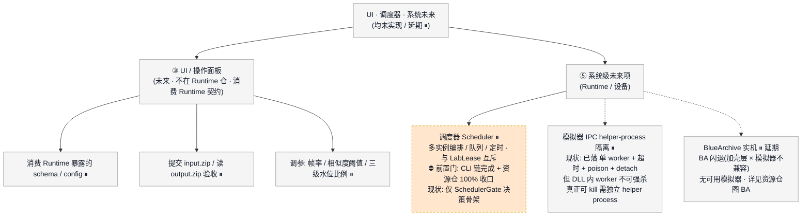

**🌐 语言 / Language:** 简体中文 · [English](./README.en.md)

# ActingCommand Runtime

> 多游戏自动化框架的 **Rust 主线运行时**。控制面为**净室 Rust 重写**(参照 MaaFramework 的行为与公开协议,**不复制其 C++ 源码**);识别面通过 **FFI 链接外部 provider**(ONNXRuntime / PP-OCR)。

`cargo build --release` ✅ · `cargo test --workspace` **791 passed / 0 failed** · 许可 `AGPL-3.0-only` · 公开仓库

早期的 Python `AliceRuntimeOrchestrator` mock、Go 历史契约与基准套件已迁出至 [ActingCommand-Legacy-Runtime](https://github.com/HS7097/ActingCommand-Legacy-Runtime)。

---

## 🧭 主链门控排序

```mermaid
graph LR
  a1["P6.4 会话抽象层"]
  a2["P6.5-A MAA 融合链<br/>已闭链 · 验收打回"]
  g1["CLI 硬门<br/>P6.5-A 全部 DoD"]
  a3["Lab-2 CLI 智能体优化层"]
  g2["资源仓 100% 整理收口门"]
  a4["调度器任务链"]

  a1 --> a2
  a2 --> g1
  g1 -.-> a3
  a3 --> g2
  g2 -.-> a4

  classDef done fill:#d5e8d4,stroke:#82b366,color:#111827;
  classDef wip fill:#fff2cc,stroke:#d6b656,color:#111827;
  classDef todo fill:#ffe6cc,stroke:#d79b00,color:#111827;
  classDef future fill:#f5f5f5,stroke:#999999,color:#111827;
  classDef gate fill:#ffe6cc,stroke:#d79b00,color:#111827,stroke-dasharray:5 3;

  class a1 done;
  class a2 wip;
  class g1 gate;
  class a3 todo;
  class g2 gate;
  class a4 future;
```



> 图例:✅ 已完成 · 🔄 进行中 / 打回 · ⬜ 待办 · ⏸ 延期 / 未来 · 🚧 硬门

---

## 📌 当前进度(2026-07)

- **P6.5-A · MAA 框架融合链已闭链**(commit `aea10a4`):设备执行(触控分级回退 / minitouch / 截图 autotune / 设备发现 / 录制回放)、声明式自愈图执行器、FeatureMatch、项目接口装配,以及 OCR / NN 识别(经 FFI 链接外部 provider)全部落地。
- **健康**:`cargo build --release` 通过 · `cargo test --workspace` = **791 passed / 0 failed / 0 ignored**。
- **完整验收结论:暂不签收(很接近)** —— 链 code-complete、控制"唯一咽喉"守住、FFI 入口已有 `catch_unwind`;但尚有 **2 个确定性 HIGH + 一批 MED** 缺陷、且 A2 的"运行中卡死→切后端"决策算出却未真正驱动,建议修一轮后签收(详见「稳定性审计」)。多数缺陷因识别 / 设备发现模块尚未接入运行时轮询,当前影响面小 = 接线前应还的健壮性债。

---

## 🏛 总架构 —— 唯一咽喉



**会话抽象层 Session Layer 是全系统的唯一咽喉**:只有它触碰模拟器 / adb;持租约者驱动;目标是消灭"原始 adb + 像素点击 + 手写资源"。上层(人类 CLI / 智能体 / 未来 UI)与调度器都经它下达;识别、截图、页检测、输入、任务环等执行层构建其上;资源数据仓为独立 lane。

---

## 🧱 Runtime 主线

```mermaid
graph TD
  R["① Runtime 主线<br/>(HS7097/ActingCommand-Runtime)"]

  R --> m1["P1.6 输入后端 MaaTouch ✅<br/>附属: device/maatouch (随 P2.2-Lab-1y)"]
  R --> m2["P2 / P2.1 / P2.1.1 截图基础 ✅<br/>(ADB screencap + 存储 + artifact 路径安全)"]
  R --> m3["P2.2 多后端 adb / droidcast_raw / nemu_ipc ✅<br/>附属: Lab-1y capture-backends · capture-backend-fixes (wchar/旋转)"]
  R --> m4["P2.3 截图管线: 原始帧 + 编码后置 ✅<br/>(release nemu capture-only 4-5ms)"]
  R --> m5["P2.x nemu DLL stdout 隔离 (严格机器可读 JSON) ⬜ 待办<br/>附属: 暂无任务文件 (CHECKPOINT 残留项)"]
  R --> m6["P4 识别引擎 CCOEFF / CCORR+color ✅<br/>附属: P4a · P4a.1 score-semantics · P4b/CONTRACT-P4b · P4c realdata · P4c-fixup"]
  R --> m7["P5 页检测 page-detector + detect-page CLI ✅<br/>附属: P5b-2 detect-page-cli"]
  R --> m8["P5c / P6a operation dry-run ✅<br/>附属: P5c-and-P6a-dry-run"]
  R --> m9["P6 任务环 / 探针 / live 验证 / benchmark / 多实例 ✅<br/>附属: P6b-P6c-P6d probe-loop · live-validation · P6d-P6e · P6e benchmark"]
  R --> mP64["P6.4 会话抽象层 Session Layer 并入主线 ✅<br/>唯一咽喉 · 常驻 daemon (P6 与 P6.5-A 之间)<br/>全系统只有它碰 adb/模拟器 · 持租约者驱动<br/>D6 已闭合 = MAA 采纳模块 A (Transceiver socket 握手)"]
  R --> mMAA["P6.5-A MAA 框架融合链 ✅ 代码完成闭链 (close chain)<br/>🔄 完整验收打回待修 (2 HIGH + 一批 MED · 见⑤稳定性审计)<br/>识别线: P0 OCR(PaddleOCR/FastDeploy) · P1 FeatureMatch(SIFT/AKAZE/ORB) · P2 NN+YOLOv8(ONNX)<br/>编排/接口: Pipeline 任务图 · ProjectInterface · Agent IPC (ZMQ)<br/>SL 非目标必借 · FFI 动态链接 LGPL→AGPL 干净"]
  R -.-> m10["调度器 Scheduler ⏸ 未来<br/>(多实例编排 / 队列 / 定时 · 与 LabLease 互斥)<br/>附属: 仅 SchedulerGate 决策骨架 · 详见「UI-调度器-未来」图"]

  m7 -.-> mFF["✅ full_frame 模板匹配挂死 修复 (已验收)<br/>金字塔 coarse-to-fine + 积分图 + 5s deadline<br/>对抗验收: 62/62 无挂 (max 307ms) · detect-page 20 页 634ms<br/>残留(非阻塞): H1 pyramid top-4 漏检 · H2 evaluate_all 短路"]

  mMAA --> a1["A readiness→socket = D6 闭合 ✅"]
  mMAA --> a11["A1 触控 fallback + P0 错误分类 ✅<br/>(shared 校验 + 8 入口零绕过)"]
  mMAA --> a111["A1.1 minitouch ✅"]
  mMAA --> a2["A2 截图 autotune ✅<br/>⚠ freshness 运行中 switch 决策算出未驱动"]
  mMAA --> a3["A3 设备发现 ✅<br/>⚠#1 file_name().is_some() 死回退待修"]
  mMAA --> a4["A4 录制回放 ✅"]
  mMAA --> aB["B on_error / wait_freezes 自愈图 ✅"]
  mMAA --> aE["E FeatureMatch gate ✅"]
  mMAA --> aO1["O1 ProjectInterface 装配 ✅"]
  mMAA --> aR["R1/R3 OCR/NN = FFI 外部 provider ✅<br/>(onnxruntime-json + ppocr-onnx-json)"]
  mMAA -.-> reject["⚠ 完整验收打回<br/>2 HIGH (A3 死回退 · PE 解析器 u32 溢出)<br/>+ 一批 MED (provider 线程泄漏/TOCTOU · 门工具不设防 · O1 校验漏项)<br/>详见⑤稳定性审计图"]

  R -.-> mFix["↪ Runtime 侧稳定性修复<br/>(FIX-P2.2 设备/FFI · FIX-P2.3 nemu 性能)<br/>见「任务树-5-稳定性审计」图"]

  classDef done fill:#d5e8d4,stroke:#82b366,color:#111827;
  classDef wip fill:#fff2cc,stroke:#d6b656,color:#111827;
  classDef todo fill:#ffe6cc,stroke:#d79b00,color:#111827;
  classDef future fill:#f5f5f5,stroke:#999999,color:#111827;
  classDef gate fill:#ffe6cc,stroke:#d79b00,color:#111827,stroke-dasharray:5 3;
  classDef root fill:#dae8fc,stroke:#6c8ebf,color:#111827;

  class R,mFix root;
  class m1,m2,m3,m4,m6,m7,m8,m9,mP64,mFF,a1,a11,a111,a2,a3,a4,aB,aE,aO1,aR done;
  class mMAA wip;
  class m5 todo;
  class m10,reject future;
```



---

## 🧪 ActingLab + Lab-2 CLI(Lab 线大型分支)



**门前已建基础(现状已完成 ✅)**:全局 CLI shell、只读桥、直连触控、Session Layer 全套子命令、编排 / 运行命令、常驻 daemon。
**CLI 硬门** = P6.5-A 融合链全部 DoD(现闭链但验收打回,待修一轮)。
**门后待做(面向智能体优化 ⬜)**:① 紧凑文本屏幕态(取代截图读图)② 按需裁剪输出 ③ 意图 / 合成命令(多往返压成一次)④ 速度(daemon 已建、部分已实现 🔄)⑤ 智能体友好(自愈透明、可行动错误)。

---

## 🎮 资源数据仓 ×3



三仓已重组为 `upstream-derived/` + `ours/`,资产目录全量下载。**🚧 资源仓 100% 整理收口门**:三仓资源完整 100% 可用(锚点重标定 + JP 坐标 + 操控精修 + 全资源实测)后,方可进入调度器任务链。

---

## 🖥 UI · 调度器 · 系统未来



---

## 🛡 稳定性审计 · 本轮验收

```mermaid
graph TD
  root["⑤ 稳定性审计 + 修复<br/>跨 Runtime + ActingLab · 多轮高压对抗审计"]

  au["全任务稳定性审计 ✅<br/>33 agent · 确认 21 漏洞 · 产出 4 份 FIX + Lab-1z round-2<br/>根因: 外部边界调用无 deadline → 挂死占 LabLease · nemu 堆溢出 · 资源泄漏 · 账务漂移"]

  gr["Lab-1z 帧存修复轮次<br/>frame_store 账务/水位/spill"]
  r1["round-1 任务边界修正版 ✅<br/>13 bug → 16 项: 生命周期/admission/segment-flush/T3 resume/timeout"]
  r2["round-2 稳定性 ✅<br/>账务原子/spill 隔离/thumbnail/reserve/删 timeout"]
  r3["round-3 回归收尾 ✅<br/>结构化错误带 frame_failures · run_dir 成功才清 · Drop 单调<br/>验收: 51+33 测试绿 · 真机零 panic · nemu 3-5ms"]

  gf["按序列号 FIX 指南<br/>round-2 整批已实现 ✅"]
  f1["FIX-P2.2 设备层 ✅<br/>nemu 堆溢出→probe+resize · 单 worker+poison · droidcast 僵尸 · 有界读"]
  f2["FIX-P2.3 nemu 截图性能 ✅<br/>33ms 是 debug 假象 · release capture-only 4-5ms 达标"]
  f3["FIX-Lab-1y 执行引擎 ✅<br/>部分 zip · zip 炸弹 · git 超时 · 危险扩展名 · run_dir 清理"]
  f4["FIX-P1g CLI/包校验 ✅<br/>zip 炸弹 · unreachable→Err · hash 路径净化 · list_runs warnings"]

  adb["⭐ ADB 连接加固 ✅<br/>统一 device 层 adb 发现/env/config · 不 kill-server · 一次有界重连 · screencap 超时<br/>实测 tap + standalone capture 稳定; 残留脏 server 为 adb 自带非可控"]

  sl["⭐ Session Layer 对抗审计 3 轮 🟠<br/>10~23 agent/轮 · 双探针 · 跟修 D1–D9 + B0 + B1 (离线绿 682/0)<br/>🔴 唯一阻断 D6 = 就绪信号可伪造(进程身份未绑) · 余 D5/D7/D3/D9/D4 低-中残留"]

  p65["⭐ P6.5-A 闭链完整验收对抗审计 🔄<br/>90 agent · 2 探针反驳 · build 绿 · 791/0 · 断电镜洁净 · CLI 门守住<br/>全程只读审计,未代改  · 待写 FIX-P6.5-A-acceptance"]

  must["🔴 必修 (2项)<br/>discovery file_name().is_some() 恒真 → nx_main 回退死代码<br/>vision PE 导出解析器 unchecked u32 溢出"]
  should["🟠 应修 (一批)<br/>provider terminate 泄漏 detached 线程 · ensure_ort TOCTOU · 静默选错 DLL<br/>ppocr Session 每调用重建 · 门工具不设防(锁不比对/退出码恒0)"]
  harden["🟡 硬化 / 威胁模型内<br/>recovery 环误判 MaxAttempts · take_owned_buffer 信 provider len<br/>manifest 路径不挡 ../ · powershell 枚举无超时"]

  root --> au
  root --> gr
  root --> gf
  root --> adb
  root --> sl
  root --> p65

  gr --> r1
  gr --> r2
  gr --> r3

  gf --> f1
  gf --> f2
  gf --> f3
  gf --> f4

  p65 --> must
  p65 --> should
  p65 --> harden

  classDef done fill:#d5e8d4,stroke:#82b366,color:#111827;
  classDef wip fill:#fff2cc,stroke:#d6b656,color:#111827;
  classDef todo fill:#ffe6cc,stroke:#d79b00,color:#111827;
  classDef future fill:#f5f5f5,stroke:#999999,color:#111827;
  classDef gate fill:#ffe6cc,stroke:#d79b00,color:#111827,stroke-dasharray:5 3;

  class root,au,r1,r2,r3,f1,f2,f3,f4,adb done;
  class sl todo;
  class p65,should wip;
  class must gate;
  class harden future;
  class gr,gf done;
```



**本轮 · P6.5-A 闭链完整验收(多智能体对抗审计 · 暂不签收)**,去重校准后:

- **🔴 必修(确定性)**:设备发现的 adb 路径"死回退"逻辑错误(存在性判断恒真 → 回退分支不可达,一行可修);provider 审计工具的可执行文件导出表解析器无溢出保护。
- **🟠 应修**:识别 provider 每次调用泄漏看门狗线程;运行时库初始化竞态;误选依赖库;整帧像素低效序列化;"门"工具不真正设防;项目接口两处惰性 / 静默校验;设备发现实例号塌缩。
- **🟡 硬化(威胁模型内 · 可延后)**:恢复图长环诊断标签;FFI 缓冲区长度信任;清单路径未做遍历校验;进程枚举无超时。

> 一次强制关机(蓝屏)后,经 `git fsck` / 零字节 / NUL 扫描确认代码洁净。

---

## 📂 仓库结构与运行

**职责**:配置发现 / 校验 · profile→runtime 解析 · 调度器与命令状态 · 设备与 ADB 边界 · 上游任务分派 · 执行结果规范化 · 运行时自愈 · 日志流式 · 资源历史 · 采集截图元数据索引。

**运行时边界**:运行时通过本机 localhost 的 HTTP / WebSocket 端点与 UI 通信,并在 UI 重载 / 崩溃 / 关闭后继续存活。

**Rust 工作区**:

- 契约 `crates/actingcommand-contract` · 设备层 `crates/device`(MaaTouch / minitouch / adb 输入回退 · 多后端截图 autotune · 设备发现 · 录制回放)
- 识别 `crates/recognition`(CCOEFF / CCORR + color)· `crates/recognition-pack` · 页检测 `crates/page-detector`
- 执行核 `crates/execution-kernel` · 调度器 `crates/scheduler` · 常驻控制面 `crates/runtime-host` · 薄客户端 `crates/runtime-client`
- 全局账本 `crates/ledger` · 产物存储 `crates/artifact-store` · 资源包海关 `crates/pack-containment` · 视觉 FFI `crates/vision-ffi`(OCR / NN 边界、产物契约、ABI 检查、artifact lock)
- 应用 `apps/actingd`(常驻 Runtime)· `apps/actingctl`(用户 CLI)· `apps/actinglab`(可选调试与资源制作 CLI)· `apps/device-test` · `apps/vision-provider-check`(视觉 provider 诊断工具)
- 识别 provider(FFI 外部库)`providers/onnxruntime-json` · `providers/ppocr-onnx-json`

```powershell
cargo test --workspace
```

**设备输入回退(A1)**:MaaTouch 失败按**严重度分类** —— 瞬态失败(传输 / 后端)可回退到 adb 输入路径,严重错误(如越界坐标校验失败)则 **fail-loud、不回退**,以免把非法输入降级发出。

**契约**:`contracts/` 下有 UI HTTP / 事件 / 任务流 / SQLite schema、服务端变体策略、执行层边界等。

## 约定

- **净室**:参照 MaaFramework 的行为与公开协议,**不复制其 C++ 源码**。控制面净室 Rust 重写,识别面 FFI 链接外部 provider。
- **审计**:全程只读对抗验收,不代为签收(由项目负责人裁定)。
- **隐私**:本机模拟器端口、adb 序列、本地绝对路径、运行时配置目录等敏感信息已从本文与图中隐去。

## 许可

计划采用 `AGPL-3.0-only`。满足许可条件时,兼容上游代码可被复制 / 改编 / 引用 / 重构;须保留上游声明、许可全文、源码可得性与修改记录。
