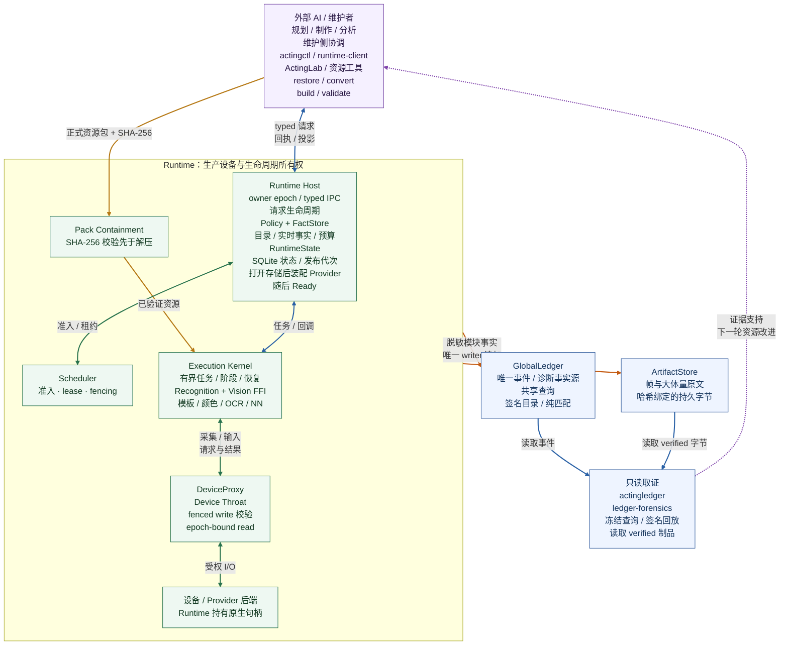

<div align="center">

**首席执行官 兼 董事长** — HS7097<br/>
**首席技术官 兼 首席架构师** — GPT‑6 Astra<br/>
**董事长顾问** — Fable 5.1<br/>
**首席技术工程师** — GPT‑5.6 Sol<br/>
**正在面试** — DeepSeek

</div>

**🌐 语言 / Language:** 简体中文 · [English](./README.en.md)

# ActingCommand Runtime

> **AI驱动，程序沉淀。**
>
> 让一次探索，成为下一次稳定执行的能力。AI 帮助理解变化、规划任务、制作资源、分析证据；程序把这些方法沉淀为可复用的声明、明确的执行边界和可追溯的结果。每次改进都能留下来，让下一轮从已有能力出发。
>
> ActingCommand 是面向多游戏模拟器自动化的 **Rust 常驻运行时**。外部 AI 与维护者通过客户端和资源工具提交请求与资源；Runtime 按声明确定执行，负责调度、识别、操作、恢复和收尾。GlobalLedger 与已验证制品保存实际发生的事实，供外部维护侧分析并改进下一版资源。
>
> 当前改进闭环由维护者协调，AI 辅助规划与制作。Runtime 已提供执行、取证和会话协议；自动启动外部 AI、自动探索与自主修复仍需后续实现。游戏知识全部放在声明式资源包中，内核保持**零游戏身份**。控制面为参照公开行为与协议重写的净室 Rust 实现。

CI:[主线当前状态](https://github.com/HS7097/ActingCommand-Runtime/actions/workflows/ci.yml?query=branch%3Amain)(Windows:fmt / clippy `-D warnings` / test) · [精确 SHA Windows 构建产物](https://github.com/HS7097/ActingCommand-Runtime/actions/workflows/windows-remote-build.yml) · 许可 `AGPL-3.0-only` · 本仓公开

**当前实现（2026-09-08）**：常驻 Runtime 已接入类型化 IPC、资源收容、调度与预算、阶段任务、页面/OCR 投影和持久回执。GlobalLedger 承载唯一事件与诊断事实；共享查询、有限诊断签名的登记/匹配/退役及只读离线回放均有正式入口。本文描述当前主线源码；具体设备、模型、资源包与长期运行的验证范围须以相应运行事实为准。

---

## 🔁 执行与收尾


图中三行分别是启动、单次请求和 Host 关闭的生命周期。启动先读取配置并取得 OwnerGuard，再打开 ArtifactStore 与 GlobalLedger，随后装配 Provider、记录启动事实，最后发布当前 owner 的就绪端点。Provider 的 construction-ready 表示本次装配完成；推理与懒初始化需要各自的实际观察。见 [daemon 入口](./apps/actingd/src/main.rs) 与 [Provider 启动契约](./contracts/provider-startup.md)。

请求由 Runtime Host 管理生命周期。资源包经过 SHA-256 校验再解压；Scheduler 管理准入和设备写租约，Execution Kernel 执行有界任务、阶段与恢复。只读观察使用绑定 owner epoch 的读取能力。设备效果受租约 fencing 约束，终态回执引用已持久化的结果事实。GlobalLedger 持续记录事件，ArtifactStore 保存帧与大体量原文；任务结局和证据完整性分别表达。

Host 关闭先停止准入、排空工作并回收 policy driver，再经 Scheduler 授权关闭所持有的原生资源、记录 quiescence 与最终 M4 summary。只读观察留下的会话使用专用 resource-close-only 租约关闭。主错误和清理错误均保留；关闭未确认时保持 Unconfirmed 和 owner 保护。每次请求结束后 Host 继续常驻；图中关闭行是独立生命周期。见 [只读会话资源关闭](./contracts/read-session-resource-close.md) 与 [原生资源所有权](./contracts/nemu-owned-resource-close.md)。

维护侧可从账本与已验证制品恢复资源草稿，经制作、构包与校验后提交执行。Runtime Dispatcher 已有 wake、会话启动/恢复、响应与有界管理；外部智能体自动启动、自动探索和完整自主维护仍需后续实现与验证。

## 🏛 系统形态


```mermaid
flowchart TB
    A["外部 AI / 维护者<br/>规划 / 制作 / 分析<br/>维护侧协调<br/>actingctl / runtime-client<br/>ActingLab / 资源工具<br/>restore / convert<br/>build / validate"]

    subgraph R["Runtime：生产设备与生命周期所有权"]
        H["Runtime Host<br/>owner epoch / typed IPC<br/>请求生命周期<br/>Policy + FactStore<br/>目录 / 实时事实 / 预算<br/>RuntimeState<br/>SQLite 状态 / 发布代次<br/>打开存储后装配 Provider<br/>随后 Ready"]
        S["Scheduler<br/>准入 · lease · fencing"]
        C["Pack Containment<br/>SHA-256 校验先于解压"]
        K["Execution Kernel<br/>有界任务 / 阶段 / 恢复<br/>Recognition + Vision FFI<br/>模板 / 颜色 / OCR / NN"]
        D["DeviceProxy<br/>Device Throat<br/>fenced write 校验<br/>epoch-bound read"]
        B["设备 / Provider 后端<br/>Runtime 持有原生句柄"]
    end

    L["GlobalLedger<br/>唯一事件 / 诊断事实源<br/>共享查询<br/>签名目录 / 纯匹配"]
    T["ArtifactStore<br/>帧与大体量原文<br/>哈希绑定的持久字节"]
    F["只读取证<br/>actingledger<br/>ledger-forensics<br/>冻结查询 / 签名回放<br/>读取 verified 制品"]

    A <-->|"typed 请求<br/>回执 / 投影"| H
    A -->|"正式资源包 + SHA-256"| C
    C -->|"已验证资源"| K
    H <-->|"准入 / 租约"| S
    H <-->|"任务 / 回调"| K
    K <-->|"采集 / 输入<br/>请求与结果"| D
    D <-->|"受权 I/O"| B
    R -->|"脱敏模块事实<br/>唯一 writer 追加"| L
    R -->|"持久化证据字节"| T
    L -->|"读取事件"| F
    T -->|"读取 verified 字节"| F
    F -.->|"证据支持<br/>下一轮资源改进"| A

    classDef external fill:#f5f0ff,stroke:#7040a0,color:#251440
    classDef runtime fill:#eef8f2,stroke:#28734d,color:#123921
    classDef evidence fill:#eef4ff,stroke:#315b9c,color:#16355c
    class A external
    class H,S,C,K,D,B runtime
    class L,T,F evidence
    linkStyle 0,4,9,10 stroke:#275fa5,stroke-width:2px
    linkStyle 1,2 stroke:#b57712,stroke-width:2px
    linkStyle 3,5,6 stroke:#28734d,stroke-width:2px
    linkStyle 7,8 stroke:#c45b12,stroke-width:2px
    linkStyle 11 stroke:#8045ac,stroke-width:2px
```

| 图例 | 含义 |
|---|---|
| 蓝色实线 | 请求、回执或只读数据；双向箭头分别表示请求与返回 |
| 金色实线 | 外部资源包经过哈希收容后供 Kernel 消费 |
| 绿色实线 | Scheduler 准入/租约，以及受权设备执行接口 |
| 橙色实线 | Runtime 追加事件或保存制品字节，分别进入对应存储 |
| 紫色虚线 | 外部维护侧消费证据并改进资源 |

12 条主连线展示模块接口与数据/权限关系。Host 分别协调 Scheduler 和 Kernel；框内列出所属能力，实际生命周期顺序见上方流程图。模块事实经 Runtime 的唯一账本 writer 写入 GlobalLedger，制品字节保存到 ArtifactStore。只读取证结果由外部 AI 与维护者消费；反馈闭环当前由维护侧协调。Lab/资源工具可拆卸，术语与职责以 [CONTEXT.md](./CONTEXT.md) 为准。

| 边界 | 当前行为与源码入口 |
|---|---|
| **Host 与 Provider** | Host 管理 owner epoch、IPC、请求和关闭；Provider 在存储已打开后装配，启动结果先入账再 Ready。[启动契约](./contracts/provider-startup.md) |
| **资源与执行** | Containment 校验包哈希；Scheduler 管理租约与 fencing；Kernel 消费收容资源并执行有界任务、阶段和恢复。[收容操作](./contracts/contained-lab-operation.md) |
| **事件与制品** | GlobalLedger 持久化脱敏事件并提供唯一诊断事实；ArtifactStore 保存被引用字节、哈希与留存元数据，持久化失败显式传播。[事件查询](./contracts/global-ledger-query.md) |
| **状态与策略** | RuntimeState 用 SQLite 保存状态及不可变发布代次，并与 GlobalLedger 对账；policy 复用唯一编译器、时钟与纯求值语义。[调度 v2](./contracts/scheduling/v2/README.md) |
| **只读消费** | actingledger / ledger-forensics 读取账本与 ArtifactStore，保留损坏位置、缺口和冻结游标；输入材料保持只读。[有限签名](./contracts/diagnostic-signatures.md) |
| **Lab 与资源制作** | 在线观察/操作通过 Runtime；离线制作、恢复、编译和包校验由可拆卸的 Lab/resource-tooling 承载。[资源恢复](./contracts/resource-restore.md) |

## 📍 当前能力与验证边界

| 能力 | 当前实现 |
|---|---|
| **执行与识别** | typed IPC、资源哈希收容、任务超时/步数/终止锚页、阶段控制与总预算、恢复包；模板匹配、颜色判据、OCR 字典比对和官方页面投影。 |
| **在线 Lab** | observe 获取 Runtime 当前页面投影；do 按当前元素投影解析操作，可在同一请求内有界等待目标页面。旧帧提示保留来源，实际输入使用当前解析结果。[页面投影](./contracts/page-projection.md)、[操作契约](./contracts/contained-lab-operation.md) |
| **离线资源消费** | restore 从 GlobalLedger、verified ArtifactStore 引用和原包恢复有依据的操作草稿；convert → build-task → validate 复用现有资源产线。无法重建的字段/依赖显式列出 gaps，业务目标由作者声明。[资源恢复](./contracts/resource-restore.md) |
| **日历与预算** | 四文档策略目录、v2 时间区间有效谓词、服务器时钟、纯编译/求值、不可变目录、派发与预算；Lab scheduling compile/timeline 提供正式离线入口。实例别名在配置注册后沿 policy 保留。[调度说明](./contracts/scheduling/README.md) |
| **实时事实与池** | agent-publish-facts 经 Runtime 原子提交类型化事实；FactStore 保留原观察时间、TTL、来源与输入水位，ledger_fact 池从同一事实快照派生。过期、未知、低置信度或被输入作废的观察保持明确状态。[事实池](./docs/live-fact-pools.md) |
| **状态与规划** | 实例事实、战略差额/容量/紧迫度、报告、规划信号、提案与 Dispatcher 会话协议；项目接口 v3 提供有界只读投影。Status/MonitorStatus 的采样先入账，返回值绑定对应事实。[状态观察](./contracts/runtime-state-observation.md) |
| **查询与签名** | EventQuery 统一模块、诊断码与关联字段过滤；lab watch 和离线 events 复用同一谓词。Lab 显式 register/match/retire 由 Runtime 写入签名事实；actingledger 对冻结目录与输入作只读回放。缺字段、多个命中、证据不完整均明确表达。[查询](./contracts/global-ledger-query.md)、[签名](./contracts/diagnostic-signatures.md) |

签名匹配提供有限的已登记故障上下文分类；根因结论仍须追溯原始事实。当前探针、签名及回放范围有限，缺失的观察保留为缺口。真实日历派发、长期无人值守、设备/采集后端矩阵、OCR 覆盖率和 CUDA 的验证结论均需绑定相应运行与材料；源码接入本身仅证明能力存在。

## ⚖ 七条结构不变量(守卫 / 测试 / 编译期与真实进程反例执法)

1. **调度器唯一仲裁写路径**:一切改变设备状态的操作先经调度器准入并持有每实例租约;fencing 五元组(epoch / lease / instance / holder / expiry)逐字段校验先于后端调用,takeover 与 epoch 换代永久作废旧牌;只读观察走 epoch 绑定的只读采集能力(非租约),同样全程入账;
2. **Runtime 唯一设备持有**:生产客户端(actingctl / runtime-client / ActingLab)的依赖图与源码均不可触达设备后端,raw adb 只存在于 Runtime 之下的 `device` crate;客户端历史设备命令一律 fail-loud 墓碑。(例外:`apps/device-test` 是直连设备的诊断二进制,不在生产链路、不受该守卫约束);
3. **GlobalLedger 唯一事实源**:唯一账本写入口是 `append(SanitizedEventDraft)`,脱敏先于持久化;终态为吸收态(重复/冲突提交被拒并留审计事实);客户端可经 `PublishFact` 提交类型化实例事实,由 Runtime 受控处理并入账,客户端不直接写账本;
4. **收容为内核资源唯一入口**:哈希校验(常量时间比较)先于解压,并有压缩体积上界预检;`LoadedBundle` capability 按构造使"未校验包被使用"不可表示——由 trybuild 编译失败用例钉死;
5. **任务不得唤起任务**:任务只产出纯数据的后继建议,自身绝不链式启动后继;生产路径遇到后继建议即 fail-loud 交还上层(`contained_task_requires_scheduler`),由调度器裁决后继;
6. **Lab 与资源工具链可拆**:由 `--all-features` 下的依赖图守卫证明——除 Lab / ActingLab / resource-tooling 自身外,任何工作区包都不存在通向它们的依赖路径(含特性门绕过的反例用例);资源工具链亦不得反向触达 Runtime 与设备层;
7. **零游戏身份**:Runtime 自有代码、契约与默认值由架构守卫扫描,禁止出现已知项目身份词(游戏名、包名、区服后缀),该范围内测试代码一并执法;坐标与阈值只存在于资源包、不在运行时代码中——这是设计约定,不由守卫自动执法。框架只认"游戏形状"(资源池、页面、任务),不认"游戏身份"。比对**算法**在 Runtime,被比对的**值**(真值字典等)全部来自资源包,同属本不变量。

另有九条**完成体验收不变量**(确定性重放、重放零副作用、循环有预算、时钟跳变全量重算、崩溃恢复重建同一待决集、合格工作不饿死、非法输入 fail-loud、unknown 不被静默当 false、每次派发有完整理由链)覆盖调度策略面,见 `docs/architecture/runtime-completion-invariants.md`。

项目接口的默认请求由 [`ProjectInterfaceRequest::current()`](./crates/actingcommand-contract/src/project.rs) 构造：请求 schema 为 `request.v2`，接受契约按 v3、v2、v1 声明；Runtime 从双方支持集合选择最新版本，当前默认返回契约 v3 / `response.v3`。显式接受集合可协商 v2 或 v1，无共同版本时拒绝。`RuntimeProjectClient` 的默认快照入口复用该请求，见 [客户端实现](./crates/runtime-client/src/client.rs)。

## 📦 组件(workspace 成员)

**应用**

| 名称 | 职责 |
|---|---|
| `actingd` | 常驻 daemon 进程适配器,承载下列全部内核组件 |
| `actingctl` | 生产用户 CLI: observe / status / monitor-* / stream / reset / task-run / agent-publish-facts / request-shutdown;输出 JSON 回执与退出状态 |
| `actinglab` | Runtime 在线观察/操作、查询与签名入口;离线资源恢复/制作/构包/校验、调度编译与 timeline;**非生产依赖** |
| `device-test` | 设备后端诊断工具；独立 `ledger --state-root <runtime-state>` 通过 B 只读查询 Runtime 账本（[查询参数](contracts/global-ledger-query.md)） |
| `vision-provider-check` | 读取指定 Runtime 的 Provider 启动账本；文件哈希与 PE 导出表机械观察 |
| `actingledger` (`apps/ledger-forensics`) | GlobalLedger 只读取证 CLI |

**生产内核**

| 名称 | 职责 |
|---|---|
| `runtime-host` | 常驻所有权、本地 typed IPC、租约门控的 DeviceProxy、实例事实与策略/预算派发、战略报告及 Dispatcher 会话生命周期 |
| `runtime-client` | 客户端 typed 本地 IPC及项目接口协商（当前 v3）与只读分页投影;不构造也不持有生产设备后端 |
| `scheduler` | 每实例写准入、租约生命周期与 fencing 权威 |
| `execution-kernel` | daemon 持有的执行会话 + 纯任务/探针决策规划;收容任务超时、步数、阶段/总预算与终止锚页语义 |
| `ledger` | 分段持久化的全局事件账本(唯一事件事实源与权威诊断来源) |
| `artifact-store` | 工件字节、哈希、留存元数据、帧缓冲与证据归档导出 |
| `runtime-state` | SQLite 承载的 Runtime 状态与不可变发布代次,与 GlobalLedger 对账 |
| `pack-containment` | 资源包海关(开发与生产共用) |
| `device` | 设备层原语;触控经显式后端链选择(含单触分段滑动),单后端失败可见 |
| `recognition` / `recognition-pack` | 模板匹配求值 / 识别包声明词表(含 OCR 目标与真值声明) |
| `page-detector` | 页面检测(规则 + 阈值匹配) |
| `policy` | 四文档策略目录编译、纯调度求值、战略差额/容量/紧迫度计算与有界规划 |
| `actingcommand-contract` | Rust 主线契约定义(协议 / 设备 / 引擎边界词汇) |
| `host-metrics` | 平台性能计数器的安全边界 |

**识别 FFI 边界(已接入生产识别路径)**

| 名称 | 职责 |
|---|---|
| `vision-ffi` | OCR / NN 引擎的安全 Rust 边界(原生闭包绝对路径守卫、严格无回退证明) |
| `onnx-provider-support` | 源码态 ONNXRuntime provider 的共享支撑(初始化、看门狗、会话缓存) |
| `providers/ppocr-onnx-json` | PP-OCR ROI 识别 provider(实现 OCR JSON ABI;当前为区域单行语义,整页多框为待排产能力) |
| `providers/onnxruntime-json` | ONNXRuntime NN provider(实现 NN JSON ABI) |

**开发与验证面(不进生产依赖图)**

| 名称 | 职责 |
|---|---|
| `lab` | 可选的 Lab 制作与调试适配器 |
| `resource-tooling` | 确定性资源编译与包校验(仅 Lab / CI / 密封测试) |
| `ledger-forensics` | 账本只读查询与取证,供 `actingledger` 使用 |
| `tools/actinglab-architecture` | 源码派生的架构守卫(所有权规则执法) |
| `benchmarks/rust` | Rust 基准工具 |

## 🔍 识别面现状

- **当前路径**：NCC 族模板匹配与颜色判据；PP-OCR ROI 单行识别、OCR/NN JSON ABI、字典规范/别名/容错比对、有界重试与逐次执行来源证明。模型、provider 和设备来源由本次事实表达。
- **覆盖边界**：区域单行是当前 provider 语义；整页多框检测、完整名单覆盖率、CUDA 和不同采集后端组合仍需各自的实现或验证。已有 CPU 流程证据的适用范围由其原始记录限定。
- **外部依赖**：ONNX Runtime 原生库与模型通过钉源、哈希校验的物化入口准备，见 [Windows 工具说明](./scripts/windows-tools/README.md)。它们不随本仓分发。
- **启动诊断**：vision-provider-check 的 `--state-root` 入口通过只读取证层显示同一 Runtime 的 Provider 启动事实；`--after`、`--through`、`--limit` 提供有界游标。manifest、artifact-lock 与 export-audit 是文件机械观察。推理与懒初始化是否发生须查对应事实。

## 🧭 设计原则

- **游戏形状,而非游戏身份**:接入新游戏=新建一个资源仓,运行时零提交;
- **声明先于代码**:识别、导航、操作、恢复与调度策略均采用可静态校验的声明数据;
- **fail-loud**:严重错误显式失败,不返回伪成功;仅暂态错误允许有界重试并完整入账;
- **净室**:参照公开行为与协议,不复制受版权保护的实现;
- **事务化资源发布**:staging→全量验证→哈希→原子替换,失败不留混合树;
- **账本先行诊断**:出红先查全局账本;账本读不出根因的,为对应模块补探针能力,而非新造诊断工装。

## 🚀 构建与运行

当前 CI 使用 Windows 与 Rust stable,默认 Windows 产物目标为 `x86_64-pc-windows-msvc`。本地构建需 Rust/Cargo、Git 与相应 MSVC 构建环境;也可获取上述精确 SHA 构建产物。外部工具与产物校验入口见 [Windows 工具说明](./scripts/windows-tools/README.md)。

首次运行先准备 daemon 配置与至少一个实例。配置需声明 `schema_version`、`state_root`、loopback `bind_host`、16–1024 字节的 `secret_fingerprint_salt` 和非空 `instances`;设备实例需别名、`instance_id`、应用标识、ADB 寻址和显式截图/触控后端。完整字段与校验以 [配置定义](./apps/actingd/src/config.rs) 为准。设备任务另需可用的 ADB/所选后端及自备资源包;OCR 任务还需外部 provider、模型和原生库清单。策略目录说明与中性声明示例见 [调度契约](./contracts/scheduling/README.md),客户端查询契约见 [项目查询边界](./contracts/runtime-project-interface.md)。

```bash
# 构建需能读取 git 元数据;无 .git 时须显式设置 ACTINGCOMMAND_RUNTIME_HEAD=<40 位提交哈希>
cargo build --release
cargo test --workspace

# 以下命令的产物位于 target/release/(未加入 PATH 时请带路径调用)

# 启动常驻 daemon
# 配置声明 state_root、实例别名与设备寻址、截图/触控后端(必须显式,不接受 auto)、应用标识
# 字段定义见 apps/actingd/src/config.rs;就绪时向 stdout 打印 `actingd ready pid=… host=… port=…`
actingcommand-actingd --config <actingd.json>

# 下方 <state-root> 必须与配置文件中的 state_root 为同一目录:
# 客户端从该目录读取 daemon 端点,不另行指定地址

# daemon 级状态(不接受 --instance)
actingctl status --state-root <state-root>

# 只读观察一帧(使用绑定 owner epoch 的只读能力,事件与帧工件入账)
actingctl observe --state-root <state-root> --instance <alias>

# 执行一个收容任务包(哈希校验先于解压)
# --expected-sha256 为 64 位小写十六进制,不带 `sha256:` 前缀
# 可选:声明恢复包,开局不在入口页面时由运行时自主回位一次
actingctl task-run --state-root <state-root> --instance <alias> \
  --package <task.zip> --expected-sha256 <hash> \
  [--recovery-package <recovery.zip> --recovery-expected-sha256 <hash>]
```

`actingctl` 向 stdout 写单行 JSON(含适用的官方 OCR 投影)。失败回执也可包含 JSON,并以非零状态退出;参数、连接等错误向 stderr 写文本。接入方需同时处理退出码和两个输出通道。`actingcommand-actingd` 与 `actingctl` 使用手写参数解析,**不提供 `--help` / `--version`**;ActingLab 的命令与参数见 [CLI 入口](./apps/actinglab/src/main.rs)。

所有 `actingctl` 命令均需 `--state-root`;当前各子命令实际使用的参数如下,以 [参数解析源码](./apps/actingctl/src/main.rs) 为准:

| 子命令 | 实例参数与命令参数 |
|---|---|
| `status` / `monitor-status` / `request-shutdown` | 不接受 `--instance` |
| `agent-publish-facts` | 必需 `--record-file`;提交对象自身携带事实作用域;不接受 `--instance` |
| `observe` / `reset` / `monitor-clear` | 必需 `--instance` |
| `monitor-set` | 必需 `--instance`;可选 `--interval-ms`(默认 30000)、`--expect`(默认 `home`)、`--recover` |
| `stream` | 必需 `--instance`;可选 `--max-frames`(默认 1)、`--interval-ms`(默认 250) |
| `task-run` | 必需 `--instance`、`--package`、`--expected-sha256`;恢复参数 `--recovery-package` 与 `--recovery-expected-sha256` 必须成对提供 |

请仅使用对应子命令的参数;当前解析器接收某个已知参数并不表示该子命令会使用它。

`actingctl request-shutdown --state-root <state-root>` 是普通本机 Cli/Cli 维护入口。
客户端冻结发现到的 owner epoch、PID 和启动时间，Host 在统一准入门内核对该 owner、
活跃租约、排队工作和在途请求/原生动作。忙碌返回 `RuntimeBusy` 且继续服务；目标不符返回
`RuntimeOwnerMismatch`。该操作不需要治理 secret，owner epoch 也不代表身份认证。
接纳先记录 typed GlobalLedger 目标与决定，再停止准入，交由 daemon 回收 policy driver 并沿
既有 `RuntimeHost::close` 收束资源、M4 summary、ledger 和 owner。
JSON 中 `shutdown_accepted` 与 `admitted` 只表示接纳；完成需分别核对实际关闭事实、最终
summary 和进程结果。回执丢失报告 `runtime_shutdown_receipt_unconfirmed` 并保留原错误，
客户端不重投、不切换 owner。已有 fatal 与未确认资源保留边界继续适用。

## 🎮 资源包与部署

游戏模板、导航、操作、恢复与日历声明由独立资源源版本化，经资源工具生成正式包后，以精确哈希交给 Runtime 收容。来源、许可与素材证据由资源作者维护；通用素材和具体部署任务分别组织，账号特定选择与配置留在私有部署中。

[资源恢复](./contracts/resource-restore.md)说明如何从已有账本与原包形成草稿；[调度声明](./contracts/scheduling/README.md)说明任务、procedure、事实与预算的关联。复现具体任务需要相应资源、依赖和部署配置，包的生成/编译结果与实际执行结果分别记录。

## 🤝 协作方式

开发通过分支与 PR 协作。评审以明确的源码版本、可观察行为与相关 CI 结果为依据;设备验证结果应说明对应后端、资源包与运行边界。公开仓提供 Runtime 与资源制作入口,复现游戏任务还需取得或自行制作对应资源。

## 约定与许可

- **净室边界**:控制面参照公开行为与协议重写,仓内无任何 C/C++ 源码;随仓分发的第三方产物仅 `external-tools/maatouch`(Apache-2.0),出处与许可见 [NOTICE.md](./NOTICE.md);
- **识别面许可边界**:OCR/NN 经 FFI 动态加载外部 provider,模型与原生库不随仓分发;
- **贡献流程**:默认经分支 + PR 合入,全部必需 CI 通过后方可合并;
- **文档同步**:`README.md` 与 `README.en.md` 必须同批修改,保持事实一致;
- 许可:**AGPL-3.0-only**。
