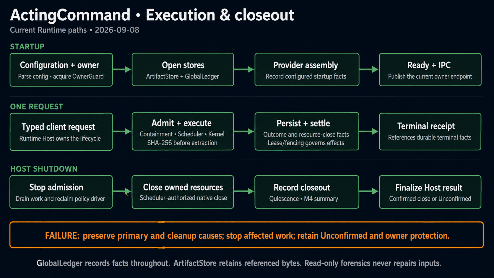
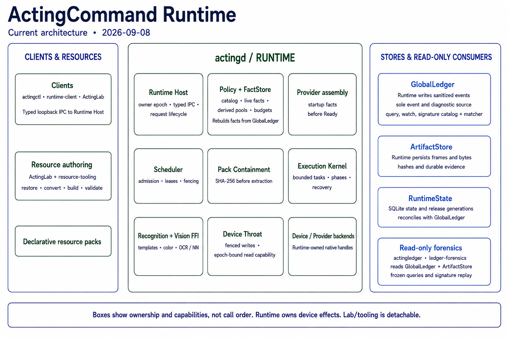

<div align="center">

**首席执行官 兼 董事长** — HS7097<br/>
**首席技术官 兼 董事长顾问** — Claude Fable 5<br/>
**首席架构师 兼 首席技术工程师** — GPT‑5.6 Sol<br/>
**正在面试** — DeepSeek

</div>

**🌐 语言 / Language:** 简体中文 · [English](./README.en.md)

# ActingCommand Runtime

> 多游戏模拟器自动化框架的 **Rust 常驻运行时**:一个长驻 daemon 承载调度仲裁、设备控制与全局事件账本;游戏知识全部外置于声明式资源包,运行时内核**零游戏逻辑**。控制面为**净室 Rust 实现**——参照公开行为与协议重写,仓内无任何 C/C++ 源码。
>
> **设计立场:智能体在环外,运行时在环内。**智能体只做维护——规划、制作资源、处理例外;逐帧执行由运行时确定性完成,每一步入账、可审计。推理花在维护,不花在执行。

`cargo test --workspace` 全绿(数字随主线滚动) · CI:GitHub Actions(windows-latest:fmt / clippy `-D warnings` / test,另有精确 SHA Windows 构建产物链) · 许可 `AGPL-3.0-only` · 本仓公开

**当前成熟度(2026-09-01)**:调度仲裁、设备咽喉、全局账本与任务收容成体系运转;**OCR 识别链已完成一轮官方 CPU 实机全流程验证**(严格无回退、逐帧入账、全部证据封箱)——自动回 Home 恢复、模板导航、单触分段滑动翻页、逐帧 16 目标 OCR、字典规范化比对、terminal 锚页判终、`return_home` 收口,一条命令 219 秒无人工输入完成。CUDA 实测与整页多框识别为已立项待排产能力(见路线图)。

早期的 Python mock 与 Go 历史契约、以及 Go/Python 基准工具已迁出本仓(归档于 ActingCommand-Legacy-Runtime,**暂未公开**);仓内保留 Rust 基准工具 `benchmarks/rust` 与历史基准报告。

---

## 🔁 自维护闭环



这套架构存在的理由:让游戏自动化摆脱「游戏一更新,全世界等维护者发版」。目标闭环是——游戏版本更新(①)后,智能体试玩摸清变化(②),制作或修订声明式资源包(③);资源包经哈希收容进入运行时,由调度器准入(④)、确定性执行(⑤)、全程入账(⑥);失败时,智能体凭账本证据自诊断并修复资源(⑦),回到 ③。环内逐帧零推理——推理花在维护,不花在执行。

③→⑦ 一段已在实战中运转:2026-08 至 09 月初的 OCR 任务链上,资源包由智能体撰写、经账本证据诊断缺陷、按裁定四次修订后实机通过——含智能体辅助制作的 `return_home` 恢复包(实机验证后冻结为可复用基线并正式入资源仓)。②(自动摸清)仍在路线图上。

## 🏛 系统形态



图中实线仅表示已经合入 `main` 的能力。虚线表示源码已经存在但尚未接入生产路径,或仍处于规划阶段;开放中的 PR 不计入可用能力。

术语以仓内 [CONTEXT.md](./CONTEXT.md) 为准(Runtime Host / Scheduler / Execution Kernel / Device Throat / DeviceProxy 等逐条定义)。

## 📍 当前进度(2026-09-01)

| 里程碑 | 内容 |
|---|---|
| **2026-08-10** | 首次实机端到端闭环:哈希封印资源包 → 常驻运行时 → 模拟器实机页面识别 → 收容任务执行 → 类型化调度结局 → 全程入账;单次 3.4 秒,零人工输入。 |
| **2026-08-20** | 日常+周常复合领取任务链实机完成(实弹领取分支验证)。 |
| **2026-09-01** | **官方 CPU 实机 OCR 全流程 PASS**:开局非 Home 由运行时自主恢复(2 步回 Home 复验)→ 模板导航入干员页 → 41 帧单触分段滑动翻页(匀速拖动+垂直刹车,MaaTouch 点流)→ 每帧 16 目标 OCR(920 条映射记录零丢弃)→ 规范/别名/容错字典比对(294 唯一规范名,零越界)→ `operator_end` 锚页判终 → `return_home` 收口。219 秒,严格无回退,42 个投影工件逐一哈希绑定。 |

| 维度 | 状态 |
|---|---|
| **已在 `main` 可用** | 常驻 daemon、typed loopback IPC、调度准入与租约 fencing、收容任务执行(任务级超时声明、`operator_end` 类终止锚页、独立 `max_steps`、恢复包自动回位)、GlobalLedger、工件存储与官方 OCR 投影(v2,分页)、资源包收容、设备后端(含单触分段滑动 `SegmentedSwipe`,MaaTouch/Minitouch 点流,MuMu Nemu IPC 动态绑定)、NCC 模板匹配与颜色判据、OCR provider 生产接线(PP-OCRv6_medium / ONNX Runtime,CPU 实机验证)、字典约束比对(规范/证据别名/容错+有界重试)、ActingLab 资源制作链路(含 `package dry-run` 离线预演)。 |
| **正在进行** | GlobalLedger SQLite 后端与统一 RuntimeDatabase 迁移、常驻账本探针与复发签名比对(前置链;收口后体系转入"出红查账本、账本不够加探针",全面停增工装与测试)。 |
| **已立项待排产** | 视觉 provider 整页多框检测(det→逐框 rec→多块输出;覆盖率由半页重叠结构保证)与 **CUDA 实机验证**;调度策略目录与虚拟时间测试;智能体驾驶接口产品化;UI 正式客户端。 |
| **尚未完成** | 采集三后端矩阵(adb / droidcast_raw / nemu_ipc)正式覆盖;多任务链内容扩充;自动摸清与自动修复。 |

## 🗺 路线图

以下均为目标态口径,按序推进,不承诺日期:

1. **账本前置链**——GlobalLedger SQLite 后端、常驻探针、复发签名比对;收口后诊断体制切换:不再新增工装与测试,复发防护由运行期签名比对承担,"无法从账本读出原因的错误直接为对应模块增加探针能力";
2. **冲刺组**——调度策略目录+虚拟时间调度测试、智能体驾驶接口正式化(Dispatcher 合同、机器可读命令目录、会话闸)、UI 正式客户端(Rust 原生渲染);
3. **识别面收官**——provider 整页多框检测(整页识别+重叠去重,消解格位对齐课题)与 CUDA 实机验证;
4. **MAA / MaaFramework 兼容**——MAA 资源格式作为种子导入源:导入一次,此后由自维护环接管维护;MaaFramework 第二执行后端蓝图已立;
5. **自动摸清与自动修复**——把自维护闭环图中 ② 与 ⑦ 两段全面转为实线,以及多实例战略规划与报告管线。

## ⚖ 七条结构不变量(守卫 / 测试 / 编译期与真实进程反例执法)

1. **调度器唯一仲裁写路径**:一切改变设备状态的操作先经调度器准入并持有每实例租约;fencing 五元组(epoch / lease / instance / holder / expiry)逐字段校验先于后端调用,takeover 与 epoch 换代永久作废旧牌;只读观察走 epoch 绑定的只读采集能力(非租约),同样全程入账;
2. **Runtime 唯一设备持有**:生产客户端(actingctl / runtime-client / ActingLab)的依赖图与源码均不可触达设备后端,raw adb 只存在于 Runtime 之下的 `device` crate;客户端历史设备命令一律 fail-loud 墓碑。(例外:`apps/device-test` 是直连设备的诊断二进制,不在生产链路、不受该守卫约束);
3. **GlobalLedger 唯一事实源**:唯一写入口是编译期唯一的 `append(SanitizedEventDraft)`,脱敏先于持久化;终态为吸收态(重复/冲突提交被拒并留审计事实);客户端不可提交语义事实——契约层根本不暴露语义事实类型;
4. **收容为内核资源唯一入口**:哈希校验(常量时间比较)先于解压,并有压缩体积上界预检;`LoadedBundle` capability 按构造使"未校验包被使用"不可表示——由 trybuild 编译失败用例钉死;
5. **任务不得唤起任务**:任务只产出纯数据的后继建议,自身绝不链式启动后继;生产路径遇到后继建议即 fail-loud 交还上层(`contained_task_requires_scheduler`)。由调度器裁决后继属规划中的下一步;
6. **Lab 与资源工具链可拆**:由 `--all-features` 下的依赖图守卫证明——除 Lab / ActingLab / resource-tooling 自身外,任何工作区包都不存在通向它们的依赖路径(含特性门绕过的反例用例);资源工具链亦不得反向触达 Runtime 与设备层;
7. **零游戏身份**:Runtime 自有代码、契约与默认值由架构守卫扫描,禁止出现已知项目身份词(游戏名、包名、区服后缀),该范围内测试代码一并执法;坐标与阈值只存在于资源包、不在运行时代码中——这是设计约定,不由守卫自动执法。框架只认"游戏形状"(资源池、页面、任务),不认"游戏身份"。比对**算法**在 Runtime,被比对的**值**(真值字典等)全部来自资源包,同属本不变量。

另有九条**完成体验收不变量**(确定性重放、重放零副作用、循环有预算、时钟跳变全量重算、崩溃恢复重建同一待决集、合格工作不饿死、非法输入 fail-loud、unknown 不被静默当 false、每次派发有完整理由链)覆盖调度策略面,见 `docs/architecture/runtime-completion-invariants.md`。

## 📦 组件(workspace 成员)

**应用**

| 名称 | 职责 |
|---|---|
| `actingd` | 常驻 daemon 进程适配器,承载下列全部内核组件 |
| `actingctl` | 生产用户 CLI(observe / status / monitor-* / stream / reset / task-run,支持 `--recovery-package` 自动回位);输出为单行 JSON |
| `actinglab` | 调试探针 + 资源制作(录制→草稿→构包→事务化发布→`package dry-run` 离线预演);**非生产依赖** |
| `device-test` | 设备后端诊断工具 |
| `vision-provider-check` | 视觉 provider 自检(ABI 校验 / artifact 锁 / OCR·NN 冒烟) |

**生产内核**

| 名称 | 职责 |
|---|---|
| `runtime-host` | 常驻所有权、本地 typed IPC、租约门控的 DeviceProxy 与生命周期控制 |
| `runtime-client` | 客户端 typed 本地 IPC;不构造也不持有生产设备后端 |
| `scheduler` | 每实例写准入、租约生命周期与 fencing 权威 |
| `execution-kernel` | daemon 持有的执行会话 + 纯任务/探针决策规划;收容任务超时、步数与终止锚页语义 |
| `ledger` | 全局事件账本(唯一事实源) |
| `artifact-store` | 工件字节、哈希、留存元数据、帧缓冲与证据归档导出 |
| `runtime-state` | SQLite 承载的权威 Runtime 状态与不可变发布代次 |
| `pack-containment` | 资源包海关(开发与生产共用) |
| `device` | 设备层原语;触控经显式后端链选择(含单触分段滑动),单后端失败可见 |
| `recognition` / `recognition-pack` | 模板匹配求值 / 识别包声明词表(含 OCR 目标与真值声明) |
| `page-detector` | 页面检测(规则 + 阈值匹配) |
| `policy` | 目录编译器与求值器共享的纯调度策略契约 |
| `actingcommand-contract` | Rust 主线契约定义(协议 / 设备 / 引擎边界词汇) |
| `host-metrics` | 平台性能计数器的安全边界 |

**识别 FFI 边界(已接入生产识别路径,CPU 实机验证)**

| 名称 | 职责 |
|---|---|
| `vision-ffi` | OCR / NN 引擎的安全 Rust 边界(原生闭包绝对路径守卫、严格无回退证明) |
| `onnx-provider-support` | 源码态 ONNXRuntime provider 的共享支撑(初始化、看门狗、会话缓存) |
| `providers/ppocr-onnx-json` | PP-OCR ROI 识别 provider(实现 OCR JSON ABI;当前为区域单行语义,整页多框为待排产能力) |
| `providers/onnxruntime-json` | ONNXRuntime NN provider(实现 NN JSON ABI) |

**开发与验证面(不进生产依赖图)**

| 名称 | 职责 |
|---|---|
| `lab` | 可选的 Lab 制作与调试适配器 |
| `resource-tooling` | 确定性资源编译与包校验(仅 Lab / CI / 密封测试) |
| `tools/actinglab-architecture` | 源码派生的架构守卫(所有权规则执法) |
| `benchmarks/rust` | Rust 基准工具 |

## 🔍 识别面现状

- **可用(实机验证)**:模板匹配(NCC 族)与颜色判据;OCR 生产链路——`PP-OCRv6_medium`(ONNX Runtime,CPU,严格无回退)、逐目标执行证明(provider/模型/设备逐次哈希证明)、字典规范/别名/容错比对与有界重试;
- **已知边界**:provider 当前为区域单行识别语义(每目标一块);整页多框检测(det→逐框 rec)已立项待排产,落地后名单类任务转为"整页读+重叠去重"口径;
- **待实测**:CUDA 执行(闭包、Ready 清单、设备 ordinal/稳定身份校验机制均已建成,与整页识别同单排产);
- **不随仓分发**:ONNX Runtime 原生库与 OCR/NN 模型均不在本仓;由钉源验哈希的官方物化工具按任务本地缓存获取,`apps/vision-provider-check` 提供自检入口。

## 🧭 设计原则

- **游戏形状,而非游戏身份**:接入新游戏=新建一个资源仓,运行时零提交;
- **声明先于代码**:识别、导航、操作、恢复、(规划中的)调度策略全部为可静态校验的声明数据;
- **fail-loud**:严重错误显式失败,不返回伪成功;仅暂态错误允许有界重试并完整入账;
- **净室**:参照公开行为与协议,不复制受版权保护的实现;
- **事务化资源发布**:staging→全量验证→哈希→原子替换,失败不留混合树;
- **账本先行诊断**:出红先查全局账本;账本读不出根因的,为对应模块补探针能力,而非新造诊断工装。

## 🚀 构建与运行

```bash
# 构建需能读取 git 元数据;无 .git 时须显式设置 ACTINGCOMMAND_RUNTIME_HEAD=<40 位提交哈希>
cargo build --release
cargo test --workspace

# 以下命令的产物位于 target/release/(未加入 PATH 时请带路径调用)

# 启动常驻 daemon
# 配置声明 state_root、实例别名与设备寻址、截图/触控后端(必须显式,不接受 auto)、应用标识
# 字段定义见 apps/actingd/src/config.rs;就绪时向 stdout 打印 `actingd ready pid=… host=… port=…`
actingcommand-actingd --config <actingd.json>

# 下方 <state-root> 必须与配置文件中的 state_root 为同一目录:
# 客户端从该目录读取 daemon 端点,不另行指定地址

# daemon 级状态(不接受 --instance)
actingctl status --state-root <state-root>

# 只读观察一帧(经调度器准入,事件与帧工件全部入账)
actingctl observe --state-root <state-root> --instance <alias>

# 执行一个收容任务包(哈希校验先于解压)
# --expected-sha256 为 64 位小写十六进制,不带 `sha256:` 前缀
# 可选:声明恢复包,开局不在入口页面时由运行时自主回位一次
actingctl task-run --state-root <state-root> --instance <alias> \
  --package <task.zip> --expected-sha256 <hash> \
  [--recovery-package <recovery.zip> --recovery-expected-sha256 <hash>]
```

`actingctl` 的全部输出为写到 stdout 的单行 JSON(含官方 OCR 投影),便于脚本与智能体消费;另有 `monitor-status` / `monitor-set` / `monitor-clear` / `stream` / `reset` 子命令。两个 CLI 均为手写参数解析,**不提供 `--help` / `--version`**。

## 🎮 资源仓

游戏数据(识别模板、导航图、操作与恢复声明)独立于运行时版本化。以下仓库**目前均为私有**,外部读者暂不可访问:

- **ActingCommand-Resources-Arknights**——上游派生层源自 MAA;自有层现有:日常+周常复合领取任务链(实机验证)、干员名单 OCR 任务包(四修版,官方实机 PASS;声明任务超时、终止锚页、16 目标 OCR 与 422 名真值字典)、`return_home` 恢复基线(实机冻结入库,可复用)、公招与全入口导航/操作集、主题检测声明(hometheme 全套)、角色/材料图鉴、识别与恢复声明、调度声明(CN 区服);
- **ActingCommand-Resources-AzurLane**——上游派生层源自 Alas;自有层现有:主界导航与全入口操作集、角色/装备全量图鉴模板(Git LFS)、识别与恢复声明;
- **ActingCommand-Resources-BlueArchive**——上游派生层源自 BAAH / BAAS(坐标目录与校验区域);自有层现有:每日领取试点任务、全入口操作集、装备/材料图鉴、识别与恢复声明。

各仓采用 `upstream-derived/`(第三方派生素材,含许可证与出处)+ `ours/`(自有声明数据)两层布局。

## 🤝 协作方式

开发由多智能体在治理规则下执行:任务契约(最小知识分发)+ 集成信封(精确头合并授权)+ 独立验收(Phase 1)+ 程序终审(实机窗独占所有权与证据封箱);GitHub 原生对象(PR 评审 / 合并事件 / Actions 运行)为正典技术记录,recorder-only 自动化(交付快照等)辅助记账但不批准不拦截。全部裁定权归 HS7097。

## 约定与许可

- **净室边界**:控制面参照公开行为与协议重写,仓内无任何 C/C++ 源码;随仓分发的第三方产物仅 `external-tools/maatouch`(Apache-2.0),出处与许可见 [NOTICE.md](./NOTICE.md);
- **识别面许可边界**:OCR/NN 经 FFI 动态加载外部 provider,模型与原生库不随仓分发;
- **贡献流程**:默认经分支 + PR 合入,全部必需 CI 通过后方可合并;
- **文档同步**:`README.md` 与 `README.en.md` 必须同批修改,保持事实一致;
- 许可:**AGPL-3.0-only**。
