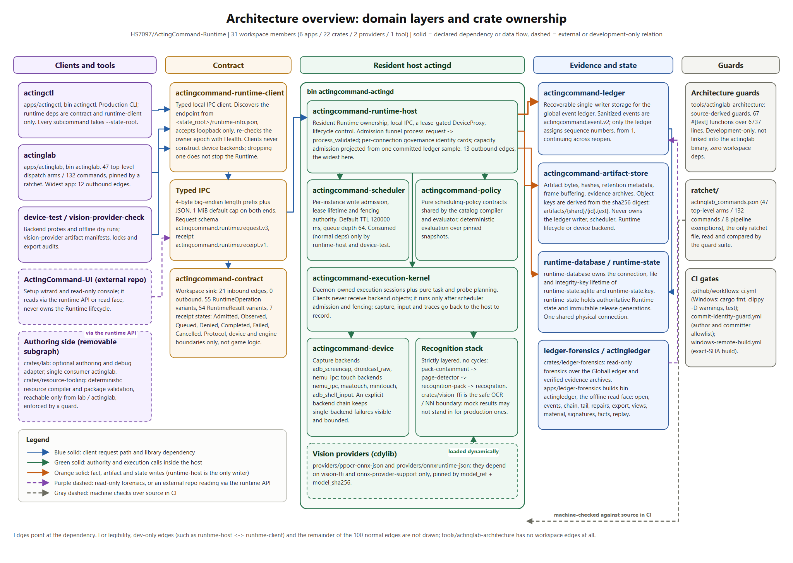
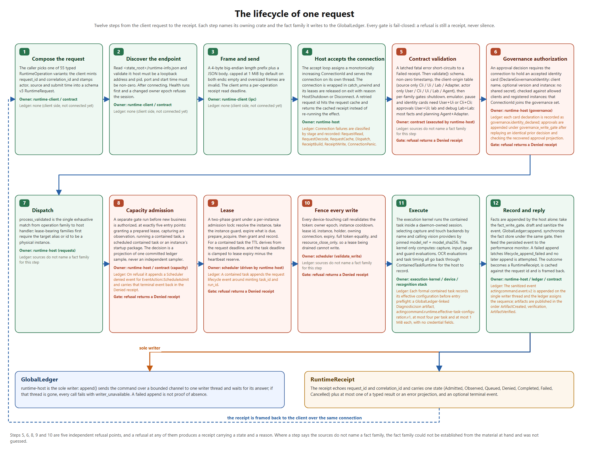
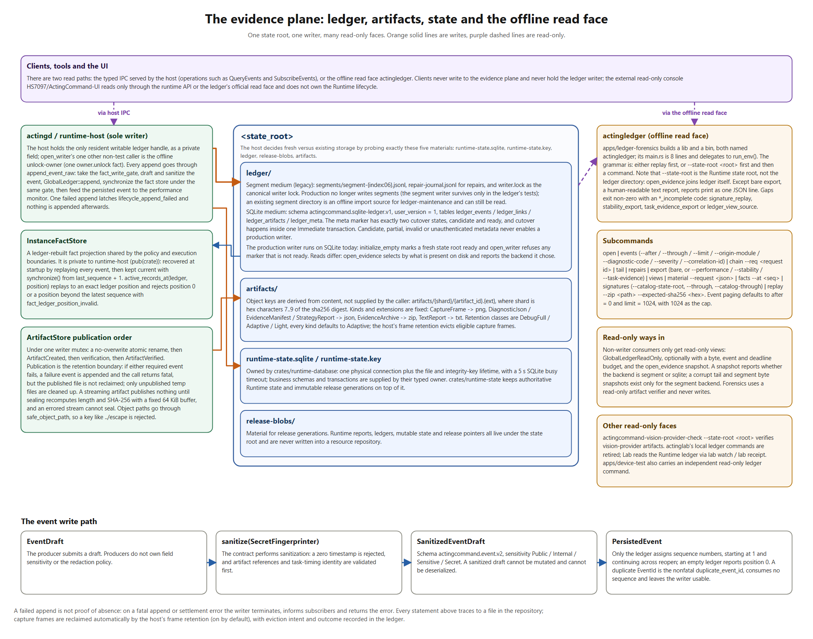

<p align="right">🌐 <b>English</b> · <a href="./README.zh-CN.md">简体中文</a></p>

<div align="center">


**Chief Executive Officer & Chairman** — HS7097<br/>
**Chief Technology Officer & Chief Architect** — Claude Opus 5.5 · GPT‑6 Astra · Claude Fable 5.1 · Claude Fable 5 · GPT‑5.5<br/>
**Board Secretary & Chief Audit Officer** — Claude Opus 5.5 · Claude Fable 5.1 · Claude Fable 5 · Claude Opus 4.8<br/>
**Principal Engineer** — Claude Opus 5.5 · GPT‑6 Astra · GPT‑5.6 Sol · GPT‑5.5<br/>
**Interviewing** — DeepSeek

</div>

**⚠️ Pre-release, debug phase. Every release so far is a pre-release; interfaces, configuration and file formats still change, and only the latest release is supported. The planned 0.12 series will bring breaking changes (a new ledger, new command output and exit codes); see [Development status](#development-status) and [Roadmap](#roadmap-planned).**

# ActingCommand Runtime

ActingCommand Runtime is a resident Rust runtime for running multi-target automation on Android emulators. The program core (Runtime, Tools and the MCP server) is neutral: it contains no logic or information about any concrete target — no names, pages, characters, stages, resources, values or rules. Code, contracts, defaults and fixtures are scanned in CI by the guard tests `c2_runtime_code_contracts_defaults_and_fixtures_are_project_neutral` and `r2f_product_and_authoring_paths_have_no_builtin_game_identity`. Everything specific to a target (screenshot material, recognition regions, click boxes, task order, data tables) lives in declarative resource packs: task packs, gathered per target into one standard pack, sealed by content digest and verified before loading; supporting another target means another pack, not another program. The runtime accepts only sealed, hash-verified packs (`actingctl task-run` requires `--package`, plus either `--expected-sha256` or `--package-ref`). The GlobalLedger is the single source of truth, and only runtime-host holds a writable handle to it; a fact must be sanitized by the contract layer into `actingcommand.event.v2` before it may enter the ledger. Device access always goes through a lease granted by the scheduler, and every write revalidates the fence. The Runtime listens only on the local loopback address and contains no network code. Every boundary fails loud: invalid configuration, a non-loopback bind, stale evidence and incomplete exports all end in an explicit error or a nonzero exit rather than a silent downgrade, a refusal is a receipt too, and unknown is never treated as no.

[CI main status](https://github.com/HS7097/ActingCommand-Runtime/actions/workflows/ci.yml?query=branch%3Amain) (Windows: fmt / clippy `-D warnings` / seven module test jobs) · [Exact-SHA Windows build](https://github.com/HS7097/ActingCommand-Runtime/actions/workflows/windows-remote-build.yml) · [Releases](https://github.com/HS7097/ActingCommand-Runtime/releases) (on demand: Actions → release → Run workflow) · License `AGPL-3.0-only` · [Umbrella repository](https://github.com/HS7097/ActingCommand) · [UI console](https://github.com/HS7097/ActingCommand-UI)

## Repository family

| Repository | Role |
| --- | --- |
| [HS7097/ActingCommand](https://github.com/HS7097/ActingCommand) | Umbrella (portal) repository: the family README, the agent manual `skills/actingcommand/`, and the Releases page with the setup wizard, the member releases and the available standard packs |
| [HS7097/ActingCommand-Runtime](https://github.com/HS7097/ActingCommand-Runtime) | This repository: the resident runtime (daemon, CLI, MCP server, ledger, device backends) and the Tools (Lab, ledger reader, checks, watchdog launcher) |
| [HS7097/ActingCommand-UI](https://github.com/HS7097/ActingCommand-UI) | Setup wizard and monitoring console; talks to the runtime only through its API |

Components are released independently, each only when it has changed. Whether they fit together is decided by the interface revisions each one declares (`distribution/windows/component-interfaces.json`, `contracts/component-interfaces.md`), not by matching version numbers. Versions follow X (major or incompatible) . Y (new features or new coverage) . Z (fixes, including features that serve a fix).

## Current release

The current release is **v0.11.6** (pre-release) on this repository's [Releases](https://github.com/HS7097/ActingCommand-Runtime/releases) page. Every Release carries two zips and `SHA256SUMS`; the version exists only in the Release tag, and every file is bound to the exact source commit by its `BUILD-MANIFEST.json`.

| Zip | Layout | Contents |
| --- | --- | --- |
| `actingcommand-runtime-<sha>.zip` | `distribution-v1` | `actingcommand-actingd.exe`, `actingctl.exe`, `actingd.config.example.json`, `INSTALL.md`, `RELEASE-NOTES.md` |
| `actingcommand-tools-<sha>.zip` | `platform-tools-v3` | `actinglab.exe`, `actingledger.exe`, `actingcommand-vision-provider-check.exe`, the watchdog launcher `actingwatch.exe`, and Google's official Android platform-tools 37.0.1 under `platform-tools/` (`adb.exe`, `AdbWinApi.dll`, `AdbWinUsbApi.dll`, `NOTICE.txt`, `source.properties`) |

Vision models and the ONNX Runtime never ship with a release: the OCR/NN engine is linked into `actingcommand-actingd.exe` and reads its models from `<vision root>\models\<model_ref>\`; without them, a target that needs OCR fails explicitly.

**What v0.11.6 changed**

- **One worker thread per instance.** A failed routine run hands the instance straight to the recovery ladder, which keeps holding and renewing the instance's key until it ends. When the disk is short, a startup claim is refused once, recorded and the instance released. A ladder whose rungs all fail is reported as an Error, one interrupted by a pause as a Warning.
- **No scheduled dispatch stays open across a restart.** A run with a terminal is settled by its terminal; a run without one (hard-killed, lease granted but not started, lease transferred or expired) is settled once as interrupted and does not count as a consecutive failure; a terminal rewritten for exceeding its time budget also settles.
- **Startup safety net.** A single run that cannot be settled at startup no longer keeps the whole Runtime from starting: it records an Error (`policy_settlement_dispatch_unsettled`) and pauses only that instance. Read, write or integrity failures of the ledger itself stay fatal.
- **Hot install transition fixes.** Each `actingctl install-transition` run has one deadline that fits the installer's 75 s; the read-only query needs no declared identity and writes nothing to the ledger while the new owner prepares; a fatal exit names the latched cause; after a failed held start or a release/held timeout the watchdog restarts the Runtime, while a shutdown accepted during a held start stays down; installation refusals, timeouts and failures are recorded in the ledger again.
- **Frame retention cleaner** (see [Current boundaries](#current-boundaries)).
- **CI split by module**: from about 45 minutes to about 8; registered flaky tests run in their own non-gating job.
- **Device-test probe retired**: the Tools zip no longer carries `actingcommand-device-test.exe`.

**v0.11.5** (also not yet in an umbrella release): startup recovery reads the ledger in pages of at most 256 events, independent of ledger length, and whole-chain verification moved to a separate read-only connection that no longer blocks writes; one request queue per instance, where a busy instance defers a candidate with an Info reason instead of a failure; near-duplicate marking of screenshots with two switches; the result-code core (code catalog, `outcome-guard`, the CI merge step); a clock-slot view (pure functions for due times and the next clock instant).

**Upgrading to v0.11.6**

- Once the cleaner has deleted or moved a frame, the state root is one-way: v0.11.5 and earlier refuse to open it. For the first start after upgrading, consider writing `"frame_retention_enabled": false` into the configuration, confirm that everything runs normally, then remove it or set it to `true` (an absent key means on).
- The installer does not delete an old `tools\actingcommand-device-test.exe`; move it away by hand.

## Install

- **Setup wizard (recommended).** The umbrella repository's [Releases](https://github.com/HS7097/ActingCommand/releases) page carries the online wizard `acsetup.exe` (fetches the latest umbrella release itself), the offline wizard `acsetup-full-<tag>.exe` (carries a complete release), the one-line scripts `install.ps1` / `install.sh`, and the member zips. It installs per user without administrator rights (default `%LOCALAPPDATA%\Programs\ActingCommand`) and checks every file against `SHA256SUMS` and each zip's `BUILD-MANIFEST.json`, stopping on any mismatch. It lays out an A/B installation: the program core (`runtime\`, `ui\`) goes into slot `A\` or `B\`, `install\active.json` selects the slot, and the fixed entries under the install root always start the selected slot; `tools\`, `vision\`, `packages\` and `state\` stay at the install root and are shared by both slots. An upgrade prepares the new version in the other slot and then switches; `ui\acsetup.exe --rollback` switches back. The latest umbrella release (v0.11.4) carries Runtime v0.11.4; Runtime v0.11.5 and v0.11.6 are so far only on this repository's Releases page.
- **By hand.** Take `actingcommand-runtime-<sha>.zip`, `actingcommand-tools-<sha>.zip` and `SHA256SUMS` from a Release here, verify them, and follow [INSTALL.md](distribution/windows/INSTALL.md): private configuration, the [bundled adb](distribution/windows/INSTALL.md#bundled-adb) (an instance without `adb_path` uses `<install root>\tools\platform-tools\adb.exe`), start / inspect / close, and the [upgrade boundary](distribution/windows/INSTALL.md#upgrade-boundary).
- **Watchdog.** The installer does not enable it. Run `<install root>\runtime\actingctl.exe watchdog install --root <install root>` once, from a normal (not elevated) PowerShell of the user the Runtime runs for: it registers a per-minute scheduled task that runs `<install root>\tools\actingwatch.exe`. The watchdog starts the Runtime again when it is gone without a formal close (a crash, a closed window, an end in Task Manager, a reboot) and, since v0.11.6, after a held start failed or a release / held timeout. It never starts a Runtime that was closed formally, stays down (and says so) when the last log ends in another `FATAL`, and starts at most 3 times in 30 minutes. It writes `<install root>\watchdog\watchdog.log`, not the ledger. `watchdog status` / `run-once` / `uninstall` take the same `--root`; run `watchdog uninstall` before removing an installation ([details](distribution/windows/INSTALL.md#runtime-watchdog), `contracts/runtime-watchdog.md`).
- **Compatibility.** UI v0.11.3 (console and setup wizard) works with Runtime v0.11.6. Rolling the Runtime back from v0.11.3 or later to v0.11.2 or earlier is not supported (ledger interface revision 2; `acsetup --rollback` exits 1 and changes nothing), and after the v0.11.6 cleaner has run, v0.11.5 and earlier refuse the state root.

## Architecture overview



`actingcommand-contract` is where the whole workspace converges: 22 workspace packages depend on it, it depends on no workspace package, and it uses only serde, serde_json and sha2. It defines the vocabulary of the protocol, device and engine boundaries, and contains no target logic.

`actingcommand-runtime-client` is the only typed IPC path available to clients. A client never constructs and never owns a production device backend, and closing a UI, CLI or MCP client does not stop the runtime.

`actingcommand-runtime-host` owns the resident process. With an out-degree of 13 it is the widest node in the graph. It exclusively holds local IPC, the lease-gated DeviceProxy and lifecycle control, and, among normal (non-dev) dependencies, it is the sole consumer of `actingcommand-runtime-state`, `actingcommand-scheduler` and `actingcommand-host-metrics`.

`actingcommand-scheduler` owns per-instance write admission, lease lifetime and fencing authority, and its only dependency is the contract. `actingcommand-policy` is a pure scheduling-policy contract shared by the catalog compiler and the evaluator; it builds on `actingcommand-selection-policy`, a pure selection evaluator (a declared document, a bounded candidate set and an explicit fact snapshot in, a deterministic choice with its reasons out). `actingcommand-execution-kernel` holds the daemon-side execution session and pure task/probe decision planning; it is invoked only after the scheduler has admitted the work and fencing has completed, and a client never obtains a backend object.

The device layer `actingcommand-device` selects input through an explicit backend chain, which keeps a single backend failure visible and bounded. The recognition stack is strictly layered and acyclic: `recognition` ← `recognition-pack` ← `page-detector` ← `pack-containment`. `actingcommand-vision-ffi` is the safety boundary for the OCR/NN engines, making it impossible for a caller to quietly substitute a simulated recognition for a production result.

`actingcommand-ledger` provides recoverable single-writer storage for the global event ledger. `actingcommand-artifact-store` owns artifact bytes, hashes, retention metadata, frame buffers and evidence archives, but never owns the ledger writer, the scheduler, the runtime lifecycle or a device backend. `actingcommand-runtime-database` owns the lifetime of the SQLite connection, file and integrity key, while the business schemas are supplied by their own typed owners; `actingcommand-runtime-state` owns the authoritative runtime state and the immutable release generations.

The authoring side is removable: `crates/lab` has exactly one consumer, `apps/actinglab`, and `crates/resource-tooling` is reachable only from lab and actinglab, so the production programs build and run without them. Both rules have named guard tests. `tools/actinglab-architecture` (architecture guards derived from source) and `tools/outcome-guard` (result-code catalog merge) are development-only packages linked into no runtime binary.

## How one request travels



1. **Assemble** (`runtime-client`): the caller picks one of 58 typed `RuntimeOperation` variants; the client mints a request_id and a correlation_id and writes the actor, source and submission time, forming an `actingcommand.runtime.request.v3` request.
2. **Discover** (`runtime-client`): the client reads `<state_root>/runtime-info.json` and requires its host to be a loopback address and pid/port/start time to be nonzero; after connecting over TCP it sends Health first, and if the owner epoch no longer matches the one seen at discovery the session is refused with `runtime_owner_epoch_changed`.
3. **Frame** (`runtime-client`): a request goes out as a 4-byte big-endian length prefix plus JSON, with a 1 MiB default cap on both ends, and the receipt read deadline is loaded according to the operation category.
4. **Accept** (`runtime-host`): the accept loop assigns each connection an increasing ConnectionId and serves it on its own named thread; the connection is wrapped in catch_unwind and, on exit, releases that connection's leases under either Disconnect or HostShutdown.
5. **Validate** (`actingcommand-contract`): `RuntimeRequest::validate()` rejects, in order, a wrong schema, a zero timestamp and an actor/source combination outside the allow table, then applies the per-family origin gates: shutdown, emulator control, instance discovery, self-check and scheduling pause / resume must be User/Ui or Cli/Cli, Lab and debug must be Lab/Lab, a governance identity card must be declared by User/Ui or Cli/Cli and an approval decision must be User/Ui, and facts and planning must be Agent/Adapter (a fact observation made only of manual priority offsets may also come from User/Ui or Cli/Cli). A failure produces a Denied + InvalidRequest receipt.
6. **Authorize** (`runtime-host`): an approval decision additionally requires that the connection has previously had a governance identity card accepted by `DeclareGovernanceIdentity` (client name, optional version and instance; no shared secret). The host checks the card against its allowed clients and registered instances, records every declaration, accepted or refused, as a `governance.identity_declared` ledger event, and on acceptance records the ConnectionId.
7. **Dispatch** (`runtime-host`): `process_validated` is the single exhaustive match from operation family to handler; a lease-bearing family first asserts that the target alias/ID is a physical instance.
8. **Capacity admission** (`runtime-host`): before authorizing new work the host consults the capacity projection. The projection reads the last committed capacity sample from an in-process cache (each entry carries a reference back to the ledger event), and refuses on a missing sample, an owner epoch change, a sample outside the freshness window, a volume binding change, an unreadable volume or hard-threshold pressure; a refusal appends a Scheduler `denied` event and comes back with the receipt. Five work entry points are protected this way (the same projection also has other call sites: policy dispatch, the monitor probe, lease transfer and the performance monitor's preflight): granting a lease, collecting an observation, running a contained task, running a scheduled contained task and running an instance's startup package after an emulator start.
9. **Lease** (`scheduler`): each instance has one queue for everyone who holds it or waits for it; the lease is prepared and committed in two phases under the per-instance admission lock, and admitted work runs on that instance's own worker thread (`actingd-instance-<alias>`). The TTL of a contained task is derived from the deadline of the request itself, and the task deadline is then clamped to lease expiry minus the heartbeat reserve.
10. **Fence every call** (`scheduler`): every single call that touches the device revalidates the token — owner epoch, cooldown, lease position, instance/lease/holder identity, owning connection, expiry, whole-token equality and the resource_close_only state.
11. **Execute** (`execution-kernel`): the kernel runs the contained task under a daemon-owned session, selects the capture and input backends by name and calls the vision provider with a fixed model_ref and model_sha256; every capture, input and trace calls back into the host through `ContainedTaskRuntime`, so the host records the facts, not the kernel.
12. **Record and receipt** (`runtime-host` + `ledger`): the host takes the fact_write_gate, drafts and sanitizes the event, hands it to the ledger's single writer thread to append, synchronizes the fact store and then feeds the performance monitor. The result becomes a `RuntimeReceipt` carrying a status (Admitted / Observed / Queued / Denied / Completed / Failed / Cancelled), cached by request_id and framed back. A refusal is a receipt too; silence is never used in its place.

Steps 5 and 6 describe the 0.11 behaviour. The 0.12 series plans one door for all three front ends (CLI, MCP, UI) that records which front end a request came from instead of gating by origin (see [Roadmap](#roadmap-planned)).

## Scheduling and recovery

- **Scheduler.** Policy dispatch runs the task packs of an approved catalog (the catalog and its approval ids are in the `actingd` configuration, `policy`) on clock slots. Each instance has one request queue and one worker thread; a busy instance defers a candidate with a recorded reason instead of failing it. Further inputs: manual priority offsets (`actingctl task-offset`), instance resource targets (`actingctl agent-apply-resource-targets`, `contracts/resource-targets.md`) and disk-capacity admission. After an emulator start, an instance's configured `startup_package` runs as a contained task.
- **Pause and resume.** `actingctl pause` stops policy dispatch globally or for one instance (after its in-flight runs drain). A pause has no expiry and survives a restart; only `actingctl resume` lifts it (`contracts/scheduling-pause.md`).
- **Recovery ladder.** When a scheduled run fails in a way that suggests the instance is stuck, the instance goes through three rungs in a fixed order: return home (the run's recovery package or the configured return-home package) → restart the application → restart the emulator (then wait up to 120 s for ADB, capture, input and Android to be ready, and run the startup package). A run started directly from the CLI, the console or MCP never starts a ladder; its caller has the receipt and decides. An instance's `stuck_recovery: false` turns the ladder off for it. Today the triggers and the rung order are fixed in code; making them configuration is planned for the 0.12 series (`contracts/emulator-control.md`, "Stuck-recovery ladder").
- **Restart settlement.** A scheduled run left open by a restart is settled at the next start (by its terminal, or once as interrupted); a run that cannot be settled pauses only its instance and is reported as an Error.

## The evidence plane



**GlobalLedger** is the single source of truth and runtime-host is its only writer: the writable handle is opened only in `RuntimeHost::start_with_provider` and is held as a private field; the offline `actingd unlock-owner` alone opens its own writer for its single `owner.unlock` fact. A producer submits an `EventDraft`, which must pass `sanitize()` into an immutable, non-deserializable `SanitizedEventDraft` (`actingcommand.event.v2`) before it may enter the ledger; field sensitivity and the redaction policy are decided by the contract, not by the producer. Sequence numbers are assigned by the ledger alone, start at 1 and continue across a reopen. A duplicate EventId is the nonfatal `duplicate_event_id` and consumes no sequence number, whereas a failed append does not mean "the event does not exist" — the writer terminates on a fatal error and notifies its subscribers. The medium the host writes to today is SQLite: schema `actingcommand.sqlite-ledger.v1`, with its tables in the same database as `runtime-state.sqlite`. A brand-new state root has the `ready` marker written directly by `initialize_empty`, and `open_writer` refuses any marker that is not `ready`, so a freshly installed instance runs on SQLite from the start. The segment storage `<state_root>/ledger/segments/segment-NNNNNN.jsonl` is the legacy on-disk form: production no longer writes it (the segment writer survives only in the ledger crate's own tests), and an existing segment directory is frozen and imported by the offline `ledger-maintenance` path; a `candidate` or unauthenticated marker never enables the production writer, and the cutover completes inside a single Immediate transaction. The read-only side differs: `open_evidence` picks its backend from the material actually present in the state root (the SQLite ledger when its schema is present, otherwise the segment directory) and reports in the snapshot whether that backend is segment or sqlite.

**ArtifactStore** owns artifact bytes and hashes. The object key is derived from content rather than specified by the caller: `artifacts/{shard}/{artifact_id}.{ext}`. The publication order is no-overwrite atomic rename → ArtifactCreated → verification → ArtifactVerified; publication is the retention boundary — a failure of either required event appends a failure event and returns a fatal error, but an already published file is not reclaimed and only unpublished temporary files are cleaned up. A streaming artifact publishes nothing until sealing has recomputed its length and SHA-256.

**runtime-state / runtime-database** own the authoritative mutable state and the immutable release generations, landing in `runtime-state.sqlite`, with the integrity key in `runtime-state.key`. At startup the host probes exactly five state-root materials to tell a fresh store from an existing one: `runtime-state.sqlite`, `runtime-state.key`, `ledger`, `release-blobs` and `artifacts`.

**InstanceFactStore** is a fact projection rebuilt from the ledger and private to runtime-host; it recovers at startup by replaying the ledger's events and afterwards synchronizes incrementally from last_sequence+1. It can also replay history at an exact ledger position; a position of 0 or one beyond the latest sequence number is refused.

**Offline reads** are served by `actingledger`, which opens only a read-only evidence snapshot and never writes. Its subcommands are `open`, `events`, `chain --req <request-id>`, `tail`, `repairs`, `export` (optionally with `--performance` / `--stability` / `--task-evidence`), `views` (one page of the ledger's terminal views, the same page the runtime serves), `material --request <json>` (one verified range of one committed artifact), `signatures`, `facts --at <sequence>` (the runtime fact store replayed at one ledger position) and `replay`. Except for bare `export`, which prints a human-readable multi-line text report, every report is single-line JSON; when evidence has gaps the report is printed first and the tool then exits nonzero with `signature_replay_incomplete`, `stability_export_incomplete`, `task_evidence_export_incomplete`, `ledger_view_source_incomplete` or, for `facts`, `runtime_facts_not_available` / the failure code.

**Result codes.** The codes registered so far (from `runtime-host`, `contract`, `artifact-store` and `ledger`) live in fragments under `contracts/outcome-codes/`; `outcome-guard merge` merges them into the code catalog `contracts/outcome-codes.json` (since v0.11.5). Unifying every program's results on this catalog is under way in the 0.12 series.

## Invariants and guards

`docs/architecture/runtime-completion-invariants.md` lists nine completion invariants; in short: deterministic replay; replay has no second side effect; loops are budgeted; a clock jump forces a full recomputation; crash recovery rebuilds the same pending set; eligible work does not starve; invalid input fails loudly; unknown is not silently treated as false; every dispatch has a complete reason chain. The same document also draws its evidence scope explicitly: it uses neutral data, fake backends, an accelerated clock, real subprocesses and persistent local state, and does **not** claim real-device, target-client, UI or 48-hour wall-clock validation.

The guard suite lives in `tools/actinglab-architecture/tests/workspace_guards.rs`. The Lab checks preserve private module ownership, helper visibility and production call paths; Rust compilation checks import resolution. The named guards include `c2_runtime_code_contracts_defaults_and_fixtures_are_project_neutral`, `r2f_product_and_authoring_paths_have_no_builtin_game_identity` (the neutrality scans), `workspace_packages_do_not_depend_on_apps`, `contract_dependencies_stay_within_budget`, `actingcommand_contract_has_no_dependency_path_to_actingcommand_ledger`, `all_non_lab_packages_remain_lab_free_with_all_features`, `production_packages_cannot_reach_resource_tooling`, `dependency_metadata_requests_all_features` and `feature_gated_forbidden_dependency_paths_are_detected`.

One ratchet file sits in `ratchet/` at the repository root: `actinglab_commands.json` (schema `actingcommand.command-inventory.v1`, 47 top-level dispatch arms / 133 commands / 8 pipeline exemptions), read by the guard test `command_inventory_matches_checked_in_snapshot`.

There are four workflows in total: three CI workflows and the on-demand `release.yml`. `ci.yml` runs, on windows-latest, a `lint` job (formatting, a locked workspace build and Clippy `-D warnings`) and seven module test jobs (`light`, `exec-core`, `exec-tooling`, `ledger`, `host-lab`, `runtime-client`, `apps`); every workspace member is in exactly one of them, which the architecture guard `gate_ci_jobs_cover_every_member` checks. On a pull request the ubuntu summary job `gate`, whose check name is `rust`, passes only when all eight are green; a push to `main` runs only the five jobs that save a dependency cache (`lint`, `light`, `exec-core`, `exec-tooling`, `apps`). `runtime-client` runs its default features and then the `test-observation` feature for the recorder tests and the feature-only trace assertions. The `light` job also runs `outcome-guard merge` and uploads the merged catalog as `outcome-codes-<sha>`. The registered flaky tests (`ci/flaky-tests.toml`) are skipped in the module jobs and run once each in the non-gating `flaky` job; a flaky test is never turned green by rerunning. `commit-identity-guard.yml` runs on ubuntu-latest and requires the author **and** committer email of every commit in the pushed or PR range to fall inside an exact allowlist of the project's own identities (the noreply forms of its three GitHub accounts, one registered mailbox address, and the GitHub web committer `noreply@github.com`), failing otherwise. `windows-remote-build.yml` parses and re-checks a 40-character lowercase SHA and then runs `cargo build --locked --release --target x86_64-pc-windows-msvc`, producing the Runtime and Tools artifacts, each with a `BUILD-MANIFEST.json`; it runs for pull requests, pushes to `stable`, manual dispatch and calls from `release.yml`, not for pushes to `main`. `release.yml` runs only when started by hand (Actions → release → Run workflow, or `gh workflow run release.yml -f bump=patch|minor|major [-f version=X.Y.Z] [-f source_sha=<sha>] [-f prerelease=true] [-f dry_run=true]`): it computes the next `vX.Y.Z` from this repository's Releases, calls `windows-remote-build.yml` for the chosen `main` commit, and publishes the two artifacts as zips with `SHA256SUMS` as a Release whose tag is created on that exact commit; with `prerelease` (always for an `-rc.N` version) it is a pre-release, never marked Latest. The version exists only in the Release tag.

## Workspace members

The workspace declares 30 members, resolver `3`, a workspace-level edition of 2024, all `publish = false`.

### apps (5)

| Path | Package | Output | Responsibility |
| --- | --- | --- | --- |
| apps/actingctl | actingcommand-actingctl | bins `actingctl`, `actingwatch` | Lean production CLI for correlation-scoped runtime flows, the MCP server (`mcp-serve`, `mcp-config`) and the watchdog; `actingwatch` is the windowless launcher the watchdog's scheduled task runs |
| apps/actingd | actingcommand-actingd | bin `actingcommand-actingd` | Lean process adapter for the resident runtime |
| apps/actinglab | actingcommand-actinglab | bin `actinglab` | Authoring and debugging CLI, 47 top-level dispatch arms, 133 commands |
| apps/ledger-forensics | actingledger | lib + bin `actingledger` | Read-only front end for ledger forensic reports, replay and the signature catalog |
| apps/vision-provider-check | actingcommand-vision-provider-check | bin | Lists vision model folders and their content identities, and reads provider startup facts from a Runtime ledger; loads no model |

### crates (22)

| Path | Package | Responsibility |
| --- | --- | --- |
| crates/actingcommand-contract | actingcommand-contract | Contract definitions for the protocol, device and engine boundaries; no target logic |
| crates/artifact-store | actingcommand-artifact-store | Artifact bytes, hashes, retention metadata, frame buffers and evidence archives |
| crates/device | actingcommand-device | Device-layer primitives; input selected through an explicit backend chain |
| crates/execution-kernel | actingcommand-execution-kernel | Daemon-owned execution sessions and pure task/probe decision planning |
| crates/host-metrics | actingcommand-host-metrics | Safe boundary for platform performance counters (windows-sys only under cfg(windows)) |
| crates/lab | actingcommand-lab | Optional authoring and debugging adapter layer; production still builds and runs without it |
| crates/ledger | actingcommand-ledger | Recoverable single-writer storage for the global runtime event ledger |
| crates/ledger-forensics | actingcommand-ledger-forensics | Read-only forensics over the GlobalLedger and verified evidence archives |
| crates/onnx-provider-support | actingcommand-onnx-provider-support | Engine-side ORT lifetime: idempotent init, cancellable watchdog |
| crates/pack-containment | actingcommand-pack-containment | Loads and verifies sealed resource packs, including projection and recognition metadata checks |
| crates/page-detector | actingcommand-page-detector | Evaluates declarative page sets against recognition results |
| crates/policy | actingcommand-policy | Pure scheduling-policy contract shared by the catalog compiler and the evaluator |
| crates/recognition | actingcommand-recognition | Low-level image and template matching primitives; no workspace dependency |
| crates/recognition-pack | actingcommand-recognition-pack | Parses declarative recognition packs and dispatches targets to vision providers |
| crates/resource-tooling | actingcommand-resource-tooling | Deterministic resource compilation and pack validation; no device/scheduler/runtime authority |
| crates/runtime-client | actingcommand-runtime-client | Typed local IPC client; owns no production device backend |
| crates/runtime-database | actingcommand-runtime-database | Runtime-owned lifetime of the SQLite connection, file and integrity key |
| crates/runtime-host | actingcommand-runtime-host | Resident runtime ownership, local IPC, lease-gated DeviceProxy and lifecycle |
| crates/runtime-state | actingcommand-runtime-state | SQLite-backed authoritative runtime state and immutable release generations |
| crates/scheduler | actingcommand-scheduler | Per-instance write admission, lease lifetime and fencing authority |
| crates/selection-policy | actingcommand-selection-policy | Pure selection-policy evaluator: declared document, bounded candidates and explicit facts in, deterministic choice with reasons out; plus the offline debugging bin `selection-eval` |
| crates/vision-ffi | actingcommand-vision-ffi | Boundary types, model folder rule and loader contract of the in-process OCR/NN engine |

### providers (1)

| Path | Package | Output | Responsibility |
| --- | --- | --- | --- |
| providers/ppocr-onnx-json | actingcommand-ppocr-onnx-json-provider | rlib | In-process ONNX Runtime vision engine linked by actingd: PP-OCR (`ppocr-ctc`) and ONNX classification (`onnx-classify`) models loaded from model folders on first use; ships no models or runtime DLLs |

### tools (2)

| Path | Package | Output | Responsibility |
| --- | --- | --- | --- |
| tools/actinglab-architecture | actingcommand-actinglab-architecture | lib | Source-derived architecture guards; development only, linked into no runtime binary |
| tools/outcome-guard | actingcommand-outcome-guard | lib + bin `outcome-guard` | `outcome-guard merge` merges the result-code fragments under `contracts/outcome-codes/` into `contracts/outcome-codes.json`; development only, run by CI |

## Device and recognition

Emulator integration targets MuMu: Nemu IPC capture and input, and MuMuManager instance discovery and start / stop (`actingctl emulator status|start|stop|restart|discover`); an explicitly configured instance can also be addressed by ADB host and port. Capture backends exist by name: `fixture_simulation`, `adb_screencap`, `adb_screencap_encode`, `adb_screencap_raw_gzip`, `droidcast_raw`, `nemu_ipc`, with selectable values `auto`, `auto-fastest`, `adb`, `droidcast_raw` and `nemu_ipc`. The input backends are `nemu_ipc`, `maatouch`, `minitouch` and `adb_shell_input`, with selectable values `auto`, `auto-fastest`, `nemu_ipc`, `maatouch`, `minitouch` and `adb_shell_input`. The Nemu IPC capture and input backends are implemented inside the crate; the capture backend carries its own worker thread. Vendor stdio is captured in bounded, explicitly closed sessions that report a resource-quiescence state. Inside an install root, ADB is the bundled adb 37.0.1 unless an instance names another `adb_path`.

Recognition targets come in seven kinds: Template, Color, ClickOnly, Ocr, Nn, ColorDigest (`contracts/color-digest.md`) and Composite (a named all-of / any-of check over 2–8 other targets). Template matching is CPU image matching with an explicit 5-second timeout and a two-stage coarse-match/refine structure; a timeout failure reports which stage it occurred in. Production OCR and NN run in the in-process engine behind the `vision-ffi` boundary; each target names its model folder and content (`contracts/vision-model-folders.md`), and the host-side adapter enforces that identity: `model_ref` must be a bounded logical identifier containing no `/`, `\` or `:` (host paths are not accepted), and `model_sha256` must be exactly 64 lowercase hexadecimal characters. Models are loaded on first use from `<vision root>\models\<model_ref>\`. Page projection is a side-effect-free projection of the resolved facts of a single frame, schema `actingcommand.page-projection.v1`, capped at 64 entries / 32 KiB, with entries keyed by role (Navigate / PageOp / ControlPoint), task ID, resource ID and page, each entry carrying a Safety classification that defaults to Dangerous; OCR field declarations under operation schema `0.8` go through `post_admission_ocr.mode = fields_v1`, field declarations cannot be mixed with the older truth-set declarations, and this contract contains no target-proprietary value (`contracts/ocr-fields.md`, `contracts/page-projection.md`).

A pack's coordinates are in the resolution it declares (today's standard packs use 1280×720); a frame of another size fails the task explicitly with `contained_task_frame_resolution_mismatch` (`contracts/linear-steps.md`). Scaling other 16:9 and 9:16 resolutions to the pack's base is planned for the 0.12 series.

## MCP server

`actingctl mcp-serve` (since v0.11.0) is a local MCP server on stdio for agent clients such as Claude Code and Codex. It is tools-only (no resources or prompts) and dual-era: a client either sends `initialize` first (protocol 2025-11-25, 2025-06-18 or 2025-03-26) or carries the stateless 2026-07-28 `_meta` on every request. It decides no business rule: what a run is, whether it may run and whether it is done come from the Runtime unchanged.

**Register it.** `actingctl mcp-config` prints the registration for a client and writes no file. Run from an A/B installation, it names the fixed entry `<install root>\runtime\actingctl.exe`, which keeps working after a slot switch.

```powershell
# Claude Code: prints  claude mcp add --scope user actingcommand -- "<install root>\runtime\actingctl.exe" mcp-serve --tier <tiers>
<install root>\runtime\actingctl.exe mcp-config --client claude --tier observer,operator
# Codex: prints a [mcp_servers.actingcommand] section to add to Codex's config.toml
<install root>\runtime\actingctl.exe mcp-config --client codex --tier observer,operator
# Every tool of every tier, with descriptions
<install root>\runtime\actingctl.exe mcp-serve --list-tools --format markdown
```

**Tiers (0.11.x).** `observer` is always on and is the default; `operator` and `author` are enabled with `--tier`. A tool outside the enabled tiers answers `tier_not_enabled`. The 0.12 series plans to remove tiers (see [Roadmap](#roadmap-planned)).

| Tier | Tools |
| --- | --- |
| observer (read-only, 9) | `ac_overview`, `ac_events`, `ac_material`, `ac_get_run`, `ac_diagnose`, `ac_resources_list`, `ac_targets_get`, `ac_pack_check`, `ac_catalog_check` |
| operator (devices and scheduling, 6) | `ac_run_pack`, `ac_stop_run`, `ac_pause`, `ac_resume`, `ac_emulator`, `ac_targets_set` |
| author (Lab recording, 7) | `ac_lab_observe`, `ac_lab_do`, `ac_record_start`, `ac_record_mark`, `ac_record_stop`, `ac_record_status`, `ac_binding_draft` |

**Rules for agents.** Start with `ac_overview`. Long operations return a handle at once; poll `ac_get_run` with `wait_s`. A run's handle is its Runtime request_id and survives restarts. After an uncertain result call `ac_get_run` before anything else, and never resend a write with new arguments. Approvals, `actingd` configuration edits and daemon restarts belong to a person. The agent manual is the skill `skills/actingcommand/` in the umbrella repository.

**Known issues in v0.11.6** (fixes planned for the 0.12 series):

- With an instance alias containing upper-case letters, `ac_pause` / `ac_resume` answer `client_action_invalid` and the Lab tools' action records are missing; use `actingctl pause` / `actingctl resume` instead.
- `ac_lab_observe` (and `actinglab observe`) fails instead of truncating when its minimal output exceeds 2048 bytes.
- After many Lab operations `ac_overview` reports incomplete (`run_status_event_limit_exceeded`); the runs themselves are not affected.

## Build and run

The Windows exact-SHA Runtime artifact carries the two Runtime executables, a configuration template to fill in, the installation notes and the release notes, each file bound by the same BUILD-MANIFEST. See the [download contract](scripts/windows-tools/README.md) and the [installation notes](distribution/windows/INSTALL.md); the Tools remain a separate artifact.

The `build.rs` of `apps/actinglab` reads Git metadata to determine HEAD. When Git metadata is available and `ACTINGCOMMAND_RUNTIME_HEAD` is also set, it must be 40 hexadecimal characters and must match the repository HEAD, or the build panics; when Git metadata is unavailable (a source tree with no `.git`, for example), that variable is required.

A normal `actingd` invocation takes `--config <path>` and may append `--install-held <json>` for an installation transaction (see [Host installation control](distribution/windows/INSTALL.md#ab-installation-inputs-and-host-control)); the first argument may instead select the `ledger-maintenance`, `check-config`, `unlock-owner` or `suspended` subcommand; anything else is `usage_invalid`. The config schema is `actingcommand.actingd.config.v1`, capped at 1 MiB, and rejects unknown fields; `bind_host` must resolve to an IP **and** must be a loopback address, and `secret_fingerprint_salt` must be 16..=1024 bytes. At startup `actingd` records its in-memory runtime configuration manifest (the subsystems it runs and every effective parameter with its source; the salt only as a byte length) as the program facts `config.subsystems` / `config.parameters`, readable with `actingctl facts --program` and printed by `check-config`. For both `actingctl` and `actingledger`, `--state-root` means the runtime state root, not the `ledger` directory.

```bash
# Local build and gates; fmt and clippy are identical to CI, while CI splits the test run into the seven module jobs described above (CI's release build additionally uses --locked and an explicit MSVC target)
cargo build --release
cargo fmt --all -- --check
cargo clippy --workspace --all-targets --keep-going -- -D warnings
cargo test --workspace --no-fail-fast

# Start the resident daemon; on success stdout prints actingd ready pid=<pid> host=<host> port=<port>
actingcommand-actingd --config runtime.json

# Clients (the subcommand must be the first argument, flags come after it; every command needs --state-root)
actingctl status --state-root <state-root>
actingctl status --config --state-root <state-root>     # only the config.subsystems / config.parameters program facts
actingctl facts --program --state-root <state-root>
actingctl monitor-status --state-root <state-root>
actingctl observe --state-root <state-root> --instance <alias>
actingctl reset --state-root <state-root> --instance <alias>
actingctl stream --state-root <state-root> --instance <alias> --max-frames 8 --interval-ms 250
actingctl monitor-set --state-root <state-root> --instance <alias> --interval-ms 30000 --expect home --recover
actingctl monitor-clear --state-root <state-root> --instance <alias>
actingctl emulator status --state-root <state-root> --instance <alias>
actingctl emulator start --state-root <state-root> --instance <alias>     # also: stop | restart (explicit request only; fenced per instance; a configured startup_package is scheduled as a contained task afterwards)
actingctl emulator discover --state-root <state-root>     # re-run the MuMu instance discovery and list every instance with its bound alias; starts no instance, binds, leases and opens nothing
actingctl pause --state-root <state-root> [--instance <alias>] [--reason <code>] [--drain-timeout-ms <n>]     # stop policy dispatch: globally, or for one physical instance after its in-flight runs drain; no expiry, and it survives a restart: restored at the next start (contracts/scheduling-pause.md)
actingctl resume --state-root <state-root> [--instance <alias>]     # lift that pause; status shows the global and per-instance pause states
actingctl selfcheck <alias> --state-root <state-root>     # reconnect and self-check one physical instance now (Nemu / ADB opens under a dedicated preparation lease, no input, no frame kept); prints the self-check in the resume receipt's shape; the instance stays unavailable to the policy until a self-check passes (contracts/runtime-fact-store.md)
actingctl task-run --state-root <state-root> --instance <alias> --package <pkg.zip> --expected-sha256 <hex>     # optional: --recovery-package <pkg.zip> --recovery-expected-sha256 <hex>
actingctl task-run --state-root <state-root> --instance <alias> --package <dir | D.zip | D.json> --package-ref '<reference>'     # a content directory or content container with its content-directory reference, such as a Lab package (contracts/package-reference.md, "Containers")
actingctl task-offset <task_id> <offset_milli> --state-root <state-root> [--instance <alias>]     # manual priority offset (±1000000 milli) as a session.task.<task_id>.priority_offset fact; without --instance it is task-level for the one configured target (task_offset_scope_ambiguous otherwise)
actingctl request-shutdown --state-root <state-root>
actingctl request-shutdown --state-root <state-root> --wait 60     # then wait (1..=3600 s) until the owner record is closed and the process has exited; read-only
actingctl install-transition --state-root <state-root> --action-json '<action-json>'     # installation control used by the setup wizard (INSTALL.md, "A/B installation inputs and Host control")
actingctl agent-publish-facts --state-root <state-root> --record-file <observation.json>     # Agent/Adapter origin: publish one bounded fact observation
actingctl agent-apply-resource-targets --state-root <state-root> --policy-file <policy.json>     # Agent/Adapter origin: apply one instance resource target policy (contracts/resource-targets.md); prints {"applied": ...}, or the refusing receipt with its field position and a non-zero exit

# Watchdog of an A/B installation (INSTALL.md, "Runtime watchdog")
actingctl watchdog install --root <install root>     # also: status | run-once | uninstall

# MCP server (stdio) and client registration
actingctl mcp-serve [--root <install root>] [--state-root <dir>] [--tier observer|operator|author[,...]]
actingctl mcp-serve --list-tools [--format json|markdown]
actingctl mcp-config --client claude|codex [--tier observer|operator|author[,...]]

# Read-only forensics (same state root)
actingledger --state-root <state-root> open
actingledger --state-root <state-root> events --after 0 --limit 200
actingledger --state-root <state-root> chain --req <request-id>
actingledger --state-root <state-root> tail
actingledger --state-root <state-root> repairs
actingledger --state-root <state-root> export --task-evidence --after 0 --limit 1024
actingledger --state-root <state-root> views [--query <json>] [--profile <profile>] [--limit <n>] [--snapshot <sequence>] [--instance-port <port>]
actingledger --state-root <state-root> material --request <json>
actingledger --state-root <state-root> facts --at <sequence>
actingledger replay --zip <evidence.zip> --expected-sha256 <hex>

# Lab recording into a linear_steps package (contracts/lab-recording.md); actinglab finds the daemon through ACTINGCOMMAND_RUNTIME_STATE_ROOT
actingctl pause --state-root <state-root> --instance <alias>     # first: no scheduled task may act on the instance between two recording commands
actinglab --json --instance <alias> record start --task-id <task_id>
actinglab --json --instance <alias> capture --record     # the next step's screen; also observe --capture --record, or record mark --frame <png> offline
actinglab --json --instance <alias> record mark --page <name> --template <id>=x,y,w,h --color <id>=x,y,w,h --click x,y,w,h
actinglab --json --instance <alias> do --capture --record --package <carrier package> --package-ref '<reference>'     # presses inside the step's click rectangle
actinglab --json --instance <alias> session app restart --record     # an application step instead of a click: launch | restart | stop | force-stop
actinglab --json --instance <alias> record mark --step <n> --transition window --min-ms <ms> --max-ms <ms>     # or --transition page --frame <png> with marks, or --to-transition <n>
actinglab --json --instance <alias> record mark --optional --settle-ms <ms>     # a screen that does not always appear
actinglab --json --instance <alias> record status
actinglab --json --instance <alias> record stop --dry-run     # runs every check and writes nothing; mark what lab.warnings asks for
actinglab --json --instance <alias> record stop --lab-dir <pack dir>     # writes <D>.zip or <D>.json and prints binding_example
actingctl resume --state-root <state-root> --instance <alias>

# Offline ledger maintenance (assembles no providers, IPC or devices)
actingcommand-actingd ledger-maintenance backup  --config runtime.json --backup frozen-backup
actingcommand-actingd ledger-maintenance dry-run --config runtime.json --backup frozen-backup
actingcommand-actingd ledger-maintenance import  --config runtime.json --backup frozen-backup
actingcommand-actingd ledger-maintenance verify  --config runtime.json
actingcommand-actingd ledger-maintenance restore --config runtime.json --backup frozen-backup --target <restore-dir> [--artifact-root <dir>]

# Side-effect-free configuration check (same load/assemble/validate as startup; touches nothing under state_root)
actingcommand-actingd check-config --config runtime.json

# Read-only report of paused, lifted and repeating scheduled linear tasks (same configuration assembly; reads the ledger without the owner lock, beside a running daemon; contracts/policy-suspension.md)
actingcommand-actingd suspended --config runtime.json

# Offline owner unlock after startup refused owner_resource_unconfirmed (appends to owner.lock, never deletes it; the next start takes over)
actingcommand-actingd unlock-owner --config runtime.json --actor <name> --confirm-resources-released

# Vision model folders and provider startup facts
actingcommand-vision-provider-check --state-root <state-root> --limit 256
actingcommand-vision-provider-check --models-root <vision root>\models --hash
```

Note: the daemon binary cargo produces is named `actingcommand-actingd`; the short names are `actingctl`, `actinglab`, `actingledger`.

## Development status

- **Debug phase.** The main loop is: find a problem → fix it → check against the expected behaviour → change again. Deployment and convenience come second.
- **Everything is a pre-release.** Interfaces, configuration and file formats still change. Only the latest release is supported; older series (including 0.11) receive no fixes.
- **Breaking changes are coming with the 0.12 series**: a new ledger format (a 0.11 state root is not carried over), new `actingctl` output and exit codes, MCP tiers removed, and Lab no longer installed by default. The current setup wizard and console (UI v0.11.3) are expected not to work with a 0.12.0 Runtime; that needs the next UI release.
- **Real-device status.** Since early October the Runtime has run daily routine batches by catalog on real MuMu instances with three standard packs. The content coverage of the standard packs is still incomplete, and multi-day unattended long runs are still being validated.

### Current boundaries

- All evidence for the completion invariants comes from constructive tests runnable in CI, using neutral data, fake backends, an accelerated clock and real subprocesses. Real-device validation, target-client validation, UI validation and 48-hour wall-clock validation are **not** within the scope of those claims.
- Ledger: the host's production writer runs on SQLite only. Segment writing survives only in the ledger crate's own tests; an existing segment directory is an offline import source that `ledger-maintenance` freezes and imports. The read-only side keeps a segment read face: `open_evidence` falls back to the segment directory, with its segment byte snapshots, when the state root holds no SQLite ledger.
- Artifact retention: the retention class has three values, DebugFull / Adaptive / Light, and every artifact kind defaults to Adaptive. Capture frames expire by class: the frame retention cleaner (v0.11.6) runs on the host's performance-monitor loop, sweeps at most every 10 minutes and handles at most 16 frames within 1 s per round. It is on unless the configuration sets `frame_retention_enabled` to `false`. It deletes near-duplicates once their run has ended, resource readings 7 days and other frames 1 day after their run ended, and moves the frames of the 30 s before each error, and Lab frames, into `<state root>\kept\<date>\<leaf>\` for people to delete; it records nothing in the ledger. Readers still find a moved frame by its artifact id; a deleted one reads as missing; a frame in use is handled in a later sweep. `frame_retention_dedup_error` (default on) and `frame_retention_dedup_lab` (default off) choose whether near-duplicates are also deleted inside error windows and from Lab output. The first deletion or move makes the state root one-way: v0.11.5 and earlier refuse it. Other artifact kinds are not reclaimed automatically.
- The UI lives in a separate repository: an online / offline setup wizard and a read-only monitoring console that can start the daemon. It talks to the runtime only through its API or the ledger's official read face and does not own the runtime lifecycle.
- Resources: an instance's configured `resource_package` is validated (by `check-config` and at startup) and shown in the runtime status, but scheduling still runs the package pinned in the `actingd` configuration (`policy.procedure_manifest[]`: `package_digest` plus `scheduled_execution.package_path`). Automatic resource updating is not built.
- Only the daemon side of the agent surface is built: `runtime-host` has an `AgentDispatcher` that records wake requests into the ledger (`agent.wake_requested`, from policy timeline and drift signals) and manages bounded agent sessions; it can be enabled from the `agent_dispatcher` section of the `actingd` config, and `actingctl agent-publish-facts` is an existing Agent/Adapter origin entry point. Agents connect through the MCP server; nothing wakes an external agent automatically, and autonomous exploration and the complete self-maintenance loop are not built yet.
- Recovery ladder triggers and rung order are fixed in code; a frame whose size differs from the pack's resolution fails the task.

## Roadmap (planned)

Nothing in this section is released. The order inside a series may still change.

### 0.12 series (planned)

- **Unified result codes** (planned): every program shares one registered code catalog, each code with a category; every command prints one result line; exit codes converge on 0 / 1 / 2; errors are explained by code, in Chinese and English.
- **Ledger as observer** (planned): live state moves into two in-memory stores (the scheduler workbench and the instance base information store); the ledger records everything through probes (silent gates on the paths data must take) and stays the one authoritative external record. A failed write is retried, then dumped with an explicit stop and imported at the next start. Status queries no longer write to the ledger, and startup no longer replays the whole ledger.
- **New ledger** (planned): from 0.12.0 a new ledger format (revision 3) that starts empty; a 0.11 state root is not carried over (the old installation stays as an archive).
- **Unified interface** (planned): one door with three front ends (CLI, MCP, UI) that map one to one. A general interface is always present: queries, pause / resume, monitoring, priority offsets, the schedulable-pack state, a shutdown request, an "enter upgrade mode" instruction for installers, and instance goals and resource targets. Each request records only which front end it came from; there are no per-identity permissions. MCP tiers are removed: the general tools are always listed, the Lab tools only when the matching option is installed.
- **Lab as a detachable debug module** (planned): not installed by default. The installer gets two independent options, either of which installs it: **authoring** (recording and pack-building tools for people who build resources with an agent) and **debugging** (direct control of Runtime internals: input, manual pack runs and stop / reset, application and emulator start / stop, pack load / unload). Uninstalled, the Lab channel exists but cannot be called.
- **Configurable recovery ladder** (planned): triggers (by result-code category), counts and time windows, rung order, per-rung time limits, cooldown and suppression rules all move into configuration with shipped defaults. They change either in the configuration file (from the next start) or with one command through the CLI, MCP or UI (immediately, and recorded). Two new triggers: repeated stability warnings within a short time, and behaviour that contradicts the pack's logic.
- **Performance pacing** (planned): when the host stalls, dispatch continues but the intervals between steps and between actions inside a step lengthen in stages. CPU / GPU load and responsiveness are measured continuously; only a sustained fall in responsiveness pauses scheduling proportionally, which resumes by itself afterwards. Shadow measurement comes first; control is switched on after looking at measured data.
- **Scheduling rules** (planned): the standard pack installed for an instance decides which of its tasks are scheduled; every task that did not run records why, visible in the status and over MCP; time blacklists with gradual quieting before them; pack suspension; the schedulable-pack state; locked features declared as data.
- **Data refresh** (planned): unknown or stale instance data no longer fails a whole round; ordinary reading packs visit the relevant pages and refresh it.
- **Selection and shared data tables** (planned): shared data tables in standard packs (referenced by digest, read by key), multi-select in one step, candidate layouts and cross-frame tracking. The Runtime provides only the generic mechanism; the tables' content lives in resource packs.
- **Per-instance goals** (planned): one goal per instance through one entry, written two ways that can be combined: task weights (run a task more often for a specific yield) and special goals (for example "accumulate resource X up to N"). They are instruction rows in the instance base information store, written through the general interface and recorded, not separate files; goals and instructions take precedence over the standard pack's defaults.
- **MCP additions** (planned): daily reads (filtered and long-polled events, run lists, instance data, screenshot export, per-run evidence, an all-instance diagnosis, a sectioned overview), code lookup, the pack list, "why didn't it run / when is it next due", asking the scheduler to run once, reading and writing instance goals, an agent inbox and briefings, MCP server shell tests, and fixes for the known issues above. The CLI is canonical and MCP maps it one to one.
- **Automatic emulator start** (planned): one configuration key, off by default.
- **Resolution support** (planned, late in the 0.12 series): any 16:9 landscape or 9:16 portrait frame is converted to the base coordinate system the pack declares, with a short side of at least 720; other aspect ratios are refused with a reason.

### 0.13 series (planned)

- **Battle layer** (planned): generic battle-flow building blocks (reading results, executing grid moves, a public data format); all target-specific battle content lives in resource packs. 0.13.0 ships the shared base first.
- **Generic spatial components, clean-room** (planned): multi-touch hold gestures with sensitivity and latency calibration, minimap localization, route-map path finding, closed-loop walking and camera turning. They are written clean-room from public principles, with no third-party code, maps or models and no unpacking, as in-process backends alongside color matching, color digest and OCR; maps, route maps and control layouts are all pack data. Localization and walking land during 0.13.x.
- **MaaFramework pipeline import / export** (planned): a package view that converts task packs to and from MaaFramework-shaped JSON; saving back runs the pack check and refuses to write on failure. It follows the latest format and reports format changes loudly. Editing happens in this project's own UI; no third-party editor ships with a release.

## Contributing

Issues are welcome. The commit identity guard accepts only commits whose author and committer are on the project's allowlist, so pull requests from other accounts cannot pass CI; please describe changes in an issue instead. Runtime reports, the ledger, mutable state and release pointers are all written under the runtime state root, never into a resource pack.

## License

`AGPL-3.0-only`. Full text in [LICENSE](./LICENSE). Third-party material in [NOTICE.md](./NOTICE.md).
