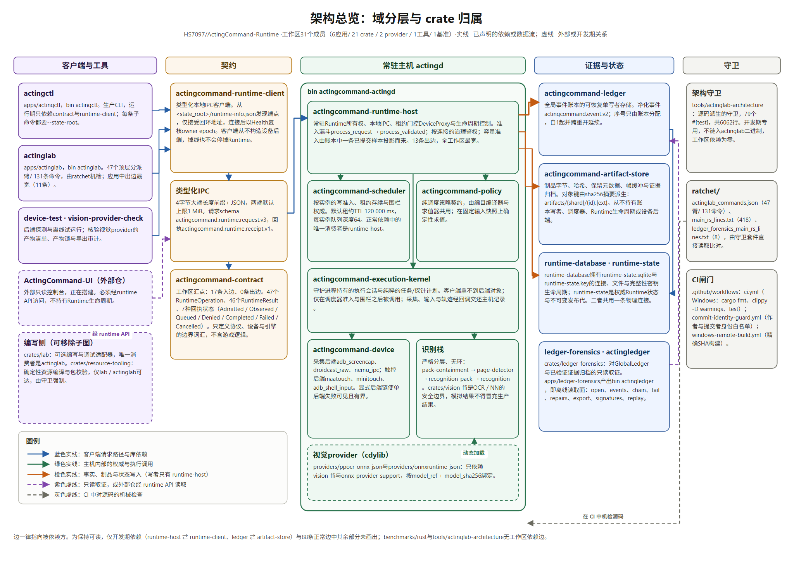
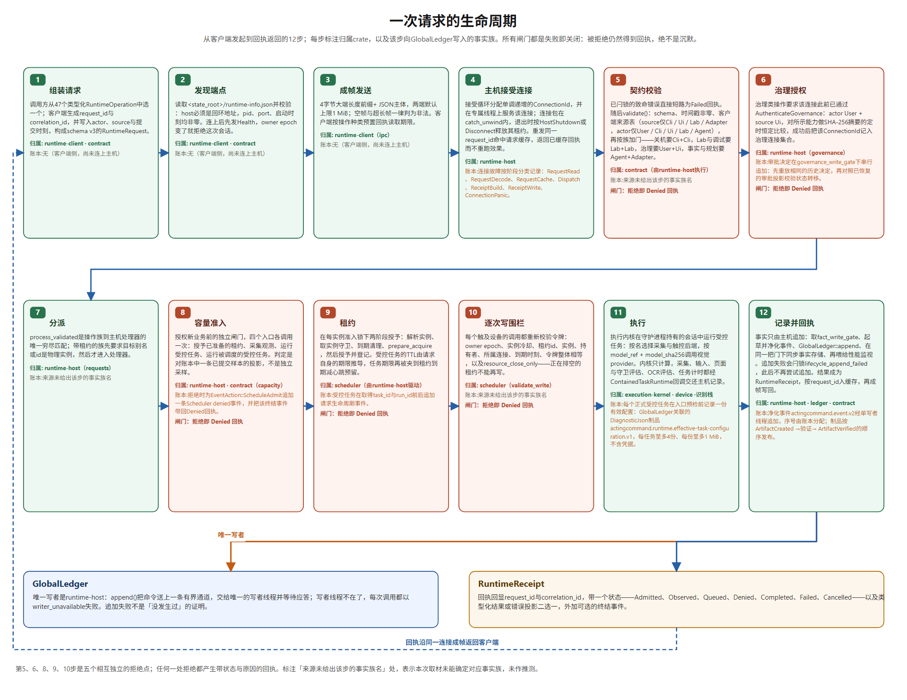
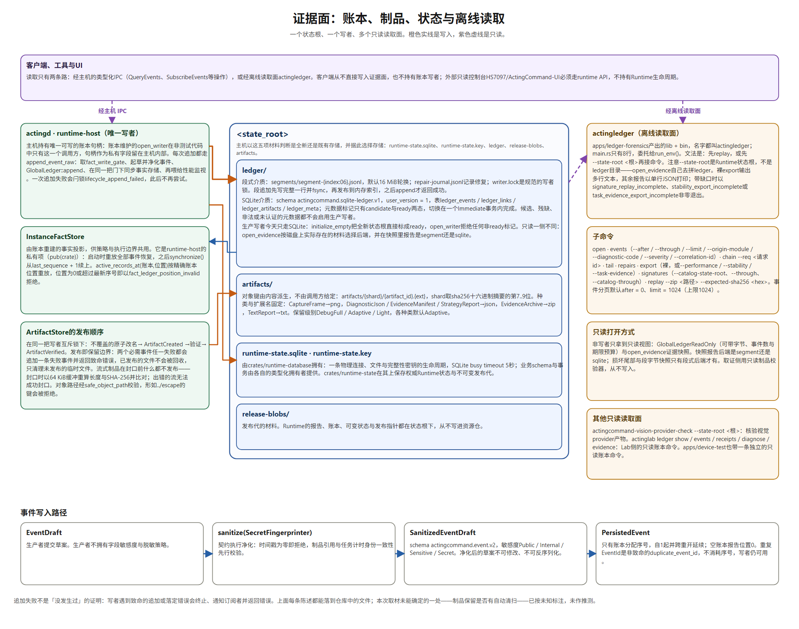

<p align="right">🌐 <a href="./README.md">English</a> · <b>简体中文</b></p>

<div align="center">


**首席执行官 兼 董事长** — HS7097<br/>
**首席技术官 兼 首席架构师** — GPT‑6 Astra<br/>
**董事会秘书 兼 首席审计官** — Fable 5.1<br/>
**首席技术工程师** — GPT‑6 Astra<br/>
**正在面试** — DeepSeek

</div>

**⚠️ 本程序仍在快速迭代，预计 2–5 星期内完成。**

# ActingCommand Runtime

ActingCommand Runtime 是一个常驻的 Rust 运行时，用于在模拟器上执行多目标自动化。内核不含任何具体目标的身份：合约、默认值、基准与夹具都由守卫测试扫描，保证其保持中立（`tools/actinglab-architecture/tests/workspace_guards.rs:161`、`:212`）。全部目标知识以声明式资源包的形式存在于独立的资源仓，运行时只接受带哈希校验的密封包（`actingctl task-run` 要求 `--package`，并要求 `--expected-sha256` 或 `--package-ref` 二者之一）。GlobalLedger 是唯一事实来源，只有 runtime-host 持有可写句柄；事实先经合约层脱敏成 `actingcommand.event.v2` 才能进入账本。设备访问一律经调度器发放的租约，每次写入都重新校验围栏。所有边界失败关闭：非法配置、非环回绑定、过期证据、不完整导出都以显性错误或非零退出结束，而不是静默降级。

[CI 主线状态](https://github.com/HS7097/ActingCommand-Runtime/actions/workflows/ci.yml?query=branch%3Amain)（Windows：fmt / clippy `-D warnings` / test） · [精确 SHA 的 Windows 构建](https://github.com/HS7097/ActingCommand-Runtime/actions/workflows/windows-remote-build.yml) · 许可 `AGPL-3.0-only` · [协作看板](https://github.com/HS7097/ActingCommand-Workflow) · [UI 控制台](https://github.com/HS7097/ActingCommand-UI) · [历史归档](https://github.com/HS7097/ActingCommand-Legacy-Runtime)

## 仓库族

| 仓库 | 角色 |
| --- | --- |
| [HS7097/ActingCommand](https://github.com/HS7097/ActingCommand) | 伞仓（门面页）：项目族 README、`bundles/` 下的标准包，以及 Releases 里的安装器与每日构建 |
| [HS7097/ActingCommand-Runtime](https://github.com/HS7097/ActingCommand-Runtime) | 本仓：常驻运行时（守护进程、CLI、账本、设备后端） |
| [HS7097/ActingCommand-UI](https://github.com/HS7097/ActingCommand-UI) | 安装向导与监控台，只经运行时 API 与运行时通信 |
| [HS7097/ActingCommand-Workflow](https://github.com/HS7097/ActingCommand-Workflow) | 协作看板，工作从这里的 issue 起步 |

## 架构总览



`actingcommand-contract` 是整个工作区的汇点：17 个包依赖它，它不依赖任何工作区包，只用 serde、serde_json、sha2。它定义协议、设备与引擎边界的词汇，不含目标逻辑。

`actingcommand-runtime-client` 是唯一的客户端类型化 IPC 路径。客户端从不构造也不拥有生产设备后端，关闭一个 UI 或 CLI 客户端不会停止运行时。

`actingcommand-runtime-host` 是常驻进程的所有者，出度 13，是图中最宽的节点。它独占本地 IPC、租约门控的 DeviceProxy 与生命周期控制，并且在正常依赖（不计 dev-dependencies）中是 `actingcommand-scheduler`、`actingcommand-runtime-state`、`actingcommand-host-metrics` 的唯一消费者。

`actingcommand-scheduler` 拥有按实例的写入准入、租约生命周期与围栏权限，其依赖只有合约一个。`actingcommand-policy` 是纯调度策略合约，由目录编译器与求值器共享。`actingcommand-execution-kernel` 持有守护进程侧的执行会话与纯粹的任务/探测决策规划，只有在调度器准入并完成围栏之后才被调用；客户端永远拿不到后端对象。

设备层 `actingcommand-device` 通过显式后端链选择输入，使单后端失败可见且有界。识别栈严格分层且无环：`recognition` ← `recognition-pack` ← `page-detector` ← `pack-containment`。`actingcommand-vision-ffi` 是 OCR/NN 引擎的安全边界，使调用方无法用模拟识别悄悄替换生产结果。

`actingcommand-ledger` 提供全局事件账本的可恢复单写者存储；`actingcommand-artifact-store` 拥有工件字节、哈希、保留元数据、帧缓冲与证据归档，但从不拥有账本写者、调度器、运行时生命周期或设备后端。`actingcommand-runtime-database` 拥有 SQLite 连接、文件与完整性密钥的生命周期，业务模式由各自的类型化所有者提供；`actingcommand-runtime-state` 是权威运行时状态与不可变发布代次的所有者。

创作侧是可移除的：`crates/lab` 只有 `apps/actinglab` 一个消费者，`crates/resource-tooling` 只能从 lab 与 actinglab 到达，两条规则都有具名守卫测试。`tools/actinglab-architecture` 是仅限开发的包，从源码推导架构守卫，不链接进任何运行时二进制。

## 一次请求怎么走



1. **组装**（`runtime-client`）：调用方从 47 个类型化 `RuntimeOperation` 变体中选一个，客户端生成 request_id 与 correlation_id，写入 actor、source 与提交时间，构成 `actingcommand.runtime.request.v3` 请求。
2. **发现**（`runtime-client`）：客户端读取 `<state_root>/runtime-info.json`，校验其 host 必须是环回地址、pid/port/启动时间非零，连上 TCP 后先发 Health；若 owner epoch 与发现时不一致，会话以 `runtime_owner_epoch_changed` 拒绝。
3. **成帧**（`runtime-client`）：请求以 4 字节大端长度前缀加 JSON 发出，两端默认上限 1 MiB，并按操作类别装载回执读取期限。
4. **受理**（`runtime-host`）：接受循环为每个连接分配递增的 ConnectionId，并在独立命名线程上服务；连接被 catch_unwind 包裹，退出时按 Disconnect 或 HostShutdown 释放该连接的租约。
5. **校验**（`actingcommand-contract`）：`RuntimeRequest::validate()` 依次拒绝错误 schema、零时间戳、不在允许表内的 actor/source 组合，再施加按族的来源门：关机必须 User/Ui 或 Cli/Cli，Lab 与调试必须 Lab/Lab，治理身份牌须由 User/Ui 或 Cli/Cli 声明、审批决定必须 User/Ui，事实与规划必须 Agent/Adapter。失败产出 Denied + InvalidRequest 回执。
6. **授权**（`runtime-host`）：审批决定还要求该连接此前以 `DeclareGovernanceIdentity` 声明的治理身份牌已被接受（客户端名、可选版本与实例，无共享密钥）。宿主按允许的客户端与已注册实例核验身份牌，每次声明无论接受或拒绝都记为账本事件 `governance.identity_declared`，接受后按 ConnectionId 记录。
7. **分派**（`runtime-host`）：`process_validated` 是从操作族到处理器的唯一穷尽匹配；带租约的族先断言目标别名/ID 是物理实例。
8. **容量准入**（`runtime-host`）：授权新业务前先查容量投影。该投影读取进程内缓存的最后一条已提交容量样本（缓存项带有指回账本事件的引用），遇到无样本、owner epoch 变化、超出新鲜度窗口、卷绑定变化、卷不可读或硬阈值压力时拒绝；拒绝会追加一条 Scheduler `denied` 事件并随回执返回。请求侧的四个业务入口受此保护（同一投影另有非请求路径的调用点）：授予租约、采集观测、运行受限任务、运行已调度的受限任务。
9. **租约**（`scheduler`）：在按实例的准入锁下两阶段准备并提交租约；受限任务的 TTL 由请求自身的期限推导，任务期限再被夹到「租约到期减心跳预留」。
10. **逐次围栏**（`scheduler`）：每一次触碰设备的调用都重新校验令牌——owner epoch、冷却、租约位置、实例/租约/持有者身份、拥有连接、到期时间、令牌整体相等，以及 resource_close_only 状态。
11. **执行**（`execution-kernel`）：内核在守护进程拥有的会话下运行受限任务，按名称选择采集与输入后端，按固定 model_ref 与 model_sha256 调用视觉提供者；每次采集、输入与追踪都经 `ContainedTaskRuntime` 回调宿主，由宿主而非内核记录事实。
12. **记录并回执**（`runtime-host` + `ledger`）：宿主取 fact_write_gate，起草并脱敏事件，交给账本的单写者线程追加，同步事实存储，再喂给性能监视。结果成为一份带状态（Admitted / Observed / Queued / Denied / Completed / Failed / Cancelled）的 `RuntimeReceipt`，按 request_id 缓存后成帧回传。拒绝也是回执，从不以沉默代替。

## 证据面



**GlobalLedger** 是唯一的事实来源，runtime-host 是唯一写者：可写句柄只在 `RuntimeHost::start_with_provider` 中打开，并作为私有字段持有；唯一例外是离线 `actingd unlock-owner` 为它那一条 `owner.unlock` 事实自开写者。生产者提交 `EventDraft`，必须经 `sanitize()` 得到不可变更、不可反序列化的 `SanitizedEventDraft`（`actingcommand.event.v2`）才能进入账本；字段敏感度与脱敏策略由合约而非生产者决定。序列号只由账本分配，从 1 开始并跨重开继续。重复 EventId 是不致命的 `duplicate_event_id`，不消耗序列号；而追加失败不等于「事件不存在」——写者在致命错误上终止并通知订阅者。今天主机写入的介质是 SQLite：schema `actingcommand.sqlite-ledger.v1`，表与 `runtime-state.sqlite` 同库。全新状态根由 `initialize_empty` 直接写入 `ready` 标记，`open_writer` 拒绝任何非 `ready` 标记，因此新装的实例一开始就跑在 SQLite 上。段存储 `<state_root>/ledger/segments/segment-NNNNNN.jsonl`（默认 16 MiB 轮转，先写整行并 fsync 再发布到内存索引）是旧的落盘形态，由离线 `ledger-maintenance` 路径冻结并导入；`candidate` 或未认证的标记不会启用生产写者，切换在一次 Immediate 事务内完成。只读一侧不同：`open_evidence` 按状态根里实际存在的材料选择后端，并在快照里报告后端是 segment 还是 sqlite。

**ArtifactStore** 拥有工件字节与哈希。对象键由内容推导而非调用方指定：`artifacts/{shard}/{artifact_id}.{ext}`。发布顺序是「不覆盖的原子重命名 → ArtifactCreated → 校验 → ArtifactVerified」；发布即保留边界——两个必需事件任一失败都会追加一条失败事件并返回致命错误，但已发布的文件不会被回收，只有未发布的临时文件会被清理。流式工件在封口重算长度与 SHA-256 之前不发布任何内容。

**runtime-state / runtime-database** 是权威可变状态与不可变发布代次的所有者，落在 `runtime-state.sqlite`，完整性密钥在 `runtime-state.key`。宿主启动时恰好探测五种状态根材料来判断全新与既有存储：`runtime-state.sqlite`、`runtime-state.key`、`ledger`、`release-blobs`、`artifacts`。

**InstanceFactStore** 是由账本重建的事实投影，对 runtime-host 私有，启动时重放全部事件恢复，之后从 last_sequence+1 增量同步；它还能按精确账本位置重放历史，位置为 0 或超出最新序列号会被拒绝。

**离线读取**由 `actingledger` 提供，它只开只读证据快照，从不写入。子命令为：`open`、`events`、`chain --req <request-id>`、`tail`、`repairs`、`export`（可加 `--performance` / `--stability` / `--task-evidence`）、`signatures`、`facts --at <sequence>`（按账本位置重放程序事实库）、`replay`。除裸 `export` 输出人类可读的多行文本报告外，其余报告都是单行 JSON；证据存在缺口时先打印报告再以 `signature_replay_incomplete`、`stability_export_incomplete`、`task_evidence_export_incomplete` 非零退出；`facts` 不可用时以 `runtime_facts_not_available` 或失败码非零退出。

## 不变式与守卫

`docs/architecture/runtime-completion-invariants.md` 列出九条完成不变式，原文为英文，要点为：确定性重放；重放没有第二次副作用；循环有预算；时钟跳变强制完全重算；崩溃恢复重建同一待定集合；可执行工作不会饥饿；非法输入大声失败；未知不被静默当作假；每次派发都有完整理由链。该文档同时明确划定证据范围：使用中立数据、假后端、加速时钟、真实子进程与持久化本地状态，**不**主张真机、目标客户端、UI 或 48 小时墙钟验证。

守卫套件位于 `tools/actinglab-architecture/tests/workspace_guards.rs`。Lab 检查保留私有模块归属、helper 可见性和生产调用路径；导入名称解析由 Rust 编译检查承担。具名守卫包括 `c2_runtime_code_contracts_defaults_and_fixtures_are_project_neutral`、`r2f_product_and_authoring_paths_have_no_builtin_game_identity`（中立性扫描）、`workspace_packages_do_not_depend_on_apps`、`contract_dependencies_stay_within_budget`、`actingcommand_contract_has_no_dependency_path_to_actingcommand_ledger`、`all_non_lab_packages_remain_lab_free_with_all_features`、`production_packages_cannot_reach_resource_tooling`、`dependency_metadata_requests_all_features`、`feature_gated_forbidden_dependency_paths_are_detected`。

三个棘轮文件在仓库根的 `ratchet/`：`actinglab_commands.json`（schema `actingcommand.command-inventory.v1`，47 个顶层分派臂 / 131 条命令 / 8 项流水线豁免）、`main_rs_lines.txt`（`418`）、`ledger_forensics_main_rs_lines.txt`（`8`）。守卫测试 `command_inventory_matches_checked_in_snapshot`、`main_rs_line_ratchet_matches_checked_in_baseline` 与 `forensic_leaf_dependency_boundary_is_narrow_and_production_free` 分别读取它们。

CI 共三个工作流：`ci.yml` 在 windows-latest 上执行格式、locked workspace build 和 Clippy。Test 步分别保留四组结果：排除 actingd/runtime-client 的 workspace、runtime-client、actingd binary 及 process integration target；Test observation 以 `test-observation` feature 执行原两个 runtime-client 检查。架构守卫仍由 workspace tests 执行。`commit-identity-guard.yml` 在 ubuntu-latest 上要求推送或 PR 范围内每个提交的 author **与** committer 邮箱都落在一份八项精确白名单内（HS7097 / HS7097Agt / HS7097ViW 三个账号各两种 noreply 形式、一个注册邮箱地址，以及 GitHub 网页端提交者 `noreply@github.com`），否则失败；`windows-remote-build.yml` 解析并复核一个 40 位小写 SHA，随后 `cargo build --locked --release --target x86_64-pc-windows-msvc`，产出两份带 `BUILD-MANIFEST.json` 的构件。

## Workspace 成员

工作区声明 30 个成员，resolver `3`，工作区声明 edition 2024，全部 `publish = false`。

### apps（6）

| 路径 | 包 | 产物 | 职责 |
| --- | --- | --- | --- |
| apps/actingctl | actingcommand-actingctl | bin `actingctl` | 面向 correlation 作用域运行时流程的精简生产 CLI |
| apps/actingd | actingcommand-actingd | bin `actingcommand-actingd` | 常驻运行时的精简进程适配器 |
| apps/actinglab | actingcommand-actinglab | bin `actinglab` | 创作与调试侧 CLI，47 个顶层分派臂、131 条命令 |
| apps/device-test | actingcommand-device-test | bin `actingcommand-device-test` | 设备后端探测与离线 dry-run 规划、页面/识别求值 |
| apps/ledger-forensics | actingledger | lib + bin `actingledger` | 账本取证报告、重放与签名目录的只读前端 |
| apps/vision-provider-check | actingcommand-vision-provider-check | bin | 校验视觉提供者工件清单、产出工件锁与导出审计 |

### crates（21）

| 路径 | 包 | 职责 |
| --- | --- | --- |
| crates/actingcommand-contract | actingcommand-contract | 协议、设备与引擎边界的合约定义，不含目标逻辑 |
| crates/artifact-store | actingcommand-artifact-store | 工件字节、哈希、保留元数据、帧缓冲与证据归档 |
| crates/device | actingcommand-device | 设备层原语；输入经显式后端链选择 |
| crates/execution-kernel | actingcommand-execution-kernel | 守护进程拥有的执行会话与纯任务/探测决策规划 |
| crates/host-metrics | actingcommand-host-metrics | 平台性能计数器的安全边界（仅 cfg(windows) 依赖 windows-sys） |
| crates/lab | actingcommand-lab | 可选的创作与调试适配层；排除后生产仍可构建可运行 |
| crates/ledger | actingcommand-ledger | 全局运行时事件账本的可恢复单写者存储 |
| crates/ledger-forensics | actingcommand-ledger-forensics | 基于 GlobalLedger 与已验证证据归档的只读取证 |
| crates/onnx-provider-support | actingcommand-onnx-provider-support | 提供者侧 ORT 生命周期：幂等初始化、可取消看门狗、会话缓存 |
| crates/pack-containment | actingcommand-pack-containment | 加载与校验密封资源包，含投影与识别元数据校验 |
| crates/page-detector | actingcommand-page-detector | 以识别结果求值声明式页面集合 |
| crates/policy | actingcommand-policy | 目录编译器与求值器共享的纯调度策略合约 |
| crates/recognition | actingcommand-recognition | 底层图像与模板匹配原语；无工作区依赖 |
| crates/recognition-pack | actingcommand-recognition-pack | 解析声明式识别包并把目标分派给视觉提供者 |
| crates/resource-tooling | actingcommand-resource-tooling | 确定性资源编译与包校验；无设备/调度器/运行时权限 |
| crates/runtime-client | actingcommand-runtime-client | 类型化本地 IPC 客户端；不拥有生产设备后端 |
| crates/runtime-database | actingcommand-runtime-database | 运行时自有的 SQLite 连接、文件与完整性密钥生命周期 |
| crates/runtime-host | actingcommand-runtime-host | 常驻运行时归属、本地 IPC、租约门控 DeviceProxy 与生命周期 |
| crates/runtime-state | actingcommand-runtime-state | SQLite 支撑的权威运行时状态与不可变发布代次 |
| crates/scheduler | actingcommand-scheduler | 按实例的写入准入、租约生命周期与围栏权限 |
| crates/vision-ffi | actingcommand-vision-ffi | OCR/NN 引擎的安全 FFI 边界 |

### providers（2）

| 路径 | 包 | 产物 | 职责 |
| --- | --- | --- | --- |
| providers/onnxruntime-json | actingcommand-onnxruntime-json-provider | cdylib + rlib | ONNXRuntime 支撑的 NN JSON ABI 提供者，导出 `ac_onnxruntime_classify_json` |
| providers/ppocr-onnx-json | actingcommand-ppocr-onnx-json-provider | cdylib + rlib | ONNXRuntime 支撑的 PPOCR ROI 识别器，导出 `ac_fastdeploy_ppocr_read_text_json`；不打包模型与运行时 DLL |

### tools（1）与 benchmarks（1）

| 路径 | 包 | 产物 | 职责 |
| --- | --- | --- | --- |
| tools/actinglab-architecture | actingcommand-actinglab-architecture | lib | 从源码推导的架构守卫；仅限开发，不链接进运行时二进制 |

## 设备与识别

采集后端按名称存在：`fixture_simulation`、`adb_screencap`、`adb_screencap_encode`、`adb_screencap_raw_gzip`、`droidcast_raw`、`nemu_ipc`，可选值为 `auto`、`auto-fastest`、`adb`、`droidcast_raw`、`nemu_ipc`。输入后端为 `maatouch`、`minitouch`、`adb_shell_input`，可选值为 `auto`、`auto-fastest`、`maatouch`、`minitouch`、`adb_shell_input`。Nemu IPC 采集后端在 crate 内实现并带独立工作线程。厂商 stdio 以有界、显式关闭的会话捕获，并报告资源静默状态。

识别目标分五类：Template、Color、ClickOnly、Ocr、Nn。模板匹配是 CPU 图像匹配，带 5 秒显式超时与粗匹配/精修两段，超时失败会报告发生在哪一段。生产 OCR 与 NN 只能经 `vision-ffi` 边界到达两个独立 cdylib 提供者，宿主侧适配器强制提供者身份：`model_ref` 必须是不含 `/`、`\` 或 `:` 的有界逻辑标识（不接受主机路径），`model_sha256` 必须是恰好 64 位小写十六进制。页面投影是对单帧已解析事实的无副作用投影，schema `actingcommand.page-projection.v1`，上限 64 条 / 32 KiB，条目按角色（Navigate / PageOp / ControlPoint）、任务 ID、资源 ID 与页面为键，每条携带 Safety 分类且默认值为 Dangerous；操作 schema `0.8` 的 OCR 字段声明走 `post_admission_ocr.mode = fields_v1`，字段声明与旧的真值集合声明不可混用，且本合约不含任何目标专有值（`contracts/ocr-fields.md`、`contracts/page-projection.md`）。

## 构建与运行

Windows 准确 SHA 工件包含两份 Runtime exe、待填写配置模板、安装说明与未发布候选说明，
由同一 BUILD-MANIFEST 逐项绑定。见[下载契约](scripts/windows-tools/README.md)与
[安装说明](distribution/windows/INSTALL.md)；Tools 仍为独立工件。

`apps/actinglab` 的 `build.rs` 会读取 Git 元数据确定 HEAD。当 Git 元数据可用时，若同时设置了 `ACTINGCOMMAND_RUNTIME_HEAD`，它必须是 40 位十六进制且与仓库 HEAD 一致，否则构建 panic；当 Git 元数据不可用（例如无 `.git` 的源码树）时，该变量为必填。

`actingd` 的正常调用只接受 `--config <path>` 两个参数；第一个参数也可以改为 `ledger-maintenance`、`check-config` 或 `unlock-owner` 子命令，其余一律 `usage_invalid`。配置 schema 为 `actingcommand.actingd.config.v1`，上限 1 MiB，拒绝未知字段；`bind_host` 必须能解析为 IP **且**必须是环回地址，`secret_fingerprint_salt` 必须是 16..=1024 字节。`actingd` 启动时会把驻内存的运行配置清单（所运行的子系统，以及每个生效参数及其来源；盐只记字节长度）记为程序事实 `config.subsystems` / `config.parameters`，可用 `actingctl facts --program` 读取，`check-config` 也会打印。`actingctl` 与 `actingledger` 的 `--state-root` 都指运行时状态根，而不是 `ledger` 目录。

```bash
# 本地构建；下面三条门禁与 CI 相同（CI 的发布构建另带 --locked 与显式 MSVC 目标）
cargo build --release
cargo fmt --all -- --check
cargo clippy --workspace --all-targets --keep-going -- -D warnings
cargo test --workspace --no-fail-fast

# 启动常驻守护进程；成功时 stdout 打印 actingd ready pid=<pid> host=<host> port=<port>
actingcommand-actingd --config runtime.json

# 客户端（子命令必须是第一个参数，之后才是标志；每条命令都需要 --state-root）
actingctl status --state-root <state-root>
actingctl facts --program --state-root <state-root>
actingctl monitor-status --state-root <state-root>
actingctl observe --state-root <state-root> --instance <alias>
actingctl reset --state-root <state-root> --instance <alias>
actingctl stream --state-root <state-root> --instance <alias> --max-frames 8 --interval-ms 250
actingctl monitor-set --state-root <state-root> --instance <alias> --interval-ms 30000 --expect home --recover
actingctl monitor-clear --state-root <state-root> --instance <alias>
actingctl emulator status --state-root <state-root> --instance <alias>
actingctl emulator start --state-root <state-root> --instance <alias>     # 另有 stop | restart（仅显式请求；按实例围栏；配置了 startup_package 则随后以受控任务排程）
actingctl pause --state-root <state-root> [--instance <alias>] [--reason <code>] [--drain-timeout-ms <n>]     # 停止策略派发：全局，或单个物理实例（先排空其在途任务）；只在内存、无过期（contracts/scheduling-pause.md）
actingctl resume --state-root <state-root> [--instance <alias>]     # 解除该暂停；status 显示全局与各实例的暂停态
actingctl task-run --state-root <state-root> --instance <alias> --package <pkg.zip> --expected-sha256 <hex>
actingctl task-offset <task_id> <offset_milli> --state-root <state-root> [--instance <alias>]     # 手动优先级偏移（±1000000 milli），写成 session.task.<task_id>.priority_offset 事实；不带 --instance 时为任务级，作用于唯一配置的游戏（否则 task_offset_scope_ambiguous）
actingctl request-shutdown --state-root <state-root>

# 只读取证（同一状态根）
actingledger --state-root <state-root> open
actingledger --state-root <state-root> events --after 0 --limit 200
actingledger --state-root <state-root> chain --req <request-id>
actingledger --state-root <state-root> tail
actingledger --state-root <state-root> repairs
actingledger --state-root <state-root> export --task-evidence --after 0 --limit 1024
actingledger replay --zip <evidence.zip> --expected-sha256 <hex>

# 离线账本维护（不装配提供者、IPC 与设备）
actingcommand-actingd ledger-maintenance backup  --config runtime.json --backup frozen-backup
actingcommand-actingd ledger-maintenance dry-run --config runtime.json --backup frozen-backup
actingcommand-actingd ledger-maintenance verify  --config runtime.json

# 无副作用的配置检查（与启动相同的加载/装配/校验；不触碰 state_root 下任何内容）
actingcommand-actingd check-config --config runtime.json

# 启动因 owner_resource_unconfirmed 被拒后的离线解锁（只向 owner.lock 追加、从不删除；下次启动自动接管）
actingcommand-actingd unlock-owner --config runtime.json --actor <name> --confirm-resources-released

# 视觉提供者工件检查
actingcommand-vision-provider-check --state-root <state-root> --limit 256
actingcommand-vision-provider-check --manifest provider.json --backend all --require-existing

# 只读 MuMu 实例发现探针（只运行 MuMuManager version 与 info -v all；输出一行 JSON）
actingcommand-device-test mumu-discover [--root <mumu-install-root>]
```

注意：cargo 产出的守护进程二进制名为 `actingcommand-actingd`；短名有 `actingctl`、`actinglab`、`actingledger`。

## 当前边界（2026-09-13）

- 完成不变式的证据全部来自 CI 可跑的构造性测试，使用中立数据、假后端、加速时钟与真实子进程。真机验证、目标客户端验证、UI 验证与 48 小时墙钟验证都**不**在其主张范围内。
- 设备后端按名称存在并可选择，但本仓不携带真机验收证据；任何真机结论需要单独给出后端、资源包与边界。
- 账本介质迁移进行中：主机的生产写者已经只走 SQLite 介质，段存储保留为导入源——离线 `ledger-maintenance` 负责冻结与导入既有段目录。段读取面与段字节快照仍在代码里，其退役排在后续阶段。
- 工件保留类只有 DebugFull / Adaptive / Light 三个取值且默认 Adaptive；本仓未见自动清理实现，请勿假定存在自动回收。
- UI 是外部只读控制台，在独立仓中起步阶段，必须经运行时 API 且不得拥有运行时生命周期。
- 代理面只建成了守护进程一侧：`runtime-host` 有 `AgentDispatcher`（唤醒记录、会话起停与有界管理），可由 `actingd` 配置的 `agent_dispatcher` 段启用；`actingctl agent-publish-facts` 是已有的 Agent/Adapter 来源入口。本仓不含任何外部代理客户端，自动唤起、自主探索与完整的自维护回路尚未建成。

## 协作

身份：HS7097 是所有者与裁定者；HS7097Agt 是实施账号；HS7097ViW 是验收账号。`commit-identity-guard` 工作流要求每个提交的 author 与 committer 邮箱都落在一份八项精确白名单内：这三个账号各两种 noreply 形式、一个注册邮箱地址，以及 GitHub 网页端提交者 `noreply@github.com`。

主线合并只由所有者执行。提交工作的顺序是：先在看板仓开 issue，再在本仓开分支与 PR，所有必需 CI 通过后停在可合并状态等待所有者。运行时报告、账本、可变状态与发布指针都写在运行时状态根下，绝不写回资源仓。

## 许可

`AGPL-3.0-only`。完整文本见 [LICENSE](./LICENSE)。第三方材料见 [NOTICE.md](./NOTICE.md)。
