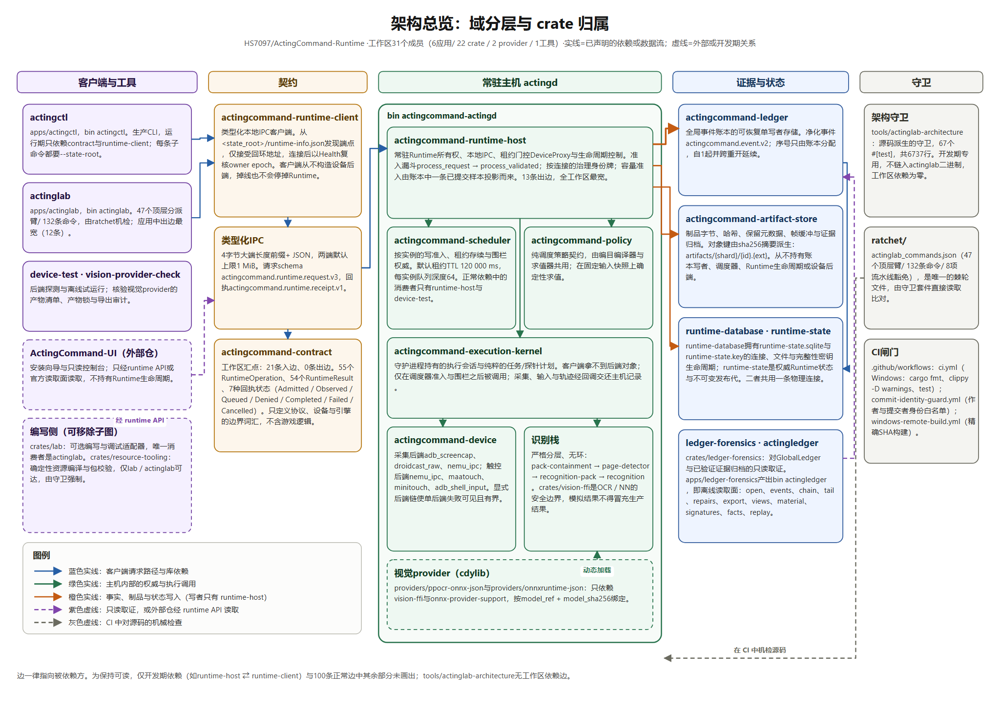
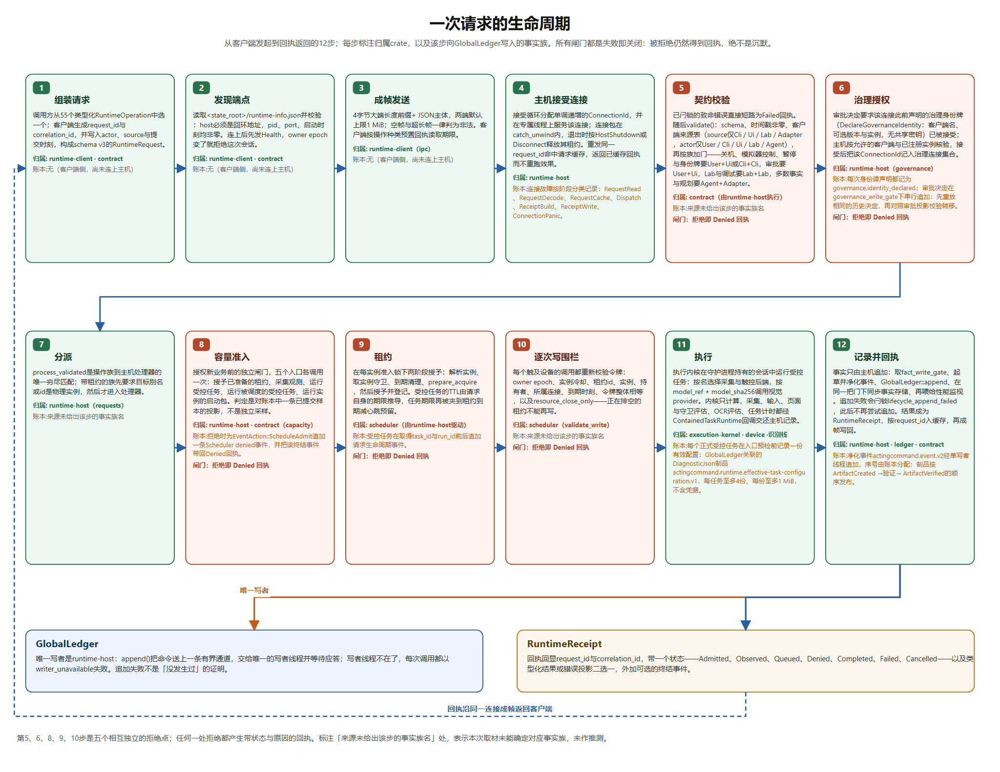
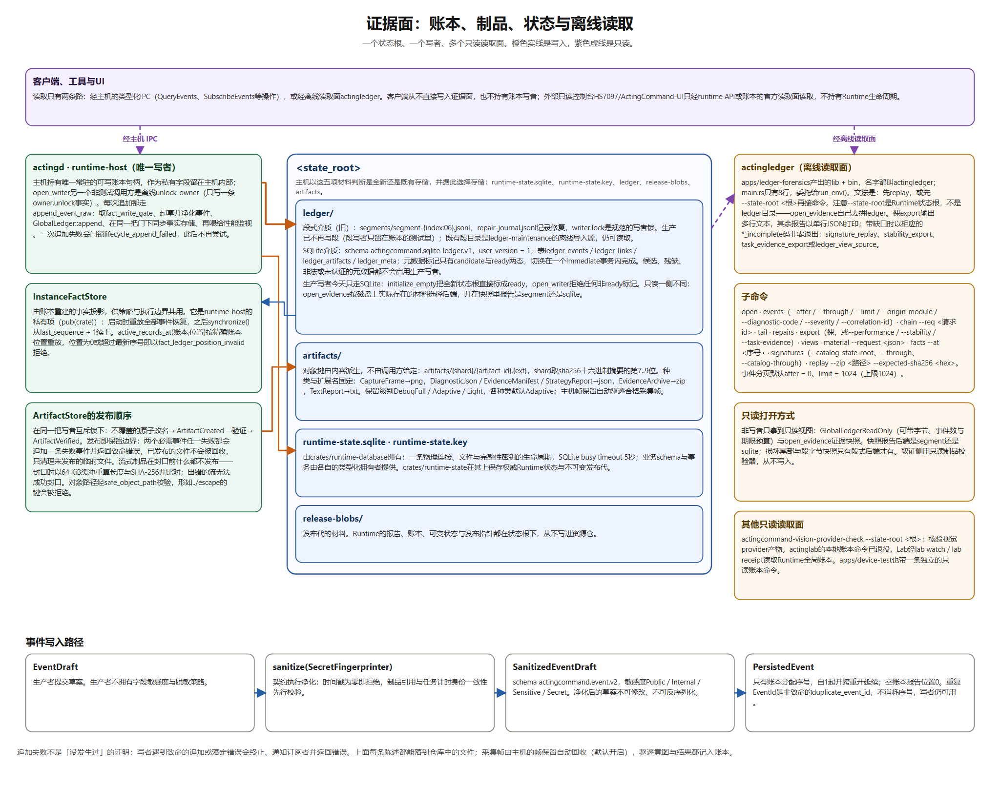

<p align="right">🌐 <a href="./README.md">English</a> · <b>简体中文</b></p>

<div align="center">


**首席执行官 兼 董事长** — HS7097<br/>
**首席技术官 兼 首席架构师** — Claude Opus 5.5 · GPT‑6 Astra · Claude Fable 5 · GPT‑5.6 Sol<br/>
**董事会秘书 兼 首席审计官** — Claude Opus 5.5 · Claude Fable 5.1<br/>
**首席技术工程师** — Claude Opus 5.5 · GPT‑6 Astra · GPT‑5.6 Sol<br/>
**正在面试** — DeepSeek

</div>

**⚠️ 预发布，调试阶段。到目前为止的每个发布都是预发布；接口、配置与文件格式仍会变化，只支持最新版。计划中的 0.12 系列会带来破坏性变化（新账本、新的命令行输出与退出码）；见[开发状态](#开发状态)与[路线图](#路线图)。**

# ActingCommand Runtime

ActingCommand Runtime 是一个常驻的 Rust 运行时，用于在安卓模拟器上执行多目标自动化。程序本体（Runtime、Tools 与 MCP 服务）保持中立：不含任何具体目标的逻辑或信息——没有名称、页面、角色、关卡、资源名、数值或规则。代码、合约、默认值与夹具都在 CI 里由守卫测试 `c2_runtime_code_contracts_defaults_and_fixtures_are_project_neutral` 与 `r2f_product_and_authoring_paths_have_no_builtin_game_identity` 扫描。一切目标专属内容（截图素材、识别区域、点击框、任务顺序、数据表）都在声明式资源包里：任务包按目标汇成一个标准包，按内容摘要密封，装载前核对；支持另一个目标就是换一份包，程序不改。运行时只接受带哈希校验的密封包（`actingctl task-run` 要求 `--package`，并要求 `--expected-sha256` 或 `--package-ref` 二者之一）。GlobalLedger 是唯一事实来源，只有 runtime-host 持有可写句柄；事实先经合约层脱敏成 `actingcommand.event.v2` 才能进入账本。设备访问一律经调度器发放的租约，每次写入都重新校验围栏。Runtime 只监听本机环回地址，本身没有网络代码。所有边界都 Fail Loud：非法配置、非环回绑定、过期证据、不完整导出都以显性错误或非零退出结束，而不是静默降级；拒绝也是一份回执；「未知」从不当作「否」。

[CI 主线状态](https://github.com/HS7097/ActingCommand-Runtime/actions/workflows/ci.yml?query=branch%3Amain)（Windows：fmt / clippy `-D warnings` / 七个模块测试作业） · [精确 SHA 的 Windows 构建](https://github.com/HS7097/ActingCommand-Runtime/actions/workflows/windows-remote-build.yml) · [Releases](https://github.com/HS7097/ActingCommand-Runtime/releases)（按需发版：Actions → release → Run workflow） · 许可 `AGPL-3.0-only` · [伞仓](https://github.com/HS7097/ActingCommand) · [UI 控制台](https://github.com/HS7097/ActingCommand-UI)

## 仓库族

| 仓库 | 角色 |
| --- | --- |
| [HS7097/ActingCommand](https://github.com/HS7097/ActingCommand) | 伞仓（门面页）：项目族 README、智能体操作手册 `skills/actingcommand/`，以及 Releases 页上的安装向导、各成员发布与可用标准包 |
| [HS7097/ActingCommand-Runtime](https://github.com/HS7097/ActingCommand-Runtime) | 本仓：常驻运行时（守护进程、命令行、MCP 服务、账本、设备后端）与 Tools（Lab、账本读取器、检查程序、看门狗启动器） |
| [HS7097/ActingCommand-UI](https://github.com/HS7097/ActingCommand-UI) | 安装向导与监控台，只经运行时 API 与运行时通信 |

各组件各自发版，只在自身有变化时发。能否搭配看各自声明的接口修订（`distribution/windows/component-interfaces.json`、`contracts/component-interfaces.md`），不看版本号是否一致。版本号规则：X 重大或不兼容 . Y 新特性或新覆盖面 . Z 修复（含为修复服务的特性）。

## 当前发布

当前发布是 **v0.11.6**（预发布），在本仓 [Releases](https://github.com/HS7097/ActingCommand-Runtime/releases) 页。每个 Release 带两个 zip 与 `SHA256SUMS`；版本号只在 Release 的 tag 上，每个文件都由其 `BUILD-MANIFEST.json` 绑定到确切的源码提交。

| zip | 布局 | 内容 |
| --- | --- | --- |
| `actingcommand-runtime-<sha>.zip` | `distribution-v1` | `actingcommand-actingd.exe`、`actingctl.exe`、`actingd.config.example.json`、`INSTALL.md`、`RELEASE-NOTES.md` |
| `actingcommand-tools-<sha>.zip` | `platform-tools-v3` | `actinglab.exe`、`actingledger.exe`、`actingcommand-vision-provider-check.exe`、看门狗启动器 `actingwatch.exe`，以及 `platform-tools/` 下 Google 官方 Android platform-tools 37.0.1（`adb.exe`、`AdbWinApi.dll`、`AdbWinUsbApi.dll`、`NOTICE.txt`、`source.properties`） |

视觉模型与 ONNX Runtime 从不随发布：OCR/NN 引擎链接进 `actingcommand-actingd.exe`，模型从 `<vision root>\models\<model_ref>\` 读取；没有模型时，需要 OCR 的识别目标会明确失败。

**v0.11.6 本版内容**

- **每个实例一个工作线程。** 例行运行失败后直接把实例交给恢复阶梯，阶梯持续持有并续租该实例的令牌直到结束。磁盘不足时，开机认领拒绝一次、记录下来并放开实例。阶梯所有级都失败时报 Error，被暂停打断时报 Warning。
- **重启后不留关不掉的调度派单。** 有终态的运行按终态结算；没有终态的运行（被硬杀、已授租约未开始、租约已移交或到期）按「中断」结算一次，不计连败；超出时长预算而被改写的终态也能结算。
- **启动安全网。** 单个运行在启动时结算不了，不再让整个 Runtime 起不来：写一条 Error（`policy_settlement_dispatch_unsettled`），只暂停那一个实例。账本本身的读写或完整性故障仍然致命。
- **热安装过渡修复。** 每次 `actingctl install-transition` 运行只有一个截止时间，落在安装器的 75 s 之内；只读查询不需声明身份，新所有者准备期间不写账本；致命退出写出被锁存的真实原因；held 启动失败、release / held 超时之后由看门狗重启 Runtime，held 期间被接受的关闭则保持停机；安装过程中的拒绝、超时与失败记录重新能写进账本。
- **截图清理器**（见[当前边界](#当前边界)）。
- **CI 按模块拆分**：从约 45 分钟降到约 8 分钟；登记的不稳定测试单独一个作业，不挡合并。
- **退役 device-test 探针**：Tools 包不再带 `actingcommand-device-test.exe`。

**v0.11.5**（同样尚未进伞仓发布）：启动恢复改为分页读账本（每次最多 256 条，与账本长度无关），整链校验移到单独的只读连接、不再挡写入；每个实例只有一个请求队列，实例被占用时候选推迟并记一条 Info 理由，不算失败；截图近重复标记与两个开关；结果码核心（码目录、`outcome-guard`、CI 合并步骤）；时钟槽视图（到期与下一时钟时刻的纯函数）。

**升级到 v0.11.6 须知**

- 截图清理器删除或移走过一帧之后，状态根即单向：v0.11.5 及更早拒绝打开它。升级后第一次启动，建议在配置里写 `"frame_retention_enabled": false`，确认一切正常后再删掉这一项或改为 `true`（不写此键即开启）。
- 安装器不删旧的 `tools\actingcommand-device-test.exe`，要手动移走。

## 安装

- **安装向导（推荐）。** 伞仓的 [Releases](https://github.com/HS7097/ActingCommand/releases) 页带在线向导 `acsetup.exe`（自己取伞仓最新发布）、离线向导 `acsetup-full-<tag>.exe`（自带一整份发布）、一键脚本 `install.ps1` / `install.sh` 与各成员 zip。向导按用户安装、不要管理员（默认 `%LOCALAPPDATA%\Programs\ActingCommand`），逐个文件按 `SHA256SUMS` 与各 zip 的 `BUILD-MANIFEST.json` 核对，不符就停。它布置 A/B 安装：程序本体（`runtime\`、`ui\`）放进槽 `A\` 或 `B\`，`install\active.json` 选槽，安装根下的固定入口总是启动所选的槽；`tools\`、`vision\`、`packages\`、`state\` 留在安装根、两槽共用。升级时在另一个槽准备新版再切换；`ui\acsetup.exe --rollback` 可切回。伞仓最新发布（v0.11.4）带的是 Runtime v0.11.4；Runtime v0.11.5 与 v0.11.6 目前只在本仓 Releases 页上。
- **手动安装。** 从本仓某个 Release 取 `actingcommand-runtime-<sha>.zip`、`actingcommand-tools-<sha>.zip` 与 `SHA256SUMS`，核对后按 [INSTALL.md](distribution/windows/INSTALL.md) 操作：私有配置、[自带 adb](distribution/windows/INSTALL.md#bundled-adb)（没写 `adb_path` 的实例用 `<install root>\tools\platform-tools\adb.exe`）、启动 / 查看 / 关闭，以及[升级边界](distribution/windows/INSTALL.md#upgrade-boundary)。
- **看门狗。** 安装器不会自动启用。在运行 Runtime 的那个用户的普通（非提权）PowerShell 里运行一次 `<install root>\runtime\actingctl.exe watchdog install --root <install root>`：它注册一个每分钟运行一次 `<install root>\tools\actingwatch.exe` 的计划任务。Runtime 没经正式关闭就不在了（崩溃、关窗、任务管理器结束、重启）时，看门狗把它拉起；v0.11.6 起 held 启动失败、release / held 超时之后也会拉起。正式关闭过的不拉；最后一份日志以其他 `FATAL` 结尾的保持停机并报出；30 分钟内最多拉 3 次。记录写在 `<install root>\watchdog\watchdog.log`，不写账本。`watchdog status` / `run-once` / `uninstall` 用同一个 `--root`；删除安装前先 `watchdog uninstall`（[详情](distribution/windows/INSTALL.md#runtime-watchdog)、`contracts/runtime-watchdog.md`）。
- **搭配。** UI v0.11.3（控制台与安装向导）可以与 Runtime v0.11.6 搭配。Runtime 从 v0.11.3 及以后回滚到 v0.11.2 及更早不受支持（账本接口修订 2；`acsetup --rollback` 退出 1、不做改动）；v0.11.6 的清理器跑过之后，v0.11.5 及更早拒绝该状态根。

## 架构总览



`actingcommand-contract` 是整个工作区的汇点：22 个工作区包依赖它，它不依赖任何工作区包，只用 serde、serde_json、sha2。它定义协议、设备与引擎边界的词汇，不含目标逻辑。

`actingcommand-runtime-client` 是唯一的客户端类型化 IPC 路径。客户端从不构造也不拥有生产设备后端，关闭一个 UI、命令行或 MCP 客户端不会停止运行时。

`actingcommand-runtime-host` 是常驻进程的所有者，出度 13，是图中最宽的节点。它独占本地 IPC、租约门控的 DeviceProxy 与生命周期控制，并且在正常依赖（不计 dev-dependencies）中是 `actingcommand-runtime-state`、`actingcommand-scheduler` 与 `actingcommand-host-metrics` 的唯一消费者。

`actingcommand-scheduler` 拥有按实例的写入准入、租约生命周期与围栏权限，其依赖只有合约一个。`actingcommand-policy` 是纯调度策略合约，由目录编译器与求值器共享；它建立在纯选择求值器 `actingcommand-selection-policy` 之上（输入一份声明文档、有界候选集与显式事实快照，输出确定性的选择及其理由）。`actingcommand-execution-kernel` 持有守护进程侧的执行会话与纯粹的任务/探测决策规划，只有在调度器准入并完成围栏之后才被调用；客户端永远拿不到后端对象。

设备层 `actingcommand-device` 通过显式后端链选择输入，使单后端失败可见且有界。识别栈严格分层且无环：`recognition` ← `recognition-pack` ← `page-detector` ← `pack-containment`。`actingcommand-vision-ffi` 是 OCR/NN 引擎的安全边界，使调用方无法用模拟识别悄悄替换生产结果。

`actingcommand-ledger` 提供全局事件账本的可恢复单写者存储；`actingcommand-artifact-store` 拥有工件字节、哈希、保留元数据、帧缓冲与证据归档，但从不拥有账本写者、调度器、运行时生命周期或设备后端。`actingcommand-runtime-database` 拥有 SQLite 连接、文件与完整性密钥的生命周期，业务模式由各自的类型化所有者提供；`actingcommand-runtime-state` 是权威运行时状态与不可变发布代次的所有者。

创作侧是可移除的：`crates/lab` 只有 `apps/actinglab` 一个消费者，`crates/resource-tooling` 只能从 lab 与 actinglab 到达，生产程序不装它们照样构建和运行；两条规则都有具名守卫测试。`tools/actinglab-architecture`（从源码推导的架构守卫）与 `tools/outcome-guard`（结果码目录合并）是仅限开发的包，不链接进任何运行时二进制。

## 一次请求怎么走



1. **组装**（`runtime-client`）：调用方从 58 个类型化 `RuntimeOperation` 变体中选一个，客户端生成 request_id 与 correlation_id，写入 actor、source 与提交时间，构成 `actingcommand.runtime.request.v3` 请求。
2. **发现**（`runtime-client`）：客户端读取 `<state_root>/runtime-info.json`，校验其 host 必须是环回地址、pid/port/启动时间非零，连上 TCP 后先发 Health；若 owner epoch 与发现时不一致，会话以 `runtime_owner_epoch_changed` 拒绝。
3. **成帧**（`runtime-client`）：请求以 4 字节大端长度前缀加 JSON 发出，两端默认上限 1 MiB，并按操作类别装载回执读取期限。
4. **受理**（`runtime-host`）：接受循环为每个连接分配递增的 ConnectionId，并在独立命名线程上服务；连接被 catch_unwind 包裹，退出时按 Disconnect 或 HostShutdown 释放该连接的租约。
5. **校验**（`actingcommand-contract`）：`RuntimeRequest::validate()` 依次拒绝错误 schema、零时间戳、不在允许表内的 actor/source 组合，再施加按族的来源门：关机、模拟器控制、实例发现、自检与调度暂停/恢复必须 User/Ui 或 Cli/Cli，Lab 与调试必须 Lab/Lab，治理身份牌须由 User/Ui 或 Cli/Cli 声明、审批决定必须 User/Ui，事实与规划必须 Agent/Adapter（只含手动优先级偏移的事实观测也可来自 User/Ui 或 Cli/Cli）。失败产出 Denied + InvalidRequest 回执。
6. **授权**（`runtime-host`）：审批决定还要求该连接此前以 `DeclareGovernanceIdentity` 声明的治理身份牌已被接受（客户端名、可选版本与实例，无共享密钥）。宿主按允许的客户端与已注册实例核验身份牌，每次声明无论接受或拒绝都记为账本事件 `governance.identity_declared`，接受后按 ConnectionId 记录。
7. **分派**（`runtime-host`）：`process_validated` 是从操作族到处理器的唯一穷尽匹配；带租约的族先断言目标别名/ID 是物理实例。
8. **容量准入**（`runtime-host`）：授权新业务前先查容量投影。该投影读取进程内缓存的最后一条已提交容量样本（缓存项带有指回账本事件的引用），遇到无样本、owner epoch 变化、超出新鲜度窗口、卷绑定变化、卷不可读或硬阈值压力时拒绝；拒绝会追加一条 Scheduler `denied` 事件并随回执返回。五个业务入口受此保护（同一投影另有其他调用点：策略派发、监视探针、租约转移与性能监视的预检）：授予租约、采集观测、运行受限任务、运行已调度的受限任务，以及模拟器启动后运行实例的启动包。
9. **租约**（`scheduler`）：每个实例只有一个队列，持有者与等待者都在其中；在按实例的准入锁下两阶段准备并提交租约，准入的工作在该实例自己的工作线程（`actingd-instance-<alias>`）上运行。受限任务的 TTL 由请求自身的期限推导，任务期限再被夹到「租约到期减心跳预留」。
10. **逐次围栏**（`scheduler`）：每一次触碰设备的调用都重新校验令牌——owner epoch、冷却、租约位置、实例/租约/持有者身份、拥有连接、到期时间、令牌整体相等，以及 resource_close_only 状态。
11. **执行**（`execution-kernel`）：内核在守护进程拥有的会话下运行受限任务，按名称选择采集与输入后端，按固定 model_ref 与 model_sha256 调用视觉提供者；每次采集、输入与追踪都经 `ContainedTaskRuntime` 回调宿主，由宿主而非内核记录事实。
12. **记录并回执**（`runtime-host` + `ledger`）：宿主取 fact_write_gate，起草并脱敏事件，交给账本的单写者线程追加，同步事实存储，再喂给性能监视。结果成为一份带状态（Admitted / Observed / Queued / Denied / Completed / Failed / Cancelled）的 `RuntimeReceipt`，按 request_id 缓存后成帧回传。拒绝也是回执，从不以沉默代替。

第 5、6 步描述的是 0.11 的行为。0.12 系列计划让三个前端（命令行、MCP、UI）走同一道门，只记录请求来自哪个前端，不再按来源设门（见[路线图](#路线图)）。

## 调度与恢复

- **调度器。** 策略派发按已批准的目录（目录与其批准 id 写在 `actingd` 配置的 `policy` 段）在时钟槽上运行任务包。每个实例一个请求队列、一个工作线程；实例被占用时，候选推迟并记下理由，不算失败。其他输入：手动优先级偏移（`actingctl task-offset`）、实例资源目标（`actingctl agent-apply-resource-targets`，`contracts/resource-targets.md`）与磁盘容量准入。模拟器启动后，实例配置的 `startup_package` 作为受限任务运行。
- **暂停与恢复。** `actingctl pause` 全局或按实例（先排空其在途运行）停止策略派发。暂停没有过期时间，熬过重启；只有 `actingctl resume` 才解除（`contracts/scheduling-pause.md`）。
- **恢复阶梯。** 调度运行以「实例可能卡住」的方式失败时，实例按固定顺序走三级：回主页（运行绑定的恢复包或配置的回主页包）→ 重启应用 → 重启模拟器（再等 ADB、截图、输入与安卓就绪最多 120 s，然后跑启动包）。从命令行、控制台或 MCP 直接跑的任务失败从不启动阶梯，由发起方凭回执决定。实例配置 `stuck_recovery: false` 即对它关闭阶梯。今天触发条件与级序写在代码里；改成配置是 0.12 系列的计划（`contracts/emulator-control.md`，「Stuck-recovery ladder」）。
- **重启结算。** 被重启留下的调度运行在下次启动时结算（按终态，或按「中断」一次）；结算不了的运行只暂停它的实例，并报 Error。

## 证据面



**GlobalLedger** 是唯一的事实来源，runtime-host 是唯一写者：可写句柄只在 `RuntimeHost::start_with_provider` 中打开，并作为私有字段持有；唯一例外是离线 `actingd unlock-owner` 为它那一条 `owner.unlock` 事实自开写者。生产者提交 `EventDraft`，必须经 `sanitize()` 得到不可变更、不可反序列化的 `SanitizedEventDraft`（`actingcommand.event.v2`）才能进入账本；字段敏感度与脱敏策略由合约而非生产者决定。序列号只由账本分配，从 1 开始并跨重开继续。重复 EventId 是不致命的 `duplicate_event_id`，不消耗序列号；而追加失败不等于「事件不存在」——写者在致命错误上终止并通知订阅者。今天主机写入的介质是 SQLite：schema `actingcommand.sqlite-ledger.v1`，表与 `runtime-state.sqlite` 同库。全新状态根由 `initialize_empty` 直接写入 `ready` 标记，`open_writer` 拒绝任何非 `ready` 标记，因此新装的实例一开始就跑在 SQLite 上。段存储 `<state_root>/ledger/segments/segment-NNNNNN.jsonl` 是旧的落盘形态：生产已不再写它（段写者只留在账本 crate 自己的测试里），既有段目录由离线 `ledger-maintenance` 路径冻结并导入；`candidate` 或未认证的标记不会启用生产写者，切换在一次 Immediate 事务内完成。只读一侧不同：`open_evidence` 按状态根里实际存在的材料选择后端（有 SQLite 账本 schema 就读 SQLite，否则读段目录），并在快照里报告后端是 segment 还是 sqlite。

**ArtifactStore** 拥有工件字节与哈希。对象键由内容推导而非调用方指定：`artifacts/{shard}/{artifact_id}.{ext}`。发布顺序是「不覆盖的原子重命名 → ArtifactCreated → 校验 → ArtifactVerified」；发布即保留边界——两个必需事件任一失败都会追加一条失败事件并返回致命错误，但已发布的文件不会被回收，只有未发布的临时文件会被清理。流式工件在封口重算长度与 SHA-256 之前不发布任何内容。

**runtime-state / runtime-database** 是权威可变状态与不可变发布代次的所有者，落在 `runtime-state.sqlite`，完整性密钥在 `runtime-state.key`。宿主启动时恰好探测五种状态根材料来判断全新与既有存储：`runtime-state.sqlite`、`runtime-state.key`、`ledger`、`release-blobs`、`artifacts`。

**InstanceFactStore** 是由账本重建的事实投影，对 runtime-host 私有，启动时重放账本事件恢复，之后从 last_sequence+1 增量同步；它还能按精确账本位置重放历史，位置为 0 或超出最新序列号会被拒绝。

**离线读取**由 `actingledger` 提供，它只开只读证据快照，从不写入。子命令为：`open`、`events`、`chain --req <request-id>`、`tail`、`repairs`、`export`（可加 `--performance` / `--stability` / `--task-evidence`）、`views`（账本终态视图的一页，与运行时提供的页相同）、`material --request <json>`（一件已提交工件的一段已校验字节）、`signatures`、`facts --at <sequence>`（按账本位置重放程序事实库）、`replay`。除裸 `export` 输出人类可读的多行文本报告外，其余报告都是单行 JSON；证据存在缺口时先打印报告再以 `signature_replay_incomplete`、`stability_export_incomplete`、`task_evidence_export_incomplete`、`ledger_view_source_incomplete` 非零退出；`facts` 不可用时以 `runtime_facts_not_available` 或失败码非零退出。

**结果码。** 各组件把自己的结果码登记在 `contracts/outcome-codes/` 下的分片里；`outcome-guard merge` 把它们合并成码目录 `contracts/outcome-codes.json`（v0.11.5 起）。0.12 系列正在把所有程序的结果统一到这份码目录上。

## 不变式与守卫

`docs/architecture/runtime-completion-invariants.md` 列出九条完成不变式，原文为英文，要点为：确定性重放；重放没有第二次副作用；循环有预算；时钟跳变强制完全重算；崩溃恢复重建同一待定集合；可执行工作不会饥饿；非法输入大声失败；未知不被静默当作假；每次派发都有完整理由链。该文档同时明确划定证据范围：使用中立数据、假后端、加速时钟、真实子进程与持久化本地状态，**不**主张真机、目标客户端、UI 或 48 小时墙钟验证。

守卫套件位于 `tools/actinglab-architecture/tests/workspace_guards.rs`。Lab 检查保留私有模块归属、helper 可见性和生产调用路径；导入名称解析由 Rust 编译检查承担。具名守卫包括 `c2_runtime_code_contracts_defaults_and_fixtures_are_project_neutral`、`r2f_product_and_authoring_paths_have_no_builtin_game_identity`（中立性扫描）、`workspace_packages_do_not_depend_on_apps`、`contract_dependencies_stay_within_budget`、`actingcommand_contract_has_no_dependency_path_to_actingcommand_ledger`、`all_non_lab_packages_remain_lab_free_with_all_features`、`production_packages_cannot_reach_resource_tooling`、`dependency_metadata_requests_all_features`、`feature_gated_forbidden_dependency_paths_are_detected`。

仓库根的 `ratchet/` 里只有一个棘轮文件：`actinglab_commands.json`（schema `actingcommand.command-inventory.v1`，47 个顶层分派臂 / 133 条命令 / 8 项流水线豁免），由守卫测试 `command_inventory_matches_checked_in_snapshot` 读取。

共四个工作流：三个 CI 工作流与按需的 `release.yml`。`ci.yml` 在 windows-latest 上运行 `lint` 作业（格式、locked workspace build 和 Clippy `-D warnings`）与七个模块测试作业（`light`、`exec-core`、`exec-tooling`、`ledger`、`host-lab`、`runtime-client`、`apps`）；每个 workspace 成员恰好属于其中一个，由架构守卫 `gate_ci_jobs_cover_every_member` 检查。PR 上，ubuntu 的汇总作业 `gate`（检查名 `rust`）只在这八个作业全绿时通过；推送 `main` 只跑存依赖缓存的五个作业（`lint`、`light`、`exec-core`、`exec-tooling`、`apps`）。`runtime-client` 先跑默认特性，再以 `test-observation` 特性跑 recorder 测试与只在该特性下的轨迹断言。`light` 作业另跑 `outcome-guard merge`，把合并后的码目录上传为 `outcome-codes-<sha>`。登记的不稳定测试（`ci/flaky-tests.toml`）在模块作业里略过，由不挡合并的 `flaky` 作业各跑一次；不靠重跑把不稳定测试转绿。`commit-identity-guard.yml` 在 ubuntu-latest 上要求推送或 PR 范围内每个提交的 author **与** committer 邮箱都落在本项目自身身份的精确白名单内（项目三个 GitHub 账号的 noreply 形式、一个注册邮箱地址，以及 GitHub 网页端提交者 `noreply@github.com`），否则失败；`windows-remote-build.yml` 解析并复核一个 40 位小写 SHA，随后 `cargo build --locked --release --target x86_64-pc-windows-msvc`，产出带 `BUILD-MANIFEST.json` 的 Runtime 与 Tools 两份构件；它在 PR、推送 `stable`、手动派发与被 `release.yml` 调用时运行，推送 `main` 不触发。`release.yml` 只在手动启动时运行（Actions → release → Run workflow，或 `gh workflow run release.yml -f bump=patch|minor|major [-f version=X.Y.Z] [-f source_sha=<sha>] [-f prerelease=true] [-f dry_run=true]`）：按本仓 Releases 算出下一个 `vX.Y.Z`，对选定的 `main` 提交调用 `windows-remote-build.yml`，把两份构件打成 zip 连同 `SHA256SUMS` 发布为 Release，tag 建在该提交上；勾选 `prerelease`（`-rc.N` 版本总是如此）时发为预发布，不标为 Latest。版本号只存在于 Release 的 tag。

## Workspace 成员

工作区声明 30 个成员，resolver `3`，工作区声明 edition 2024，全部 `publish = false`。

### apps（5）

| 路径 | 包 | 产物 | 职责 |
| --- | --- | --- | --- |
| apps/actingctl | actingcommand-actingctl | bin `actingctl`、`actingwatch` | 面向 correlation 作用域运行时流程的精简生产命令行，以及 MCP 服务（`mcp-serve`、`mcp-config`）与看门狗；`actingwatch` 是看门狗计划任务运行的无窗口启动器 |
| apps/actingd | actingcommand-actingd | bin `actingcommand-actingd` | 常驻运行时的精简进程适配器 |
| apps/actinglab | actingcommand-actinglab | bin `actinglab` | 创作与调试侧命令行，47 个顶层分派臂、133 条命令 |
| apps/ledger-forensics | actingledger | lib + bin `actingledger` | 账本取证报告、重放与签名目录的只读前端 |
| apps/vision-provider-check | actingcommand-vision-provider-check | bin | 列出视觉模型文件夹及其内容身份，并从 Runtime 账本读取提供者启动事实；不加载任何模型 |

### crates（22）

| 路径 | 包 | 职责 |
| --- | --- | --- |
| crates/actingcommand-contract | actingcommand-contract | 协议、设备与引擎边界的合约定义，不含目标逻辑 |
| crates/artifact-store | actingcommand-artifact-store | 工件字节、哈希、保留元数据、帧缓冲与证据归档 |
| crates/device | actingcommand-device | 设备层原语；输入经显式后端链选择 |
| crates/execution-kernel | actingcommand-execution-kernel | 守护进程拥有的执行会话与纯任务/探测决策规划 |
| crates/host-metrics | actingcommand-host-metrics | 平台性能计数器的安全边界（仅 cfg(windows) 依赖 windows-sys） |
| crates/lab | actingcommand-lab | 可选的创作与调试适配层；排除后生产仍可构建可运行 |
| crates/ledger | actingcommand-ledger | 全局运行时事件账本的可恢复单写者存储 |
| crates/ledger-forensics | actingcommand-ledger-forensics | 基于 GlobalLedger 与已验证证据归档的只读取证 |
| crates/onnx-provider-support | actingcommand-onnx-provider-support | 引擎侧 ORT 生命周期：幂等初始化、可取消看门狗 |
| crates/pack-containment | actingcommand-pack-containment | 加载与校验密封资源包，含投影与识别元数据校验 |
| crates/page-detector | actingcommand-page-detector | 以识别结果求值声明式页面集合 |
| crates/policy | actingcommand-policy | 目录编译器与求值器共享的纯调度策略合约 |
| crates/recognition | actingcommand-recognition | 底层图像与模板匹配原语；无工作区依赖 |
| crates/recognition-pack | actingcommand-recognition-pack | 解析声明式识别包并把目标分派给视觉提供者 |
| crates/resource-tooling | actingcommand-resource-tooling | 确定性资源编译与包校验；无设备/调度器/运行时权限 |
| crates/runtime-client | actingcommand-runtime-client | 类型化本地 IPC 客户端；不拥有生产设备后端 |
| crates/runtime-database | actingcommand-runtime-database | 运行时自有的 SQLite 连接、文件与完整性密钥生命周期 |
| crates/runtime-host | actingcommand-runtime-host | 常驻运行时归属、本地 IPC、租约门控 DeviceProxy 与生命周期 |
| crates/runtime-state | actingcommand-runtime-state | SQLite 支撑的权威运行时状态与不可变发布代次 |
| crates/scheduler | actingcommand-scheduler | 按实例的写入准入、租约生命周期与围栏权限 |
| crates/selection-policy | actingcommand-selection-policy | 纯选择策略求值器：输入声明文档、有界候选与显式事实，输出确定性选择及理由；另带离线调试 bin `selection-eval` |
| crates/vision-ffi | actingcommand-vision-ffi | 进程内 OCR/NN 引擎的边界类型、模型文件夹规则与加载器契约 |

### providers（1）

| 路径 | 包 | 产物 | 职责 |
| --- | --- | --- | --- |
| providers/ppocr-onnx-json | actingcommand-ppocr-onnx-json-provider | rlib | 由 actingd 链接的进程内 ONNX Runtime 视觉引擎：PP-OCR（`ppocr-ctc`）与 ONNX 分类（`onnx-classify`）模型，首次使用时从模型文件夹加载；不打包模型与运行时 DLL |

### tools（2）

| 路径 | 包 | 产物 | 职责 |
| --- | --- | --- | --- |
| tools/actinglab-architecture | actingcommand-actinglab-architecture | lib | 从源码推导的架构守卫；仅限开发，不链接进运行时二进制 |
| tools/outcome-guard | actingcommand-outcome-guard | lib + bin `outcome-guard` | `outcome-guard merge` 把 `contracts/outcome-codes/` 下的结果码分片合并成 `contracts/outcome-codes.json`；仅限开发，由 CI 运行 |

## 设备与识别

模拟器集成面向 MuMu：Nemu IPC 截图与输入，MuMuManager 实例发现与启停（`actingctl emulator status|start|stop|restart|discover`）；显式配置的实例也可以按 ADB 主机与端口寻址。采集后端按名称存在：`fixture_simulation`、`adb_screencap`、`adb_screencap_encode`、`adb_screencap_raw_gzip`、`droidcast_raw`、`nemu_ipc`，可选值为 `auto`、`auto-fastest`、`adb`、`droidcast_raw`、`nemu_ipc`。输入后端为 `nemu_ipc`、`maatouch`、`minitouch`、`adb_shell_input`，可选值为 `auto`、`auto-fastest`、`nemu_ipc`、`maatouch`、`minitouch`、`adb_shell_input`。Nemu IPC 采集与输入后端都在 crate 内实现，采集后端带独立工作线程。厂商 stdio 以有界、显式关闭的会话捕获，并报告资源静默状态。在安装根里，除非实例写了别的 `adb_path`，ADB 用自带的 adb 37.0.1。

识别目标分七类：Template、Color、ClickOnly、Ocr、Nn、ColorDigest（颜色摘要，`contracts/color-digest.md`）与 Composite（对 2–8 个其他目标的具名「全部满足 / 任一满足」检查）。模板匹配是 CPU 图像匹配，带 5 秒显式超时与粗匹配/精修两段，超时失败会报告发生在哪一段。生产 OCR 与 NN 在 `vision-ffi` 边界后的进程内引擎中运行；每个目标指明其模型文件夹与内容（`contracts/vision-model-folders.md`），宿主侧适配器强制该身份：`model_ref` 必须是不含 `/`、`\` 或 `:` 的有界逻辑标识（不接受主机路径），`model_sha256` 必须是恰好 64 位小写十六进制。模型在第一次用到时从 `<vision root>\models\<model_ref>\` 加载。页面投影是对单帧已解析事实的无副作用投影，schema `actingcommand.page-projection.v1`，上限 64 条 / 32 KiB，条目按角色（Navigate / PageOp / ControlPoint）、任务 ID、资源 ID 与页面为键，每条携带 Safety 分类且默认值为 Dangerous；操作 schema `0.8` 的 OCR 字段声明走 `post_admission_ocr.mode = fields_v1`，字段声明与旧的真值集合声明不可混用，且本合约不含任何目标专有值（`contracts/ocr-fields.md`、`contracts/page-projection.md`）。

包的坐标处在它声明的分辨率下（今天的标准包都用 1280×720）；截图尺寸不同时任务以 `contained_task_frame_resolution_mismatch` 明确失败（`contracts/linear-steps.md`）。把其他 16:9 与 9:16 分辨率换算到包的基准坐标系是 0.12 系列的计划。

## MCP 服务

`actingctl mcp-serve`（v0.11.0 起）是 stdio 上的本地 MCP 服务，供 Claude Code、Codex 等智能体客户端使用。它只有工具（tools-only），不提供 resources / prompts，支持两代协议：客户端要么先发 `initialize`（协议 2025-11-25、2025-06-18 或 2025-03-26），要么每次请求都带无状态 2026-07-28 的 `_meta`。它不判定任何业务规则：什么是一次运行、能否运行、是否完成，都原样来自 Runtime。

**注册。** `actingctl mcp-config` 打印给某个客户端的注册内容，不写任何文件。在 A/B 安装里运行时，它给出安装根下的固定入口 `<install root>\runtime\actingctl.exe`，切槽后仍然有效。

```powershell
# Claude Code：打印  claude mcp add --scope user actingcommand -- "<install root>\runtime\actingctl.exe" mcp-serve --tier <档位>
<install root>\runtime\actingctl.exe mcp-config --client claude --tier observer,operator
# Codex：打印一段 [mcp_servers.actingcommand]，加进 Codex 的 config.toml
<install root>\runtime\actingctl.exe mcp-config --client codex --tier observer,operator
# 列出所有档位的全部工具及说明
<install root>\runtime\actingctl.exe mcp-serve --list-tools --format markdown
```

**档位（0.11.x）。** `observer` 总是开、也是默认；`operator` 与 `author` 用 `--tier` 打开。未开档位的工具答 `tier_not_enabled`。0.12 系列计划取消档位（见[路线图](#路线图)）。

| 档位 | 工具 |
| --- | --- |
| observer（只读，9 个） | `ac_overview`、`ac_events`、`ac_material`、`ac_get_run`、`ac_diagnose`、`ac_resources_list`、`ac_targets_get`、`ac_pack_check`、`ac_catalog_check` |
| operator（设备与调度，6 个） | `ac_run_pack`、`ac_stop_run`、`ac_pause`、`ac_resume`、`ac_emulator`、`ac_targets_set` |
| author（Lab 录制，7 个） | `ac_lab_observe`、`ac_lab_do`、`ac_record_start`、`ac_record_mark`、`ac_record_stop`、`ac_record_status`、`ac_binding_draft` |

**智能体守则。** 从 `ac_overview` 开始。长操作立即返回句柄，用 `ac_get_run`（带 `wait_s`）轮询；运行的句柄是 Runtime 的 request_id，跨重启有效。结果不确定时先 `ac_get_run`，不换参数重发写操作。批准、`actingd` 配置改动与守护进程重启归人。智能体操作手册是伞仓里的 skill `skills/actingcommand/`。

**v0.11.6 已知问题**（修复排在 0.12 系列）：

- 实例别名含大写字母时，`ac_pause` / `ac_resume` 答 `client_action_invalid`，Lab 工具的操作留痕缺失；请改用 `actingctl pause` / `actingctl resume`。
- `ac_lab_observe`（以及 `actinglab observe`）的最小输出超过 2048 字节时报错，而不是截断。
- 大量 Lab 操作之后 `ac_overview` 报 incomplete（`run_status_event_limit_exceeded`）；运行本身不受影响。

## 构建与运行

Windows 准确 SHA 工件包含两份 Runtime exe、待填写配置模板、安装说明与发布说明，由同一 BUILD-MANIFEST 逐项绑定。见[下载契约](scripts/windows-tools/README.md)与[安装说明](distribution/windows/INSTALL.md)；Tools 仍为独立工件。

`apps/actinglab` 的 `build.rs` 会读取 Git 元数据确定 HEAD。当 Git 元数据可用时，若同时设置了 `ACTINGCOMMAND_RUNTIME_HEAD`，它必须是 40 位十六进制且与仓库 HEAD 一致，否则构建 panic；当 Git 元数据不可用（例如无 `.git` 的源码树）时，该变量为必填。

`actingd` 的正常调用接受 `--config <path>`，安装事务时可再加 `--install-held <json>`（见[宿主安装控制](distribution/windows/INSTALL.md#ab-installation-inputs-and-host-control)）；第一个参数也可以改为 `ledger-maintenance`、`check-config`、`unlock-owner` 或 `suspended` 子命令，其余一律 `usage_invalid`。配置 schema 为 `actingcommand.actingd.config.v1`，上限 1 MiB，拒绝未知字段；`bind_host` 必须能解析为 IP **且**必须是环回地址，`secret_fingerprint_salt` 必须是 16..=1024 字节。`actingd` 启动时会把驻内存的运行配置清单（所运行的子系统，以及每个生效参数及其来源；盐只记字节长度）记为程序事实 `config.subsystems` / `config.parameters`，可用 `actingctl facts --program` 读取，`check-config` 也会打印。`actingctl` 与 `actingledger` 的 `--state-root` 都指运行时状态根，而不是 `ledger` 目录。

```bash
# 本地构建与门禁；fmt 与 clippy 与 CI 相同，CI 的测试则按上文七个模块作业分开执行（CI 的发布构建另带 --locked 与显式 MSVC 目标）
cargo build --release
cargo fmt --all -- --check
cargo clippy --workspace --all-targets --keep-going -- -D warnings
cargo test --workspace --no-fail-fast

# 启动常驻守护进程；成功时 stdout 打印 actingd ready pid=<pid> host=<host> port=<port>
actingcommand-actingd --config runtime.json

# 客户端（子命令必须是第一个参数，之后才是标志；每条命令都需要 --state-root）
actingctl status --state-root <state-root>
actingctl status --config --state-root <state-root>     # 只取 config.subsystems / config.parameters 两条程序事实
actingctl facts --program --state-root <state-root>
actingctl monitor-status --state-root <state-root>
actingctl observe --state-root <state-root> --instance <alias>
actingctl reset --state-root <state-root> --instance <alias>
actingctl stream --state-root <state-root> --instance <alias> --max-frames 8 --interval-ms 250
actingctl monitor-set --state-root <state-root> --instance <alias> --interval-ms 30000 --expect home --recover
actingctl monitor-clear --state-root <state-root> --instance <alias>
actingctl emulator status --state-root <state-root> --instance <alias>
actingctl emulator start --state-root <state-root> --instance <alias>     # 另有 stop | restart（仅显式请求；按实例围栏；配置了 startup_package 则随后以受控任务排程）
actingctl emulator discover --state-root <state-root>     # 重新执行 MuMu 实例发现，列出每个实例及其绑定别名；不启动实例，也不绑定、不租约、不打开任何东西
actingctl pause --state-root <state-root> [--instance <alias>] [--reason <code>] [--drain-timeout-ms <n>]     # 停止策略派发：全局，或单个物理实例（先排空其在途运行）；无过期，熬过重启：下次启动时恢复暂停态（contracts/scheduling-pause.md）
actingctl resume --state-root <state-root> [--instance <alias>]     # 解除该暂停；status 显示全局与各实例的暂停态
actingctl selfcheck <alias> --state-root <state-root>     # 立即重连并自检一个物理实例（在专用准备租约下打开 Nemu / ADB，不发输入、不留帧）；按 resume 回执的形状打印自检结果；自检通过前该实例对策略不可用（contracts/runtime-fact-store.md）
actingctl task-run --state-root <state-root> --instance <alias> --package <pkg.zip> --expected-sha256 <hex>     # 可选：--recovery-package <pkg.zip> --recovery-expected-sha256 <hex>
actingctl task-run --state-root <state-root> --instance <alias> --package <dir | D.zip | D.json> --package-ref '<reference>'     # 内容目录或内容外壳文件，配内容目录引用，例如 Lab 包（contracts/package-reference.md，"Containers"）
actingctl task-offset <task_id> <offset_milli> --state-root <state-root> [--instance <alias>]     # 手动优先级偏移（±1000000 milli），写成 session.task.<task_id>.priority_offset 事实；不带 --instance 时为任务级，作用于唯一配置的目标（否则 task_offset_scope_ambiguous）
actingctl request-shutdown --state-root <state-root>
actingctl request-shutdown --state-root <state-root> --wait 60     # 随后等待（1..=3600 秒）直到 owner 记录关闭且进程退出；只读
actingctl install-transition --state-root <state-root> --action-json '<action-json>'     # 安装向导使用的安装控制（INSTALL.md，"A/B installation inputs and Host control"）
actingctl agent-publish-facts --state-root <state-root> --record-file <observation.json>     # Agent/Adapter 来源：发布一份有界事实观测
actingctl agent-apply-resource-targets --state-root <state-root> --policy-file <policy.json>     # Agent/Adapter 来源：应用一份实例资源目标策略（contracts/resource-targets.md）；成功打印 {"applied": ...}，被拒时打印带字段位置的回执并以非零退出

# A/B 安装的看门狗（INSTALL.md，"Runtime watchdog"）
actingctl watchdog install --root <install root>     # 另有 status | run-once | uninstall

# MCP 服务（stdio）与客户端注册
actingctl mcp-serve [--root <install root>] [--state-root <dir>] [--tier observer|operator|author[,...]]
actingctl mcp-serve --list-tools [--format json|markdown]
actingctl mcp-config --client claude|codex [--tier observer|operator|author[,...]]

# 只读取证（同一状态根）
actingledger --state-root <state-root> open
actingledger --state-root <state-root> events --after 0 --limit 200
actingledger --state-root <state-root> chain --req <request-id>
actingledger --state-root <state-root> tail
actingledger --state-root <state-root> repairs
actingledger --state-root <state-root> export --task-evidence --after 0 --limit 1024
actingledger --state-root <state-root> views [--query <json>] [--profile <profile>] [--limit <n>] [--snapshot <sequence>] [--instance-port <port>]
actingledger --state-root <state-root> material --request <json>
actingledger --state-root <state-root> facts --at <sequence>
actingledger replay --zip <evidence.zip> --expected-sha256 <hex>

# Lab 录制成 linear_steps 包（contracts/lab-recording.md）；actinglab 经 ACTINGCOMMAND_RUNTIME_STATE_ROOT 找到守护进程
actingctl pause --state-root <state-root> --instance <alias>     # 先暂停：两条录制命令之间不能有调度任务操作该实例
actinglab --json --instance <alias> record start --task-id <task_id>
actinglab --json --instance <alias> capture --record     # 下一步的画面；也可用 observe --capture --record，或离线 record mark --frame <png>
actinglab --json --instance <alias> record mark --page <name> --template <id>=x,y,w,h --color <id>=x,y,w,h --click x,y,w,h
actinglab --json --instance <alias> do --capture --record --package <载体包> --package-ref '<reference>'     # 在本步点击矩形内按下
actinglab --json --instance <alias> session app restart --record     # 以应用操作代替点击：launch | restart | stop | force-stop
actinglab --json --instance <alias> record mark --step <n> --transition window --min-ms <ms> --max-ms <ms>     # 或 --transition page --frame <png> 加标记，或 --to-transition <n>
actinglab --json --instance <alias> record mark --optional --settle-ms <ms>     # 不一定出现的画面
actinglab --json --instance <alias> record status
actinglab --json --instance <alias> record stop --dry-run     # 全部检查都跑、什么都不写；按 lab.warnings 补标
actinglab --json --instance <alias> record stop --lab-dir <包目录>     # 写出 <D>.zip 或 <D>.json，并打印 binding_example
actingctl resume --state-root <state-root> --instance <alias>

# 离线账本维护（不装配提供者、IPC 与设备）
actingcommand-actingd ledger-maintenance backup  --config runtime.json --backup frozen-backup
actingcommand-actingd ledger-maintenance dry-run --config runtime.json --backup frozen-backup
actingcommand-actingd ledger-maintenance import  --config runtime.json --backup frozen-backup
actingcommand-actingd ledger-maintenance verify  --config runtime.json
actingcommand-actingd ledger-maintenance restore --config runtime.json --backup frozen-backup --target <restore-dir> [--artifact-root <dir>]

# 无副作用的配置检查（与启动相同的加载/装配/校验；不触碰 state_root 下任何内容）
actingcommand-actingd check-config --config runtime.json

# 只读列出被挂起、已解除、反复失败的定时按步任务（与启动相同的配置装配；不取 owner 锁只读账本，可与运行中的守护进程并行；contracts/policy-suspension.md）
actingcommand-actingd suspended --config runtime.json

# 启动因 owner_resource_unconfirmed 被拒后的离线解锁（只向 owner.lock 追加、从不删除；下次启动自动接管）
actingcommand-actingd unlock-owner --config runtime.json --actor <name> --confirm-resources-released

# 视觉模型文件夹与提供者启动事实
actingcommand-vision-provider-check --state-root <state-root> --limit 256
actingcommand-vision-provider-check --models-root <vision root>\models --hash
```

注意：cargo 产出的守护进程二进制名为 `actingcommand-actingd`；短名有 `actingctl`、`actinglab`、`actingledger`。

## 开发状态

- **调试阶段。** 主循环是：发现问题 → 修复 → 对照预期检查 → 再改。部署与易用性是次要的。
- **全部是预发布。** 接口、配置与文件格式还会变。只支持最新版；旧系列（包括 0.11）不出修复。
- **0.12 系列会有破坏性变化**：新账本格式（0.11 的状态根不带过去）、`actingctl` 的输出与退出码变化、MCP 档位取消、Lab 默认不装。当前安装向导（UI v0.11.3）预计装不了 0.12.0 的 Runtime，要等下一版 UI。
- **实机现状。** 自 10 月上旬起，Runtime 在真实 MuMu 实例上按目录每天跑例行批次，使用三个标准包。标准包的内容覆盖还不完整，多日无人值守长跑仍在验证。

### 当前边界

- 完成不变式的证据全部来自 CI 可跑的构造性测试，使用中立数据、假后端、加速时钟与真实子进程。真机验证、目标客户端验证、UI 验证与 48 小时墙钟验证都**不**在其主张范围内。
- 账本：主机的生产写者只走 SQLite。段写入只留在账本 crate 自己的测试里；既有段目录是离线导入源，由 `ledger-maintenance` 冻结并导入。只读一侧仍保留段读取面：状态根里没有 SQLite 账本时，`open_evidence` 退回读段目录及其段字节快照。
- 工件保留：保留类有 DebugFull / Adaptive / Light 三个取值，各工件种类默认 Adaptive。采集帧按类别到期：截图清理器（v0.11.6）跑在主机的性能监视循环上，至多每 10 分钟清扫一遍，每轮在 1 秒内至多处理 16 帧。除非配置把 `frame_retention_enabled` 设为 `false`，它就是开启的。近似重复帧在其运行结束后删除，资源读数帧在运行结束 7 天后、其他帧在运行结束 1 天后删除；每次错误前 30 秒的帧和 Lab 帧移入 `<state root>\kept\<日期>\<叶目录>\`，由人删除；清理不往账本写任何记录。读取方仍能按工件 ID 找到被移走的帧，被删的帧读作缺失，被占用的帧留到后面一遍再处理。`frame_retention_dedup_error`（默认开）和 `frame_retention_dedup_lab`（默认关）决定错误窗口内与 Lab 输出里的近似重复帧是否也删除。第一次删除或移动之后，状态根只能向前：v0.11.5 及更早拒绝它。其他工件种类不会被自动回收。
- UI 在独立仓：一个在线 / 离线安装向导，以及一个可启动守护进程的只读监控台。它只经运行时 API 或账本的官方读取面与运行时交互，不拥有运行时生命周期。
- 资源：实例配置的 `resource_package` 会被校验（`check-config` 与启动时）并在运行时状态里显示，但调度仍运行 `actingd` 配置里钉住的包（`policy.procedure_manifest[]` 的 `package_digest` 加 `scheduled_execution.package_path`）。资源自动更新尚未建成。
- 代理面只建成了守护进程一侧：`runtime-host` 有 `AgentDispatcher`，把唤醒请求记进账本（`agent.wake_requested`，来自策略的时间线与漂移信号）并管理有界的代理会话，可由 `actingd` 配置的 `agent_dispatcher` 段启用；`actingctl agent-publish-facts` 是已有的 Agent/Adapter 来源入口。智能体经 MCP 服务接入；没有任何东西会自动唤起外部智能体，自主探索与完整的自维护回路尚未建成。
- 恢复阶梯的触发条件与级序写在代码里；截图尺寸与包的分辨率不同时任务失败。

## 路线图

本节全部是计划中的内容，均未发布；同一系列内的先后次序仍可能调整。

### 0.12 系列（计划中）

- **结果码统一**（计划中）：所有程序共用一张登记过的码目录，每个码有类别；每条命令输出一行结果；退出码收敛为 0 / 1 / 2；错误按码解释（中英）。
- **账本做观测者**（计划中）：实时状态移进两块内存库（调度器工作台、实例基础信息库）；账本经探针（数据必经之路上的静默闸门）记录一切，仍是对外唯一的权威记录。写入失败先重试，用尽则转储并明确停机，下次启动时导入。状态查询不再写账本，启动不再重放整本账本。
- **新账本**（计划中）：0.12.0 起用新的账本格式（修订 3），从空账本开始；0.11 的状态根不带过去（旧安装整体留作归档）。
- **统一接口**（计划中）：一道门、三个前端（命令行、MCP、UI）一一对应。一般接口总在：查询、暂停 / 恢复、监视、优先级偏移、可排包状态、请求关闭、给安装器用的「进入升级态」指令，以及实例目标与资源目标。每次请求只记录来自哪个前端，不再按身份设权限。MCP 档位取消：一般工具总在，Lab 工具只在装了相应选项时列出。
- **Lab 改为可拆的调试模块**（计划中）：默认不装。安装器新增两个相互独立的选项，勾任一就装：**创作**（给用智能体制作资源的人：录制与制包工具）与**调试**（给高级用户：直接操控 Runtime 内部动作，如点击输入、手动跑包与停止复位、启停应用与模拟器、包加载与卸载）。卸掉后 Lab 通道在，但不可调用。
- **恢复阶梯配置化**（计划中）：触发条件（按结果码类别）、次数与时间窗、级序、每级时限、冷却与抑制规则全部进配置，随发布带默认值。两种改法：改配置文件（下次启动生效），或经命令行、MCP、UI 的一条指令（立即生效并记账）。新增两类触发：短时间内多次稳定性警告，以及不符合包逻辑的行为。
- **性能节奏**（计划中）：宿主卡顿时不停派单，而是分级拉长步与步之间、步内动作之间的间隔。持续测量 CPU / GPU 负载与响应率；只有响应率持续下降才按比例暂停调度，之后自动续跑。先做影子测量，看过实测数据再开控制。
- **调度规则**（计划中）：实例装了哪个标准包，就按规则调度其中的任务；每个没跑的任务都写明原因，在状态与 MCP 里看得到；时段黑名单，进黑名单前渐进静默；任务包挂起；可排包状态；功能未解锁作为数据声明。
- **数据刷新**（计划中）：实例数据未知或过期时不再整轮失败；由普通的读数包去相应页面读取、刷新。
- **选择与共享数据表**（计划中）：标准包里的共享数据表（按摘要引用、按键取值）、一步多选、候选布局与跨帧追踪。Runtime 只提供通用机制，表的内容在资源包里。
- **每实例目标**（计划中）：每个实例一份目标、一个入口，两种写法可并用：**任务权重**（让某个任务多跑以拿特定收益）与**特殊目标**（例如「资源 X 攒到 N」）。它们是实例基础信息库里的指令行，经一般接口写入并记账，不落盘为单独文件；目标与指令优先于标准包默认值。
- **MCP 增补**（计划中）：日常读（带筛选与长轮询的事件、运行列表、实例数据、截图导出、单次运行证据、全实例诊断、分节总览）、查码、包列表、「为什么没跑 / 下次何时到点」、请调度器排一次、读写实例目标、智能体收件箱与简报、MCP 服务壳测试，以及修复上面的已知问题。命令行是正本，MCP 与之一一对应。
- **自动起模拟器**（计划中）：一个配置键，默认关。
- **分辨率支持**（计划中，0.12 系列末段）：任意 16:9 横屏与 9:16 竖屏统一换算到包声明的基准坐标系，短边不低于 720；其他比例明确拒绝并写明原因。

### 0.13 系列（计划中）

- **战斗层**（计划中）：通用的战斗流程件（结算读取、走格子执行与公开的数据格式）；目标专属的战斗内容全部在资源包里。0.13.0 先放共用底座。
- **通用空间组件，净室重写**（计划中）：多指按住的手势输入与灵敏度、延迟标定，小地图定位，路线图找路，闭环行走与转视角。按公开原理净室重写，不用任何第三方代码、底图或模型，不拆包；做成与颜色匹配、颜色摘要、OCR 同列的进程内后端；地图、路线图、操控布局全部是包数据。定位与行走在 0.13.x 陆续落地。
- **MaaFramework 流水线格式导入导出**（计划中）：包视图，把任务包与 MaaFramework 形状的 JSON 互转；存回时过检包，过不了就报错、不写。跟随最新格式，格式有变化就明确报出。编辑用本项目自己的 UI；发布不带第三方编辑器。

## 参与

欢迎开 issue。提交身份守卫只接受作者与提交者都在本项目白名单内的提交，因此其他账号的 PR 过不了 CI；改动建议请写在 issue 里。运行时报告、账本、可变状态与发布指针都写在运行时状态根下，绝不写进资源包。

## 许可

`AGPL-3.0-only`。完整文本见 [LICENSE](./LICENSE)。第三方材料见 [NOTICE.md](./NOTICE.md)。
